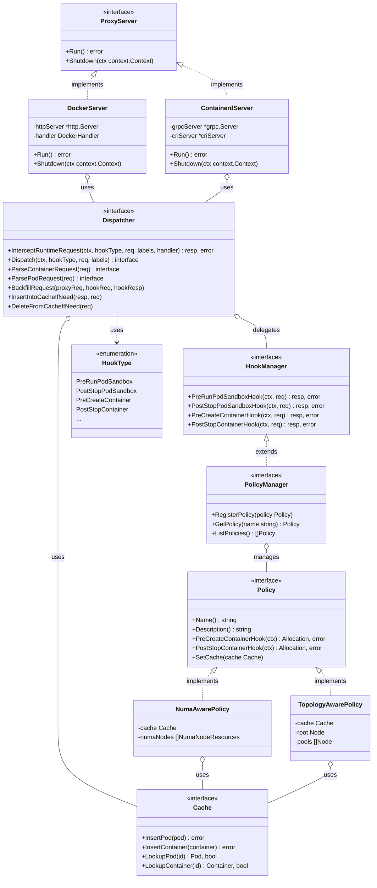
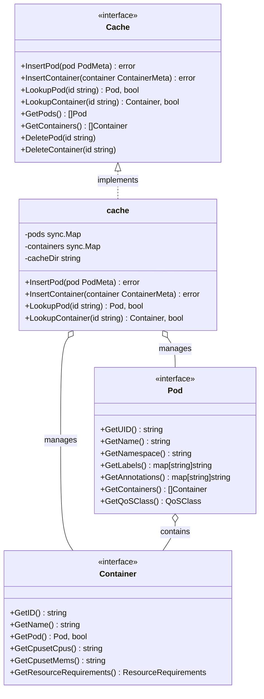

# Kunpeng-TAP 整体架构与核心接口设计文档

## 目录

- [概述](#概述)
- [整体架构](#整体架构)
  - [系统架构图](#系统架构图)
  - [运行时模式](#运行时模式)
- [组件解耦设计](#组件解耦设计)
  - [分层架构](#分层架构)
  - [解耦架构类图](#解耦架构类图)
  - [解耦关系说明](#解耦关系说明)
- [核心接口设计](#核心接口设计)
  - [HookType 枚举](#hooktype-枚举)
  - [HookManager 接口](#hookmanager-接口)
  - [Dispatcher 接口](#dispatcher-接口)
  - [PolicyManager 接口](#policymanager-接口)
  - [Policy 接口](#policy-接口)
  - [Cache 接口](#cache-接口)
- [相关设计文档](#相关设计文档)

---

## 概述

Kunpeng-TAP（Topology-Aware Plugin）是一个容器资源拓扑感知调度插件，通过代理容器运行时请求，在容器创建时实现 CPU、内存等资源的拓扑感知分配。本文档描述 Kunpeng-TAP 的整体架构设计和核心接口定义，作为各子模块详细设计文档的公共基础。

### 核心设计原则

- **分层解耦**：Proxy Server、Hook/Dispatcher、Policy 三层分离
- **运行时无关**：通过统一接口支持 Docker 和 Containerd 运行时
- **策略可插拔**：通过 Policy 接口支持多种资源分配策略
- **透明代理**：对 kubelet 和容器运行时透明，无需修改现有配置

---

## 整体架构

### 系统架构图

```
┌─────────────────────────────────────────────────────────────────────────────────┐
│                             Kubernetes Worker Node                               │
│                                                                                   │
│   ┌─────────────┐                                                                │
│   │   kubelet   │                                                                │
│   └──────┬──────┘                                                                │
│          │                                                                        │
│          │ ◄──── Docker API (HTTP) 或 CRI (gRPC)                                 │
│          ▼                                                                        │
│   ┌──────────────────────────────────────────────────────────────────────────┐   │
│   │                          Kunpeng-TAP Proxy                                │   │
│   │  ┌────────────────────────────────────────────────────────────────────┐  │   │
│   │  │                     Proxy Server 层                                 │  │   │
│   │  │  ┌──────────────────────┐     ┌──────────────────────┐             │  │   │
│   │  │  │    DockerServer      │     │   ContainerdServer   │             │  │   │
│   │  │  │   (HTTP Reverse)     │ OR  │   (gRPC CRI Proxy)   │             │  │   │
│   │  │  └──────────┬───────────┘     └──────────┬───────────┘             │  │   │
│   │  └─────────────│────────────────────────────│─────────────────────────┘  │   │
│   │                │                            │                             │   │
│   │                └────────────┬───────────────┘                             │   │
│   │                             ▼                                             │   │
│   │  ┌────────────────────────────────────────────────────────────────────┐  │   │
│   │  │                   Hook / Dispatcher 层                              │  │   │
│   │  │  ┌──────────────┐  ┌──────────────┐  ┌──────────────────────────┐  │  │   │
│   │  │  │  Dispatcher  │  │  HookManager │  │        HookType          │  │  │   │
│   │  │  │              │──│              │  │  (PreCreate, PostStop..) │  │  │   │
│   │  │  └──────┬───────┘  └──────────────┘  └──────────────────────────┘  │  │   │
│   │  └─────────│──────────────────────────────────────────────────────────┘  │   │
│   │            │                                                              │   │
│   │            ▼                                                              │   │
│   │  ┌────────────────────────────────────────────────────────────────────┐  │   │
│   │  │                       Policy 层                                     │  │   │
│   │  │  ┌────────────────┐  ┌────────────────┐  ┌────────────────────┐   │  │   │
│   │  │  │ PolicyManager  │──│  NUMA-Aware    │  │  Topology-Aware    │   │  │   │
│   │  │  │                │  │    Policy      │  │      Policy        │   │  │   │
│   │  │  └────────────────┘  └────────────────┘  └────────────────────┘   │  │   │
│   │  └────────────────────────────────────────────────────────────────────┘  │   │
│   │                             │                                             │   │
│   │                             ▼                                             │   │
│   │  ┌────────────────────────────────────────────────────────────────────┐  │   │
│   │  │                       数据层                                        │  │   │
│   │  │  ┌──────────────┐  ┌──────────────┐  ┌──────────────────────────┐  │  │   │
│   │  │  │    Cache     │  │    System    │  │      Metrics Manager     │  │  │   │
│   │  │  │ (Pod/Ctr)    │  │  (Topology)  │  │      (Prometheus)        │  │  │   │
│   │  │  └──────────────┘  └──────────────┘  └──────────────────────────┘  │  │   │
│   │  └────────────────────────────────────────────────────────────────────┘  │   │
│   └──────────────────────────────────────────────────────────────────────────┘   │
│          │                                                                        │
│          ▼                                                                        │
│   ┌──────────────────────────────────────────────────────────────────────────┐   │
│   │                    Container Runtime                                      │   │
│   │     ┌──────────────────────┐     ┌──────────────────────┐                │   │
│   │     │    Docker Engine     │ OR  │     containerd       │                │   │
│   │     └──────────────────────┘     └──────────────────────┘                │   │
│   └──────────────────────────────────────────────────────────────────────────┘   │
│                                                                                   │
│   ┌──────────────────────────────────────────────────────────────────────────┐   │
│   │                         Hardware Topology                                 │   │
│   │     ┌──────────┐  ┌──────────┐  ┌──────────┐  ┌──────────┐               │   │
│   │     │  NUMA 0  │  │  NUMA 1  │  │  NUMA 2  │  │  NUMA 3  │  ...          │   │
│   │     │ CPU/Mem  │  │ CPU/Mem  │  │ CPU/Mem  │  │ CPU/Mem  │               │   │
│   │     └──────────┘  └──────────┘  └──────────┘  └──────────┘               │   │
│   └──────────────────────────────────────────────────────────────────────────┘   │
└─────────────────────────────────────────────────────────────────────────────────┘
```

### 运行时模式

Kunpeng-TAP 支持两种容器运行时模式：

| 模式 | Proxy Server | 协议 | 策略支持 |
|-----|-------------|------|---------|
| **Docker** | DockerServer | HTTP Docker API | NUMA-Aware, Topology-Aware |
| **Containerd** | ContainerdServer | gRPC CRI v1 | NUMA-Aware, Topology-Aware |

通过 `--container-runtime-mode` 参数选择运行时模式。

---

## 组件解耦设计

Kunpeng-TAP 采用分层解耦架构，将 Proxy Server、Hook 机制和 Policy 策略三个核心模块分离，实现高内聚低耦合的设计目标。

### 分层架构

| 层级 | 职责 | 关键组件 |
|-----|------|---------|
| **Proxy Server 层** | 协议适配，接收运行时请求 | DockerServer, ContainerdServer, DockerHandler, CriServer |
| **Hook/Dispatcher 层** | 请求解析，钩子分发，响应回填 | Dispatcher, HookManager, HookType |
| **Policy 层** | 资源分配策略实现 | PolicyManager, NUMA-Aware Policy, Topology-Aware Policy |
| **数据层** | 状态缓存，系统拓扑 | Cache, System, MetricsManager |

### 解耦架构类图



### 解耦关系说明

**层间依赖规则**：

1. **上层依赖下层**：Proxy Server 层 → Hook/Dispatcher 层 → Policy 层 → 数据层
2. **同层不互相依赖**：DockerServer 和 ContainerdServer 互不依赖
3. **通过接口交互**：各层通过接口（interface）进行通信，不直接依赖具体实现

**数据流向**：

```
Runtime Request → Proxy Server → Dispatcher → HookManager → PolicyManager → Policy
                                                                              ↓
Runtime Response ← Proxy Server ← Dispatcher ← BackfillRequest ← Allocation (cpuset.cpus, cpuset.mems)
```

**关键解耦点**：

| 解耦点 | 接口 | 说明 |
|-------|------|-----|
| Proxy Server ↔ Dispatcher | `Dispatcher` | Proxy Server 不关心请求如何被处理 |
| Dispatcher ↔ HookManager | `HookManager` | Dispatcher 不关心钩子如何被执行 |
| HookManager ↔ Policy | `Policy` | HookManager 不关心具体的资源分配策略 |
| Policy ↔ Cache | `Cache` | Policy 不关心数据如何被存储 |

---

## 核心接口设计

本节详细描述各层之间的核心接口定义，这些接口是实现组件解耦的关键契约。

### HookType 枚举

HookType 定义了容器生命周期中的钩子点，是 Dispatcher 和 Policy 之间的契约。

```go
// HookType identifies the container lifecycle hook point
type HookType string

const (
    PreRunPodSandbox            HookType = "PreRunPodSandbox"
    PostStopPodSandbox          HookType = "PostStopPodSandbox"
    PreRemovePodSandbox         HookType = "PreRemovePodSandbox"
    PreCreateContainer          HookType = "PreCreateContainer"
    PreStartContainer           HookType = "PreStartContainer"
    PostStartContainer          HookType = "PostStartContainer"
    PostStopContainer           HookType = "PostStopContainer"
    PreRemoveContainer          HookType = "PreRemoveContainer"
    PreUpdateContainerResources HookType = "PreUpdateContainerResources"
    NoneHookType                HookType = "NoneHookType"
)
```

**HookType 触发时机**：

| HookType | 触发时机 | 典型用途 |
|----------|---------|---------|
| `PreRunPodSandbox` | Pod Sandbox 创建前 | 设置 Pod 级别的 cgroup 和资源限制 |
| `PostStopPodSandbox` | Pod Sandbox 停止后 | 清理 Pod 相关资源 |
| `PreRemovePodSandbox` | Pod Sandbox 删除前 | 释放 Pod 占用的资源 |
| `PreCreateContainer` | 容器创建前 | **拓扑感知 CPU/内存分配（核心钩子）** |
| `PreStartContainer` | 容器启动前 | 启动前的资源调整 |
| `PostStartContainer` | 容器启动后 | 记录容器运行状态 |
| `PostStopContainer` | 容器停止后 | 释放容器占用的资源 |
| `PreRemoveContainer` | 容器删除前 | 清理容器相关状态 |
| `PreUpdateContainerResources` | 容器资源更新前 | 动态调整资源分配 |

### HookManager 接口

HookManager 是 Hook 层的核心接口，定义了所有生命周期钩子方法。它是 Dispatcher 与 Policy 层之间的桥梁。

```go
// HookManager manages lifecycle hooks for pods and containers
type HookManager interface {
    // Pod 生命周期钩子
    PreRunPodSandboxHook(ctx context.Context,
        req *v1alpha1.PodSandboxHookRequest) (*v1alpha1.PodSandboxHookResponse, error)
    PostStopPodSandboxHook(ctx context.Context,
        req *v1alpha1.PodSandboxHookRequest) (*v1alpha1.PodSandboxHookResponse, error)
    PreRemovePodSandboxHook(ctx context.Context,
        req *v1alpha1.PodSandboxHookRequest) (*v1alpha1.PodSandboxHookResponse, error)

    // Container 生命周期钩子
    PreCreateContainerHook(ctx context.Context,
        req *v1alpha1.ContainerResourceHookRequest) (*v1alpha1.ContainerResourceHookResponse, error)
    PreStartContainerHook(ctx context.Context,
        req *v1alpha1.ContainerResourceHookRequest) (*v1alpha1.ContainerResourceHookResponse, error)
    PostStartContainerHook(ctx context.Context,
        req *v1alpha1.ContainerResourceHookRequest) (*v1alpha1.ContainerResourceHookResponse, error)
    PostStopContainerHook(ctx context.Context,
        req *v1alpha1.ContainerResourceHookRequest) (*v1alpha1.ContainerResourceHookResponse, error)
    PreRemoveContainerHook(ctx context.Context,
        req *v1alpha1.ContainerResourceHookRequest) (*v1alpha1.ContainerResourceHookResponse, error)
    PreUpdateContainerResourcesHook(ctx context.Context,
        req *v1alpha1.ContainerResourceHookRequest) (*v1alpha1.ContainerResourceHookResponse, error)
}
```

### Dispatcher 接口

Dispatcher 是连接 Proxy Server 和 Hook 层的核心组件，负责请求解析、钩子分发和响应回填。

```go
// Dispatcher dispatches runtime requests to hook manager
type Dispatcher interface {
    // SetDockerCgroupDriver 设置 Docker cgroup 驱动类型（仅 Docker 模式使用）
    SetDockerCgroupDriver(dockerCgroupDriver string)

    // InterceptRuntimeRequest 拦截运行时请求，调用钩子并转发到后端
    // 这是 Dispatcher 的核心方法，实现了请求拦截的完整流程
    InterceptRuntimeRequest(ctx context.Context, hookType policy.HookType,
        request interface{}, labels map[string]string,
        handler grpc.UnaryHandler) (interface{}, error)

    // ParseContainerRequest 解析容器请求为 Hook 请求格式
    ParseContainerRequest(req interface{}) interface{}

    // ParsePodRequest 解析 Pod 请求为 Hook 请求格式
    ParsePodRequest(req interface{}) interface{}

    // Dispatch 将请求分发到对应的 Hook 处理器
    Dispatch(ctx context.Context, hookType policy.HookType,
        request interface{}, labels map[string]string) interface{}

    // InsertIntoCacheIfNeed 根据运行时响应将 Pod/Container 插入缓存
    InsertIntoCacheIfNeed(criResp, hookReq interface{})

    // DeleteFromCacheIfNeed 根据请求从缓存中删除 Pod/Container
    DeleteFromCacheIfNeed(request interface{})

    // BackfillRequest 将 Hook 响应回填到原始请求
    // 例如：将 Allocation 中的 CpusetCpus 回填到 CreateContainerRequest
    BackfillRequest(proxyReq, hookReq, hookResp interface{})
}
```

### PolicyManager 接口

PolicyManager 管理所有注册的策略，实现策略的动态注册和查询。

```go
// PolicyManager manages all policies and delegates requests to appropriate policies
type PolicyManager interface {
    // 继承 HookManager 的所有方法
    HookManager

    // RegisterPolicy 注册一个策略到管理器
    RegisterPolicy(policy Policy)

    // GetPolicy 根据名称获取策略
    GetPolicy(name string) Policy

    // ListPolicies 列出所有已注册的策略
    ListPolicies() []Policy
}
```

### Policy 接口

Policy 定义了资源分配策略的标准接口，所有策略（NUMA-Aware、Topology-Aware）都必须实现此接口。

```go
// Policy defines the interface for a resource allocation policy
type Policy interface {
    // Name 返回策略的唯一名称
    Name() string

    // Description 返回策略的描述信息
    Description() string

    // Pod 生命周期钩子
    PreRunPodSandboxHook(ctx HookContext) (*Allocation, error)
    PostStopPodSandboxHook(ctx HookContext) (*Allocation, error)
    PreRemovePodSandboxHook(ctx HookContext) (*Allocation, error)

    // Container 生命周期钩子
    PreCreateContainerHook(ctx HookContext) (*Allocation, error)
    PreStartContainerHook(ctx HookContext) (*Allocation, error)
    PostStartContainerHook(ctx HookContext) (*Allocation, error)
    PostStopContainerHook(ctx HookContext) (*Allocation, error)
    PreRemoveContainerHook(ctx HookContext) (*Allocation, error)
    PreUpdateContainerResourcesHook(ctx HookContext) (*Allocation, error)

    // SetCache 设置共享缓存
    SetCache(cache cache.Cache)
}

// Allocation 表示资源分配结果
type Allocation struct {
    CpusetCpus string  // CPU 集合，例如 "0-23" 或 "0,1,2,3"
    CpusetMems string  // 内存节点集合，例如 "0" 或 "0,1"
}

// HookContext 包含钩子执行所需的上下文信息
type HookContext interface {
    GetPodUID() string
    GetPodName() string
    GetPodNamespace() string
    GetContainerName() string
    GetContainerID() string
    GetLabels() map[string]string
    GetAnnotations() map[string]string
    GetResourceRequirements() ResourceRequirements
    GetQoSClass() QoSClass
}
```

### Cache 接口

Cache 接口定义了 Pod 和 Container 状态缓存的管理方法。

```go
// Cache manages runtime state of pods and containers
type Cache interface {
    // Pod 管理
    InsertPod(pod PodMeta) error
    LookupPod(id string) (Pod, bool)
    GetPods() []Pod
    DeletePod(id string)

    // Container 管理
    InsertContainer(container ContainerMeta) error
    LookupContainer(id string) (Container, bool)
    GetContainers() []Container
    DeleteContainer(id string)

    // 持久化（可选）
    LoadStoreContainerd(client runtimeapi.RuntimeServiceClient) error
}

// Pod 接口定义
type Pod interface {
    GetUID() string
    GetName() string
    GetNamespace() string
    GetLabels() map[string]string
    GetAnnotations() map[string]string
    GetContainers() []Container
    GetQoSClass() QoSClass
}

// Container 接口定义
type Container interface {
    GetID() string
    GetName() string
    GetPod() (Pod, bool)
    GetCpusetCpus() string
    GetCpusetMems() string
    GetResourceRequirements() ResourceRequirements
}
```

**Cache 类图**：



---

## 相关设计文档

本文档定义的架构和接口被以下详细设计文档引用：

| 文档 | 说明 |
|-----|------|
| [Docker-Server 详细设计](./kunpeng-tap-docker-server-design.md) | Docker API 代理服务器的详细设计 |
| [Containerd-Server 详细设计](./kunpeng-tap-containerd-server-design.md) | CRI gRPC 代理服务器的详细设计 |
| [NUMA-Aware 策略详细设计](./kunpeng-tap-numa-aware-policy-design.md) | NUMA 感知资源分配策略的详细设计 |
| [Topology-Aware 策略详细设计](./kunpeng-tap-topology-aware-policy-design.md) | 多层级拓扑感知资源分配策略的详细设计 |
```

