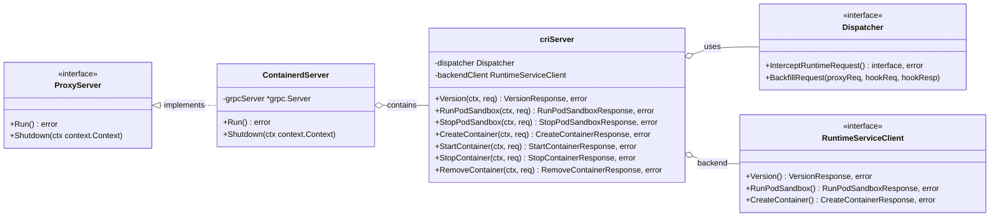

# Kunpeng-TAP Containerd-Server 详细设计文档

> **前置阅读**：本文档依赖 [Kunpeng-TAP 整体架构与核心接口设计](./kunpeng-tap-architecture-and-interfaces.md)，请先阅读该文档了解整体架构和核心接口定义。

## 目录

- [概述](#概述)
- [架构设计](#架构设计)
  - [组件类图](#组件类图)
  - [核心组件](#核心组件)
- [CRI 请求处理流程](#cri-请求处理流程)
  - [容器创建流程](#容器创建流程)
  - [CRI 方法拦截表](#cri-方法拦截表)
- [接口实现](#接口实现)
  - [CriServer 接口](#criserver-接口)
  - [gRPC 拦截器](#grpc-拦截器)
- [部署配置](#部署配置)
- [参考资料](#参考资料)

---

## 概述

Containerd-Server 是 Kunpeng-TAP 针对 containerd 运行时的代理服务器实现。它通过 gRPC 代理模式实现 Kubernetes CRI（Container Runtime Interface）接口，在容器创建时调用资源分配策略，将分配结果回填到 CRI 请求中，然后转发给 containerd。

### 核心特性

- **gRPC CRI 代理**：实现 CRI RuntimeService 接口的代理
- **透明拦截**：kubelet 无感知，仅需修改 containerd Socket 路径
- **选择性处理**：仅拦截关键 CRI 方法，其他通过 grpc-proxy 直接透传

---

## 架构设计

### 组件类图



### 核心组件

| 组件 | 文件路径 | 职责 |
|-----|---------|-----|
| **ContainerdServer** | `server/containerd/server.go` | gRPC 服务器，监听 Unix Socket，使用 grpc-proxy 透传非拦截方法 |
| **criServer** | `server/containerd/runtime.go` | CRI RuntimeService 接口实现，拦截关键方法 |
| **grpc-proxy** | `github.com/mwitkow/grpc-proxy` | 透明代理未拦截的 gRPC 方法 |

---

## CRI 请求处理流程

### 容器创建流程

```
┌──────────────────────────────────────────────────────────────────────────────┐
│                      CRI CreateContainer 请求处理流程                         │
├──────────────────────────────────────────────────────────────────────────────┤
│                                                                              │
│  1. kubelet 发送 CRI CreateContainer gRPC 请求                               │
│     │                                                                        │
│     ▼                                                                        │
│  ┌─────────────────────────────────────────────────────────────────────────┐│
│  │ 2. criServer.CreateContainer(ctx, req)                                   ││
│  │    • 记录日志：ContainerName, PodSandboxID                                ││
│  │    • 调用 dispatcher.InterceptRuntimeRequest(PreCreateContainer)          ││
│  └─────────────────────────────────────────────────────────────────────────┘│
│     │                                                                        │
│     ▼                                                                        │
│  ┌─────────────────────────────────────────────────────────────────────────┐│
│  │ 3. Dispatcher.InterceptRuntimeRequest()                                   ││
│  │    • 从 Cache 查询 PodSandbox 信息                                        ││
│  │    • 解析请求：ParseContainerRequest(req)                                  ││
│  │    • 调用钩子：Dispatch(ctx, PreCreateContainer, hookReq)                  ││
│  └─────────────────────────────────────────────────────────────────────────┘│
│     │                                                                        │
│     ▼                                                                        │
│  ┌─────────────────────────────────────────────────────────────────────────┐│
│  │ 4. HookManager → PolicyManager → Policy                                   ││
│  │    • Policy.PreCreateContainerHook() 返回 Allocation                      ││
│  │    • Allocation = {CpusetCpus: "0-23", CpusetMems: "0"}                   ││
│  └─────────────────────────────────────────────────────────────────────────┘│
│     │                                                                        │
│     ▼                                                                        │
│  ┌─────────────────────────────────────────────────────────────────────────┐│
│  │ 5. Dispatcher.BackfillRequest()                                           ││
│  │    • 修改 req.Config.Linux.Resources.CpusetCpus                           ││
│  │    • 修改 req.Config.Linux.Resources.CpusetMems                           ││
│  └─────────────────────────────────────────────────────────────────────────┘│
│     │                                                                        │
│     ▼                                                                        │
│  ┌─────────────────────────────────────────────────────────────────────────┐│
│  │ 6. backendClient.CreateContainer(ctx, modifiedReq)                        ││
│  │    • 将修改后的请求转发到 containerd                                       ││
│  │    • 获取 CreateContainerResponse                                         ││
│  └─────────────────────────────────────────────────────────────────────────┘│
│     │                                                                        │
│     ▼                                                                        │
│  ┌─────────────────────────────────────────────────────────────────────────┐│
│  │ 7. Dispatcher.InsertIntoCacheIfNeed()                                     ││
│  │    • 将容器信息插入 Cache                                                  ││
│  │    • 返回 CRI Response 给 kubelet                                         ││
│  └─────────────────────────────────────────────────────────────────────────┘│
│                                                                              │
└──────────────────────────────────────────────────────────────────────────────┘
```

### CRI 方法拦截表

| CRI 方法 | HookType | 处理逻辑 |
|---------|----------|---------|
| `RunPodSandbox` | PreRunPodSandbox | 记录 Pod 信息到 Cache |
| `StopPodSandbox` | PostStopPodSandbox | 清理 Pod 相关资源 |
| `RemovePodSandbox` | PreRemovePodSandbox | 从 Cache 删除 Pod |
| `CreateContainer` | PreCreateContainer | **拓扑感知资源分配**，回填 CpusetCpus/CpusetMems |
| `StartContainer` | PreStartContainer | 记录容器启动状态 |
| `StopContainer` | PostStopContainer | 释放容器占用的资源 |
| `RemoveContainer` | PreRemoveContainer | 从 Cache 删除容器 |
| `Version` | - | 直接透传 |
| `Status` | - | 直接透传 |
| `ListContainers` | - | 直接透传（通过 grpc-proxy） |
| 其他 CRI 方法 | - | 通过 grpc-proxy 直接透传 |

---

## 接口实现

### CriServer 接口

```go
// criServer implements CRI RuntimeService
type criServer struct {
    dispatcher                  dispatcher.Dispatcher
    backendRuntimeServiceClient runtimeapi.RuntimeServiceClient
}

// NewCriServer creates a new CRI server
func NewCriServer(
    dispatcher dispatcher.Dispatcher,
    backendConn *grpc.ClientConn,
) *criServer {
    return &criServer{
        dispatcher:                  dispatcher,
        backendRuntimeServiceClient: runtimeapi.NewRuntimeServiceClient(backendConn),
    }
}

// CreateContainer implements RuntimeService.CreateContainer
func (c *criServer) CreateContainer(
    ctx context.Context,
    req *runtimeapi.CreateContainerRequest,
) (*runtimeapi.CreateContainerResponse, error) {
    klog.V(2).InfoS("CreateContainer",
        "containerName", req.Config.Metadata.Name,
        "podSandboxId", req.PodSandboxId)

    // 通过 Dispatcher 拦截请求
    resp, err := c.dispatcher.InterceptRuntimeRequest(
        ctx,
        policy.PreCreateContainer,
        req,
        req.Config.Labels,
        func(ctx context.Context, req interface{}) (interface{}, error) {
            return c.backendRuntimeServiceClient.CreateContainer(
                ctx,
                req.(*runtimeapi.CreateContainerRequest),
            )
        },
    )
    if err != nil {
        return nil, err
    }
    return resp.(*runtimeapi.CreateContainerResponse), nil
}
```

### gRPC 拦截器

ContainerdServer 使用 `grpc-proxy` 库实现未拦截方法的透明代理：

```go
// NewContainerdServer creates a new containerd server with gRPC proxy
func NewContainerdServer(
    criServer *criServer,
    remoteContainerRuntimeConn *grpc.ClientConn,
) server.ProxyServer {
    // 创建 gRPC 代理 director
    director := func(ctx context.Context, fullMethodName string) (
        context.Context, *grpc.ClientConn, error,
    ) {
        return ctx, remoteContainerRuntimeConn, nil
    }

    // 创建 gRPC 服务器，使用透明代理处理未注册的方法
    grpcServer := grpc.NewServer(
        grpc.UnknownServiceHandler(proxy.TransparentHandler(director)),
    )

    // 注册 CRI RuntimeService（仅拦截部分方法）
    runtimeapi.RegisterRuntimeServiceServer(grpcServer, criServer)

    return &containerdServer{grpcServer: grpcServer}
}
```

---

## 部署配置

### 命令行参数

| 参数 | 默认值 | 说明 |
|-----|-------|------|
| `--container-runtime-mode` | `Containerd` | 容器运行时模式 |
| `--resource-policy` | `topology-aware` | 资源分配策略 |
| `--runtime-proxy-endpoint` | `/var/run/kunpeng-tap/runtime-proxy.sock` | 代理服务监听的 Socket 路径 |
| `--container-runtime-service-endpoint` | `/run/containerd/containerd.sock` | containerd Socket 路径 |
| `--enable-memory-topology` | `false` | 是否启用内存拓扑感知 |
| `-v` | `0` | 日志级别（0-5） |


### kubelet 配置

修改 kubelet 配置，使用 Kunpeng-TAP 代理 Socket：

```yaml
# /var/lib/kubelet/config.yaml
containerRuntimeEndpoint: unix:///var/run/kunpeng-tap/runtime-proxy.sock
```

---

## 参考资料

- [Kubernetes Container Runtime Interface (CRI)](https://kubernetes.io/docs/concepts/architecture/cri/)
- [containerd](https://containerd.io/)
- [grpc-proxy](https://github.com/mwitkow/grpc-proxy)
- [Kunpeng-TAP 整体架构与核心接口设计](./kunpeng-tap-architecture-and-interfaces.md)
- [NUMA-Aware 策略详细设计](./kunpeng-tap-numa-aware-policy-design.md)
- [Topology-Aware 策略详细设计](./kunpeng-tap-topology-aware-policy-design.md)

