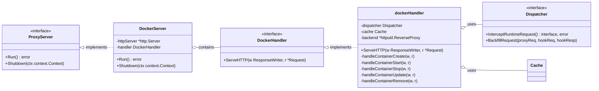

# Kunpeng-TAP Docker-Server 详细设计文档

> **前置阅读**：本文档依赖 [Kunpeng-TAP 整体架构与核心接口设计](./kunpeng-tap-architecture-and-interfaces.md)，请先阅读该文档了解整体架构和核心接口定义。

## 目录

- [概述](#概述)
- [架构设计](#架构设计)
  - [组件类图](#组件类图)
  - [核心组件](#核心组件)
- [请求处理流程](#请求处理流程)
  - [容器创建流程](#容器创建流程)
  - [Docker API 拦截表](#docker-api-拦截表)
- [接口实现](#接口实现)
  - [DockerHandler 接口](#dockerhandler-接口)
  - [请求解析与回填](#请求解析与回填)
- [部署配置](#部署配置)
- [参考资料](#参考资料)

---

## 概述

Docker-Server 是 Kunpeng-TAP 针对 Docker 运行时的代理服务器实现。它通过 HTTP 反向代理模式拦截 Docker Engine API 请求，在容器创建时调用资源分配策略，将分配结果（如 CpusetCpus）回填到请求中，然后转发给 Docker Engine。

### 核心特性

- **HTTP 反向代理**：通过 Unix Socket 代理 Docker API 请求
- **透明拦截**：kubelet 无感知，无需修改 Kubernetes 配置
- **选择性处理**：仅拦截关键 API（create、start、stop、update），其他直接透传

---

## 架构设计

### 组件类图



### 核心组件

| 组件 | 文件路径 | 职责 |
|-----|---------|-----|
| **DockerServer** | `server/docker/server.go` | HTTP 服务器，监听 Unix Socket，路由请求到 DockerHandler |
| **dockerHandler** | `server/docker/handler.go` | Docker API 请求处理，解析请求、调用 Dispatcher、回填响应 |
| **ReverseProxy** | `net/http/httputil` | 将处理后的请求转发到 Docker Engine |

---

## 请求处理流程

### 容器创建流程

```
┌──────────────────────────────────────────────────────────────────────────────┐
│                      Docker Container Create 请求处理流程                     │
├──────────────────────────────────────────────────────────────────────────────┤
│                                                                              │
│  1. kubelet 发送 POST /containers/create HTTP 请求                           │
│     │                                                                        │
│     ▼                                                                        │
│  ┌─────────────────────────────────────────────────────────────────────────┐│
│  │ 2. DockerServer.ServeHTTP()                                              ││
│  │    • 路由请求到 dockerHandler.handleContainerCreate()                     ││
│  └─────────────────────────────────────────────────────────────────────────┘│
│     │                                                                        │
│     ▼                                                                        │
│  ┌─────────────────────────────────────────────────────────────────────────┐│
│  │ 3. dockerHandler.handleContainerCreate()                                  ││
│  │    • 解析 HTTP Body 为 ContainerCreateConfig                              ││
│  │    • 从 Labels 提取 Pod 信息                                              ││
│  │    • 调用 dispatcher.InterceptRuntimeRequest(PreCreateContainer)          ││
│  └─────────────────────────────────────────────────────────────────────────┘│
│     │                                                                        │
│     ▼                                                                        │
│  ┌─────────────────────────────────────────────────────────────────────────┐│
│  │ 4. Dispatcher → HookManager → Policy                                      ││
│  │    • Policy.PreCreateContainerHook() 返回 Allocation                      ││
│  │    • Allocation = {CpusetCpus: "0-23", CpusetMems: "0"}                   ││
│  └─────────────────────────────────────────────────────────────────────────┘│
│     │                                                                        │
│     ▼                                                                        │
│  ┌─────────────────────────────────────────────────────────────────────────┐│
│  │ 5. dispatcher.BackfillRequest()                                           ││
│  │    • 修改 ContainerCreateConfig.HostConfig.CpusetCpus                     ││
│  │    • 修改 ContainerCreateConfig.HostConfig.CpusetMems                     ││
│  └─────────────────────────────────────────────────────────────────────────┘│
│     │                                                                        │
│     ▼                                                                        │
│  ┌─────────────────────────────────────────────────────────────────────────┐│
│  │ 6. ReverseProxy.ServeHTTP()                                               ││
│  │    • 将修改后的请求转发到 Docker Engine                                    ││
│  │    • 返回 ContainerCreateResponse                                         ││
│  └─────────────────────────────────────────────────────────────────────────┘│
│     │                                                                        │
│     ▼                                                                        │
│  ┌─────────────────────────────────────────────────────────────────────────┐│
│  │ 7. dispatcher.InsertIntoCacheIfNeed()                                     ││
│  │    • 将容器信息插入 Cache                                                  ││
│  │    • 返回响应给 kubelet                                                   ││
│  └─────────────────────────────────────────────────────────────────────────┘│
│                                                                              │
└──────────────────────────────────────────────────────────────────────────────┘
```

### Docker API 拦截表

| HTTP 方法 | API 路径 | HookType | 处理逻辑 |
|----------|---------|----------|---------|
| `POST` | `/containers/create` | PreCreateContainer | **拓扑感知资源分配**，回填 CpusetCpus/CpusetMems |
| `POST` | `/containers/{id}/start` | PreStartContainer | 记录容器启动状态 |
| `POST` | `/containers/{id}/stop` | PostStopContainer | 释放容器占用的资源 |
| `POST` | `/containers/{id}/update` | PreUpdateContainerResources | 动态调整资源分配 |
| `DELETE` | `/containers/{id}` | PreRemoveContainer | 清理容器相关状态 |
| 其他 | `*` | - | 直接透传到 Docker Engine |

---

## 接口实现

### DockerHandler 接口

```go
// DockerHandler handles Docker API requests
type DockerHandler interface {
    http.Handler
}

// dockerHandler implements DockerHandler
type dockerHandler struct {
    dispatcher dispatcher.Dispatcher
    cache      cache.Cache
    backend    *httputil.ReverseProxy
}

// NewDockerHandler creates a new Docker handler
func NewDockerHandler(
    dispatcher dispatcher.Dispatcher,
    cache cache.Cache,
    backendSocket string,
) DockerHandler {
    // 创建到 Docker Engine 的反向代理
    backend := &httputil.ReverseProxy{
        Director: func(req *http.Request) {
            req.URL.Scheme = "http"
            req.URL.Host = "docker"
        },
        Transport: &http.Transport{
            DialContext: func(ctx context.Context, network, addr string) (net.Conn, error) {
                return net.Dial("unix", backendSocket)
            },
        },
    }
    return &dockerHandler{
        dispatcher: dispatcher,
        cache:      cache,
        backend:    backend,
    }
}
```

### 请求解析与回填

**从 Docker Labels 解析 Pod 信息**：

```go
// Docker 容器 Labels 中的 Kubernetes 元数据
const (
    LabelPodUID       = "io.kubernetes.pod.uid"
    LabelPodName      = "io.kubernetes.pod.name"
    LabelPodNamespace = "io.kubernetes.pod.namespace"
    LabelContainerName = "io.kubernetes.container.name"
)

// 解析容器请求
func (h *dockerHandler) parseContainerRequest(config *ContainerCreateConfig) *HookRequest {
    labels := config.Config.Labels
    return &HookRequest{
        PodUID:        labels[LabelPodUID],
        PodName:       labels[LabelPodName],
        PodNamespace:  labels[LabelPodNamespace],
        ContainerName: labels[LabelContainerName],
        Resources:     parseResources(config.HostConfig.Resources),
    }
}
```

**回填资源分配结果**：

```go
// 将 Allocation 回填到 Docker 请求
func (d *dispatcher) BackfillRequest(proxyReq, hookReq, hookResp interface{}) {
    config := proxyReq.(*ContainerCreateConfig)
    allocation := hookResp.(*Allocation)

    if allocation.CpusetCpus != "" {
        config.HostConfig.CpusetCpus = allocation.CpusetCpus
    }
    if allocation.CpusetMems != "" {
        config.HostConfig.CpusetMems = allocation.CpusetMems
    }
}
```

---

## 部署配置

### 命令行参数

| 参数 | 默认值 | 说明 |
|-----|-------|------|
| `--container-runtime-mode` | `Docker` | 容器运行时模式 |
| `--resource-policy` | `numa-aware` | 资源分配策略 |
| `--runtime-proxy-endpoint` | `/var/run/kunpeng-tap/docker.sock` | 代理服务监听的 Socket 路径 |
| `--container-runtime-service-endpoint` | `/var/run/docker.sock` | Docker Engine Socket 路径 |
| `-v` | `0` | 日志级别（0-5） |

### DaemonSet 配置示例

```yaml
apiVersion: apps/v1
kind: DaemonSet
metadata:
  name: kunpeng-tap-docker
  namespace: topo-affinity-plugin-system
spec:
  selector:
    matchLabels:
      app: kunpeng-tap
  template:
    spec:
      containers:
      - name: kunpeng-tap
        image: kunpeng-tap:v0.3.0
        args:
        - --container-runtime-mode=Docker
        - --resource-policy=numa-aware
        - --runtime-proxy-endpoint=/var/run/kunpeng-tap/docker.sock
        - --container-runtime-service-endpoint=/var/run/docker.sock
        volumeMounts:
        - name: docker-socket
          mountPath: /var/run/docker.sock
        - name: kunpeng-tap-socket
          mountPath: /var/run/kunpeng-tap
      volumes:
      - name: docker-socket
        hostPath:
          path: /var/run/docker.sock
          type: Socket
      - name: kunpeng-tap-socket
        hostPath:
          path: /var/run/kunpeng-tap
          type: DirectoryOrCreate
```

---

## 参考资料

- [Docker Engine API](https://docs.docker.com/engine/api/)
- [Kunpeng-TAP 整体架构与核心接口设计](./kunpeng-tap-architecture-and-interfaces.md)
- [NUMA-Aware 策略详细设计](./kunpeng-tap-numa-aware-policy-design.md)
- [Topology-Aware 策略详细设计](./kunpeng-tap-topology-aware-policy-design.md)

