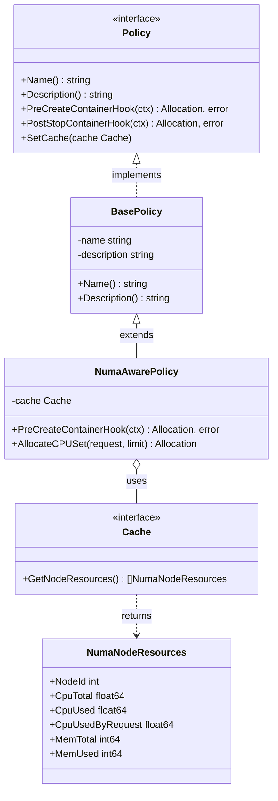

# Kunpeng-TAP NUMA-Aware 策略详细设计文档

> **前置阅读**：本文档依赖 [Kunpeng-TAP 整体架构与核心接口设计](./kunpeng-tap-architecture-and-interfaces.md)，请先阅读该文档了解 Policy 接口定义。

## 目录

- [概述](#概述)
- [策略设计](#策略设计)
  - [策略类图](#策略类图)
  - [核心数据结构](#核心数据结构)
- [资源分配算法](#资源分配算法)
  - [算法流程](#算法流程)
  - [节点选择策略](#节点选择策略)
  - [QoS 处理](#qos-处理)
- [接口实现](#接口实现)
- [配置说明](#配置说明)
- [参考资料](#参考资料)

---

## 概述

NUMA-Aware 策略是 Kunpeng-TAP 提供的一种资源分配策略，专注于 NUMA（Non-Uniform Memory Access）感知的 CPU 亲和性分配。该策略通过分析各 NUMA 节点的资源使用情况，将容器绑定到负载最低的 NUMA 节点，从而减少跨 NUMA 内存访问延迟，提升容器性能。

### 核心特性

- **扁平 NUMA 模型**：将系统视为多个平等的 NUMA 节点
- **负载均衡**：选择 CPU 已分配量最低的 NUMA 节点
- **QoS 感知**：仅处理 Guaranteed 和 Burstable QoS 级别的 Pod
- **轻量级实现**：算法简单高效，适合资源需求不超过单节点容量的场景

### 适用场景

| 场景 | 适用性 |
|-----|--------|
| 中小型容器（CPU < 单 NUMA 节点核数） | ✅ 推荐 |
| 多租户混部环境 | ✅ 推荐 |
| 大型容器（跨 NUMA 节点） | ❌ 不适用 |
| 需要 GPU 亲和性 | ❌ 建议使用 Topology-Aware |

---

## 策略设计

### 策略类图



### 核心数据结构

```go
// NumaNodeResources 表示单个 NUMA 节点的资源状态
type NumaNodeResources struct {
    NodeId           int     // NUMA 节点 ID
    CpuTotal         float64 // 节点总 CPU 核数
    CpuUsed          float64 // 已使用的 CPU 核数（按 Limit 计算）
    CpuUsedByRequest float64 // 已使用的 CPU 核数（按 Request 计算）
    MemTotal         int64   // 节点总内存（字节）
    MemUsed          int64   // 已使用的内存（字节）
}
```

---

## 资源分配算法

### 算法流程

```
┌──────────────────────────────────────────────────────────────────────────────┐
│                        NUMA-Aware CPU 分配算法                                │
├──────────────────────────────────────────────────────────────────────────────┤
│                                                                              │
│  输入: ContainerContext (包含 CPU 请求/限制、QoS 类型)                         │
│  输出: Allocation (CpusetCpus)                                               │
│                                                                              │
│  1. 解析容器上下文                                                            │
│     if Resources == nil:                                                     │
│         return nil  // 无资源请求，不处理                                     │
│                                                                              │
│  2. 获取 QoS 类型                                                            │
│     qos = ParseCgroupForQOSClass(CgroupParent)                               │
│                                                                              │
│  3. QoS 过滤                                                                 │
│     if qos == BestEffort:                                                    │
│         return nil  // 不处理 BestEffort                                     │
│                                                                              │
│  4. 获取节点资源状态                                                          │
│     nodeResources = cache.GetNodeResources()                                  │
│     if len(nodeResources) == 0:                                              │
│         return nil  // 无节点资源                                            │
│                                                                              │
│  5. 检查资源需求                                                              │
│     cpuTotal = nodeResources[0].CpuTotal                                      │
│     if reqCpu > cpuTotal || limitCpu > cpuTotal:                             │
│         return nil  // 超出单节点容量                                        │
│                                                                              │
│  6. 选择最优节点                                                              │
│     preferedNode = -1                                                        │
│     minUsed = MaxFloat64                                                     │
│     for i, node in nodeResources:                                            │
│         // 检查容量是否足够                                                   │
│         if reqCpu + node.CpuUsedByRequest > cpuTotal:                        │
│             continue                                                         │
│         // 选择负载最低的节点                                                 │
│         if node.CpuUsed < minUsed:                                           │
│             preferedNode = i                                                 │
│             minUsed = node.CpuUsed                                           │
│                                                                              │
│  7. 生成 CPU 集合                                                             │
│     if preferedNode == -1:                                                   │
│         return nil  // 无合适节点                                            │
│     cpuStart = preferedNode * cpuTotal                                        │
│     cpuEnd = (preferedNode + 1) * cpuTotal - 1                                │
│     return Allocation{CpusetCpus: "cpuStart-cpuEnd"}                          │
│                                                                              │
└──────────────────────────────────────────────────────────────────────────────┘
```

### 节点选择策略

NUMA-Aware 策略采用**最低负载优先**的节点选择策略：

```
┌─────────────────────────────────────────────────────────────────────────────┐
│                          节点选择示例                                        │
├─────────────────────────────────────────────────────────────────────────────┤
│                                                                             │
│  系统配置: 4 个 NUMA 节点，每节点 24 核                                       │
│                                                                             │
│  ┌──────────────┐  ┌──────────────┐  ┌──────────────┐  ┌──────────────┐     │
│  │   NUMA 0     │  │   NUMA 1     │  │   NUMA 2     │  │   NUMA 3     │     │
│  │  CPU 0-23    │  │  CPU 24-47   │  │  CPU 48-71   │  │  CPU 72-95   │     │
│  │              │  │              │  │              │  │              │     │
│  │  Used: 18    │  │  Used: 12    │  │  Used: 20    │  │  Used: 8     │     │
│  │  ████████░░  │  │  █████░░░░░  │  │  █████████░  │  │  ███░░░░░░░  │     │
│  └──────────────┘  └──────────────┘  └──────────────┘  └──────────────┘     │
│                                                                             │
│  新容器请求: 4 CPU                                                           │
│  选择结果: NUMA 3 (负载最低: 8 核)                                           │
│  分配结果: CpusetCpus = "72-95"                                              │
│                                                                             │
└─────────────────────────────────────────────────────────────────────────────┘
```

### QoS 处理

| QoS 类型 | 处理方式 | 说明 |
|---------|---------|------|
| **Guaranteed** | ✅ 分配 | CPU Request = Limit，进行 NUMA 亲和性分配 |
| **Burstable** | ✅ 分配 | CPU Request < Limit，进行 NUMA 亲和性分配 |
| **BestEffort** | ❌ 跳过 | 无资源请求，不进行亲和性分配 |

---

## 接口实现

### NumaAwarePolicy 实现

```go
// NumaAwarePolicy implements Policy interface for NUMA-aware allocation
type NumaAwarePolicy struct {
    policy.BasePolicy
    cache cache.Cache
}

// NewNumaAwarePolicy creates a new NUMA-aware policy
func NewNumaAwarePolicy(cache cache.Cache) policy.Policy {
    return &NumaAwarePolicy{
        BasePolicy: *policy.NewBasePolicy(PolicyName, PolicyDescription),
        cache:      cache,
    }
}

// PreCreateContainerHook implements NUMA-aware CPU set allocation
func (p *NumaAwarePolicy) PreCreateContainerHook(ctx policy.HookContext) (*policy.Allocation, error) {
    containerCtx, ok := ctx.(*policy.ContainerContext)
    if !ok {
        return nil, nil
    }

    request := containerCtx.Request
    if request.Resources == nil {
        return nil, nil
    }

    qos := policy.ParseCgroupForQOSClass(request.CgroupParent)

    switch qos {
    case v1.PodQOSGuaranteed, v1.PodQOSBurstable:
        return p.AllocateCPUSet(
            request.Resources.GetRequests(),
            request.Resources.GetLimits(),
        ), nil
    case v1.PodQOSBestEffort:
        return nil, nil
    }

    return nil, nil
}

// AllocateCPUSet selects the best NUMA node and returns CPU set
func (p *NumaAwarePolicy) AllocateCPUSet(request, limit *v1.ResourceList) *policy.Allocation {
    alloc := policy.NewAllocation()

    reqCpu := request.Cpu().AsApproximateFloat64()
    limitCpu := limit.Cpu().AsApproximateFloat64()
    nodeResources := p.cache.GetNodeResources()

    if len(nodeResources) == 0 {
        return nil
    }

    cpuTotalInNode := nodeResources[0].CpuTotal

    // 超出单节点容量，不处理
    if reqCpu > cpuTotalInNode || limitCpu > cpuTotalInNode {
        return nil
    }

    // 选择 CPU 已分配量最低的节点
    var preferedNode int = -1
    used := math.MaxFloat64

    for i, v := range nodeResources {
        if reqCpu+v.CpuUsedByRequest > cpuTotalInNode {
            continue
        }
        if v.CpuUsed < used {
            preferedNode = i
            used = v.CpuUsed
        }
    }

    if preferedNode == -1 {
        return nil
    }

    // 生成 CPU 集合字符串
    cpuStart := preferedNode * int(cpuTotalInNode)
    cpuEnd := (preferedNode+1)*int(cpuTotalInNode) - 1
    alloc.SetCPUSetCpus(strconv.Itoa(cpuStart) + "-" + strconv.Itoa(cpuEnd))

    return alloc
}
```

---

## 配置说明

### 启用 NUMA-Aware 策略

```bash
kunpeng-tap \
  --container-runtime-mode=Docker \
  --resource-policy=numa-aware \
  --runtime-proxy-endpoint=/var/run/kunpeng-tap/docker.sock \
  --container-runtime-service-endpoint=/var/run/docker.sock
```

### 策略参数

| 参数 | 值 | 说明 |
|-----|---|------|
| `--resource-policy` | `numa-aware` | 启用 NUMA-Aware 策略 |

---

## 参考资料

- [NUMA Architecture](https://en.wikipedia.org/wiki/Non-uniform_memory_access)
- [Linux cpuset](https://www.kernel.org/doc/html/latest/admin-guide/cgroup-v1/cpusets.html)
- [Kunpeng-TAP 整体架构与核心接口设计](./kunpeng-tap-architecture-and-interfaces.md)
- [Docker-Server 详细设计](./kunpeng-tap-docker-server-design.md)
- [Containerd-Server 详细设计](./kunpeng-tap-containerd-server-design.md)

