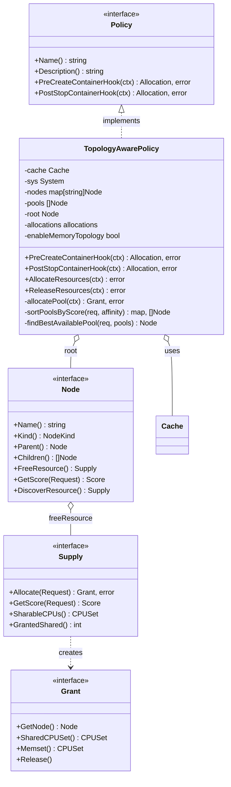

# Kunpeng-TAP Topology-Aware 策略详细设计文档

> **前置阅读**：本文档依赖 [Kunpeng-TAP 整体架构与核心接口设计](./kunpeng-tap-architecture-and-interfaces.md)，请先阅读该文档了解 Policy 接口定义。

## 目录

- [概述](#概述)
- [策略设计](#策略设计)
  - [策略类图](#策略类图)
  - [拓扑树结构](#拓扑树结构)
  - [核心数据结构](#核心数据结构)
- [资源分配算法](#资源分配算法)
  - [算法流程](#算法流程)
  - [节点评分机制](#节点评分机制)
  - [QoS 处理](#qos-处理)
- [接口实现](#接口实现)
  - [Node 接口](#node-接口)
  - [Supply 接口](#supply-接口)
  - [Grant 接口](#grant-接口)
- [配置说明](#配置说明)
- [参考资料](#参考资料)

---

## 概述

Topology-Aware 策略是 Kunpeng-TAP 提供的高级资源分配策略，专注于多层级硬件拓扑感知的 CPU 和内存亲和性分配。该策略通过构建完整的硬件拓扑树（Virtual → Socket → Die → NUMA），结合多维度评分算法，为容器选择最优的资源池，从而最大化资源利用率和应用性能。

### 核心特性

- **多层级拓扑树**：支持 Virtual、Socket、Die、NUMA 四级拓扑结构
- **多维度评分**：综合考虑深度、容量、共置容器数、GPU 亲和性等因素
- **内存拓扑感知**：可选启用 `--enable-memory-topology` 进行内存节点绑定
- **GPU 亲和性**：自动检测 GPU 设备位置，优先分配到 GPU 所在 NUMA 节点
- **资源状态恢复**：支持从 Cache 恢复资源分配状态

### 适用场景

| 场景 | 适用性 |
|-----|--------|
| 大型容器（跨 NUMA 节点） | ✅ 推荐 |
| GPU 密集型工作负载 | ✅ 推荐 |
| 需要内存拓扑感知 | ✅ 推荐 |
| 多 Socket 服务器 | ✅ 推荐 |
| 简单场景（单 NUMA） | ⚠️ 可用，但 NUMA-Aware 更轻量 |

---

## 策略设计

### 策略类图



### 拓扑树结构

Topology-Aware 策略构建多层级的硬件拓扑树来表示系统资源：

```
┌─────────────────────────────────────────────────────────────────────────────┐
│                          拓扑树结构示例                                       │
├─────────────────────────────────────────────────────────────────────────────┤
│                                                                             │
│                           ┌─────────────┐                                   │
│                           │    root     │  VirtualNode                      │
│                           │  (virtual)  │  (多 Socket 时创建)                │
│                           └──────┬──────┘                                   │
│                    ┌─────────────┴─────────────┐                            │
│                    ▼                           ▼                            │
│            ┌─────────────┐             ┌─────────────┐                      │
│            │  socket #0  │             │  socket #1  │  SocketNode          │
│            │  CPU 0-47   │             │  CPU 48-95  │                      │
│            └──────┬──────┘             └──────┬──────┘                      │
│              ┌────┴────┐                 ┌────┴────┐                        │
│              ▼         ▼                 ▼         ▼                        │
│        ┌─────────┐ ┌─────────┐     ┌─────────┐ ┌─────────┐                  │
│        │ die #0  │ │ die #1  │     │ die #0  │ │ die #1  │  DieNode         │
│        │ 0/0     │ │ 0/1     │     │ 1/0     │ │ 1/1     │  (可选层级)       │
│        └────┬────┘ └────┬────┘     └────┬────┘ └────┬────┘                  │
│             ▼           ▼               ▼           ▼                       │
│        ┌─────────┐ ┌─────────┐     ┌─────────┐ ┌─────────┐                  │
│        │ NUMA #0 │ │ NUMA #1 │     │ NUMA #2 │ │ NUMA #3 │  NumaNode        │
│        │ 0-23    │ │ 24-47   │     │ 48-71   │ │ 72-95   │  (叶子节点)       │
│        └─────────┘ └─────────┘     └─────────┘ └─────────┘                  │
│                                                                             │
└─────────────────────────────────────────────────────────────────────────────┘
```

**节点类型说明**：

| 节点类型 | 说明 | 创建条件 |
|---------|------|---------|
| `VirtualNode` | 虚拟根节点 | 多 Socket 系统时创建 |
| `SocketNode` | 物理 CPU 插槽 | 始终创建 |
| `DieNode` | CPU Die（芯片） | 系统存在 Die 拓扑时创建 |
| `NumaNode` | NUMA 内存节点 | 始终创建（叶子节点） |

### 核心数据结构

```go
// TopologyAwarePolicy 拓扑感知策略
type TopologyAwarePolicy struct {
    policy.BasePolicy
    cache                cache.Cache           // Pod/Container 缓存
    sys                  system.System         // 系统拓扑信息
    allowed              cpuset.CPUSet         // 允许使用的 CPU 集合
    nodes                map[string]Node       // 节点名称到节点的映射
    pools                []Node                // 所有资源池（深度优先遍历顺序）
    root                 Node                  // 拓扑树根节点
    nodeCnt              int                   // 节点总数
    depth                int                   // 树的最大深度
    allocations          allocations           // 容器资源分配记录
    enableMemoryTopology bool                  // 是否启用内存拓扑感知
}

// allocations 资源分配缓存
type allocations struct {
    policy *TopologyAwarePolicy
    grants sync.Map  // map[string]Grant，key = podUID:containerName
}
```

---

## 资源分配算法

### 算法流程

```
┌──────────────────────────────────────────────────────────────────────────────┐
│                     Topology-Aware 资源分配算法                               │
├──────────────────────────────────────────────────────────────────────────────┤
│                                                                              │
│  输入: ContainerContext (包含 CPU/Memory 请求、GPU 设备、QoS 类型)            │
│  输出: Allocation (CpusetCpus, CpusetMems)                                   │
│                                                                              │
│  1. QoS 过滤                                                                 │
│     if qos == BestEffort:                                                    │
│         return nil  // 不处理 BestEffort                                     │
│                                                                              │
│  2. 构建资源请求                                                              │
│     request = newRequest(containerCtx)                                        │
│     // 包含 CPU Request/Limit、Memory Request/Limit、GPU 设备列表             │
│                                                                              │
│  3. 计算 GPU 亲和性（如果有 GPU 请求）                                        │
│     affinity = calculatePoolAffinities(request)                               │
│     // 返回 map[numaID]weight，GPU 所在 NUMA 节点权重更高                     │
│                                                                              │
│  4. 节点评分与排序                                                            │
│     scores, pools = sortPoolsByScore(request, affinity)                       │
│     // 按评分对所有资源池排序                                                 │
│                                                                              │
│  5. 选择最优资源池                                                            │
│     pool = findBestAvailablePool(request, pools)                              │
│     // 从排序后的池中选择第一个满足容量要求的池                               │
│                                                                              │
│  6. 分配资源                                                                  │
│     supply = pool.FreeResource()                                              │
│     grant = supply.Allocate(request)                                          │
│     // 创建 Grant 并更新资源使用状态                                          │
│                                                                              │
│  7. 向上传播资源使用                                                          │
│     propagateResourceUsageToParent(grant)                                     │
│     // 更新父节点的资源使用统计                                               │
│                                                                              │
│  8. 生成分配结果                                                              │
│     alloc.CpusetCpus = grant.SharedCPUSet().String()                          │
│     if enableMemoryTopology:                                                  │
│         alloc.CpusetMems = grant.Memset().String()                            │
│     return alloc                                                              │
│                                                                              │
└──────────────────────────────────────────────────────────────────────────────┘
```

### 节点评分机制

Topology-Aware 策略使用多维度评分算法对资源池进行排序：

```
┌─────────────────────────────────────────────────────────────────────────────┐
│                          节点评分比较算法                                     │
├─────────────────────────────────────────────────────────────────────────────┤
│                                                                             │
│  compare(node1, node2) -> bool:                                             │
│                                                                             │
│  1. 资源容量检查                                                             │
│     if node1.SharedCapacity >= 0 && node2.SharedCapacity < 0:               │
│         return node1 wins  // 有容量的节点优先                               │
│                                                                             │
│  2. 深度比较（优先选择更深的节点 = 更小的资源池）                             │
│     if node1.RootDistance > node2.RootDistance:                             │
│         return node1 wins  // 更深的节点优先                                 │
│                                                                             │
│  3. 共享容量比较                                                             │
│     if node1.SharedCapacity > node2.SharedCapacity:                         │
│         return node1 wins  // 更大容量的节点优先                             │
│                                                                             │
│  4. 共置容器数比较                                                           │
│     if node1.Colocated < node2.Colocated:                                   │
│         return node1 wins  // 更少共置容器的节点优先                         │
│                                                                             │
│  5. GPU 亲和性比较（如果有 GPU 请求）                                        │
│     if node1.GPUAffinity > node2.GPUAffinity:                               │
│         return node1 wins  // GPU 亲和性更高的节点优先                       │
│                                                                             │
│  6. 节点 ID 比较（最终决胜）                                                 │
│     return node1.ID < node2.ID                                               │
│                                                                             │
└─────────────────────────────────────────────────────────────────────────────┘
```

**评分维度说明**：

| 维度 | 权重 | 说明 |
|-----|------|------|
| 资源容量 | 最高 | 必须有足够容量才能被选中 |
| 节点深度 | 高 | 优先选择更小的资源池（NUMA > Die > Socket） |
| 共享容量 | 中 | 在同深度节点中，选择容量更大的 |
| 共置容器 | 中 | 减少容器间的资源竞争 |
| GPU 亲和性 | 中 | GPU 工作负载优先分配到 GPU 所在 NUMA |
| 节点 ID | 低 | 最终决胜，保证确定性 |

### QoS 处理

| QoS 类型 | 处理方式 | 说明 |
|---------|---------|------|
| **Guaranteed** | ✅ 分配 | CPU Request = Limit，进行拓扑感知分配 |
| **Burstable** | ✅ 分配 | CPU Request < Limit，进行拓扑感知分配 |
| **BestEffort** | ❌ 跳过 | 无资源请求，不进行亲和性分配 |

---

## 接口实现

### Node 接口

```go
// Node 表示拓扑树中的一个节点
type Node interface {
    // 基本信息
    Policy() *TopologyAwarePolicy
    Name() string
    Kind() NodeKind
    NodeID() int
    SetNodeID(id int)
    IsNil() bool

    // 树结构
    Depth() int
    IsLeafNode() bool
    Parent() Node
    Children() []Node
    LinkParent(Node, Node)
    AddChildren([]Node)
    RootDistance() int

    // 遍历
    DepthFirst(fn func(Node) error) error
    BreadthFirst(fn func(Node) error) error

    // 资源管理
    GetScore(Request) Score
    GrantedCPU() int
    DiscoverResource() Supply
    FreeResource() Supply

    // 内存信息
    MemoryInfo() (*system.MemInfo, error)
    GetNUMAIDs() []system.ID
}

// NodeKind 节点类型枚举
type NodeKind string

const (
    NilNode     NodeKind = ""
    UnknownNode NodeKind = "unknown"
    NumaNode    NodeKind = "numa node"
    DieNode     NodeKind = "die"
    SocketNode  NodeKind = "socket"
    VirtualNode NodeKind = "virtual node"
)
```

### Supply 接口

```go
// Supply 表示节点的可用资源
type Supply interface {
    // 节点信息
    GetNode() Node

    // CPU 资源
    IsolatedCPUs() cpuset.CPUSet
    SharableCPUs() cpuset.CPUSet
    GrantedShared() int
    GrantedCPUByRequest() int
    GrantedCPUByLimit() int

    // 内存资源
    GrantedMemory() int64

    // 资源分配
    Allocate(Request) (Grant, error)
    Release(Grant)

    // 评分
    GetScore(Request) Score

    // 资源收集
    Collect(Supply)
    Clone() Supply
}
```

### Grant 接口

```go
// Grant 表示一次资源分配的结果
type Grant interface {
    // 节点信息
    GetNode() Node
    GetContext() policy.ContainerContext

    // CPU 分配
    SharedCPUSet() cpuset.CPUSet
    AllocatedCPUs() int
    AllocatedCPUByRequest() int
    AllocatedCPUByLimit() int

    // 内存分配
    Memset() cpuset.CPUSet
    AllocatedMemory() int64

    // 资源释放
    Release()
    SetAllocatedCPU(int)
}
```

---

## 配置说明

### 启用 Topology-Aware 策略

```bash
kunpeng-tap \
  --container-runtime-mode=Containerd \
  --resource-policy=topology-aware \
  --runtime-proxy-endpoint=/var/run/kunpeng-tap/runtime-proxy.sock \
  --container-runtime-service-endpoint=/run/containerd/containerd.sock \
  --enable-memory-topology=true
```

### 策略参数

| 参数 | 值 | 说明 |
|-----|---|------|
| `--resource-policy` | `topology-aware` | 启用 Topology-Aware 策略 |
| `--enable-memory-topology` | `true/false` | 是否启用内存拓扑感知（默认 false） |

---

## 参考资料

- [NUMA Architecture](https://en.wikipedia.org/wiki/Non-uniform_memory_access)
- [Linux cpuset](https://www.kernel.org/doc/html/latest/admin-guide/cgroup-v1/cpusets.html)
- [Kunpeng-TAP 整体架构与核心接口设计](./kunpeng-tap-architecture-and-interfaces.md)
- [Docker-Server 详细设计](./kunpeng-tap-docker-server-design.md)
- [Containerd-Server 详细设计](./kunpeng-tap-containerd-server-design.md)
- [NUMA-Aware 策略详细设计](./kunpeng-tap-numa-aware-policy-design.md)

