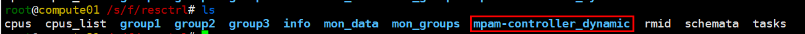

# 项目介绍<a name="ZH-CN_TOPIC_0000002440791696"></a>

鲲鹏云原生项目集合，包含多个针对鲲鹏处理器优化的云原生组件。

# 版本说明<a name="ZH-CN_TOPIC_0000002441456462"></a>

**表 1**  版本说明

<a name="table1911819583242"></a>
<table><thead align="left"><tr id="row81181558182420"><th class="cellrowborder" valign="top" width="26.640000000000004%" id="mcps1.2.4.1.1"><p id="p613134819116"><a name="p613134819116"></a><a name="p613134819116"></a>项目名</p>
</th>
<th class="cellrowborder" valign="top" width="19.61%" id="mcps1.2.4.1.2"><p id="p2011865842412"><a name="p2011865842412"></a><a name="p2011865842412"></a>版本</p>
</th>
<th class="cellrowborder" valign="top" width="53.75%" id="mcps1.2.4.1.3"><p id="p611895822414"><a name="p611895822414"></a><a name="p611895822414"></a>说明</p>
</th>
</tr>
</thead>
<tbody><tr id="row1011813587244"><td class="cellrowborder" valign="top" width="26.640000000000004%" headers="mcps1.2.4.1.1 "><p id="p2131348121110"><a name="p2131348121110"></a><a name="p2131348121110"></a>K8s MPAM Controller</p>
</td>
<td class="cellrowborder" valign="top" width="19.61%" headers="mcps1.2.4.1.2 "><p id="p19118125872412"><a name="p19118125872412"></a><a name="p19118125872412"></a>0.1.0</p>
</td>
<td class="cellrowborder" valign="top" width="53.75%" headers="mcps1.2.4.1.3 "><a name="ul14988152791610"></a><a name="ul14988152791610"></a><ul id="ul14988152791610"><li>支持K8s中MPAM纳管Pod。</li><li>在离线混部场景下，支持动态限制离线业务，保障在线业务。</li></ul>
</td>
</tr>
<tr id="row12424143501220"><td class="cellrowborder" valign="top" width="26.640000000000004%" headers="mcps1.2.4.1.1 "><p id="p16424173581216"><a name="p16424173581216"></a><a name="p16424173581216"></a>Kunpeng Topology Aware Plugin</p>
</td>
<td class="cellrowborder" valign="top" width="19.61%" headers="mcps1.2.4.1.2 "><p id="p12424133531215"><a name="p12424133531215"></a><a name="p12424133531215"></a>v0.3（待发布）</p>
</td>
<td class="cellrowborder" valign="top" width="53.75%" headers="mcps1.2.4.1.3 "><p id="p142553511210"><a name="p142553511210"></a><a name="p142553511210"></a>-</p>
</td>
</tr>
</tbody>
</table>

# 环境部署<a name="ZH-CN_TOPIC_0000002441616318"></a>


## Kunpeng TAP（Topology Aware Plugin）<a name="ZH-CN_TOPIC_0000002441675240"></a>

**硬件要求<a name="section8119658132416"></a>**

硬件要求如[表1](#table1911819583242)所示。

**表 1**  硬件要求

<a name="table1911819583242"></a>
<table><thead align="left"><tr id="row81181558182420"><th class="cellrowborder" valign="top" width="28.000000000000004%" id="mcps1.2.3.1.1"><p id="p2011865842412"><a name="p2011865842412"></a><a name="p2011865842412"></a>项目</p>
</th>
<th class="cellrowborder" valign="top" width="72%" id="mcps1.2.3.1.2"><p id="p611895822414"><a name="p611895822414"></a><a name="p611895822414"></a>说明</p>
</th>
</tr>
</thead>
<tbody><tr id="row1011813587244"><td class="cellrowborder" valign="top" width="28.000000000000004%" headers="mcps1.2.3.1.1 "><p id="p19118125872412"><a name="p19118125872412"></a><a name="p19118125872412"></a>处理器</p>
</td>
<td class="cellrowborder" valign="top" width="72%" headers="mcps1.2.3.1.2 "><p id="p211865813245"><a name="p211865813245"></a><a name="p211865813245"></a><span id="ph2083215281714"><a name="ph2083215281714"></a><a name="ph2083215281714"></a>鲲鹏920系列处理器</span></p>
</td>
</tr>
</tbody>
</table>

**软件要求<a name="section2021616722519"></a>**

软件要求如[表2](#table18216177162517)所示。

**表 2**  软件要求

<a name="table18216177162517"></a>
<table><thead align="left"><tr id="row102141372254"><th class="cellrowborder" valign="top" width="27.92%" id="mcps1.2.4.1.1"><p id="p152141075252"><a name="p152141075252"></a><a name="p152141075252"></a>项目</p>
</th>
<th class="cellrowborder" valign="top" width="33.52%" id="mcps1.2.4.1.2"><p id="p62140742515"><a name="p62140742515"></a><a name="p62140742515"></a>版本</p>
</th>
<th class="cellrowborder" valign="top" width="38.56%" id="mcps1.2.4.1.3"><p id="p1521411711250"><a name="p1521411711250"></a><a name="p1521411711250"></a>获取方法</p>
</th>
</tr>
</thead>
<tbody><tr id="row15611759195712"><td class="cellrowborder" rowspan="2" valign="top" width="27.92%" headers="mcps1.2.4.1.1 "><p id="p992185413314"><a name="p992185413314"></a><a name="p992185413314"></a>OS</p>
</td>
<td class="cellrowborder" valign="top" width="33.52%" headers="mcps1.2.4.1.2 "><p id="p49919297200"><a name="p49919297200"></a><a name="p49919297200"></a><span>openEuler 20.03 LTS SP3</span></p>
</td>
<td class="cellrowborder" valign="top" width="38.56%" headers="mcps1.2.4.1.3 "><p id="p3969416751"><a name="p3969416751"></a><a name="p3969416751"></a><a href="https://repo.openeuler.org/openEuler-20.03-LTS-SP3/ISO/aarch64/" target="_blank" rel="noopener noreferrer">获取链接</a></p>
</td>
</tr>
<tr id="row97069209545"><td class="cellrowborder" valign="top" headers="mcps1.2.4.1.1 "><p id="p17071120105415"><a name="p17071120105415"></a><a name="p17071120105415"></a>openEuler 22.03 LTS SP4</p>
</td>
<td class="cellrowborder" valign="top" headers="mcps1.2.4.1.2 "><p id="p3633721452"><a name="p3633721452"></a><a name="p3633721452"></a><a href="https://repo.openeuler.org/openEuler-22.03-LTS-SP4/ISO/aarch64/" target="_blank" rel="noopener noreferrer">获取链接</a></p>
</td>
</tr>
<tr id="row17307111824410"><td class="cellrowborder" valign="top" width="27.92%" headers="mcps1.2.4.1.1 "><p id="p12134123815817"><a name="p12134123815817"></a><a name="p12134123815817"></a>Kunpeng TAP源代码</p>
</td>
<td class="cellrowborder" valign="top" width="33.52%" headers="mcps1.2.4.1.2 "><p id="p1634252516559"><a name="p1634252516559"></a><a name="p1634252516559"></a>release-0.2</p>
</td>
<td class="cellrowborder" valign="top" width="38.56%" headers="mcps1.2.4.1.3 "><p id="p1716882610513"><a name="p1716882610513"></a><a name="p1716882610513"></a><a href="https://gitee.com/kunpeng_compute/topo-affinity-plugin.git" target="_blank" rel="noopener noreferrer">获取链接</a></p>
</td>
</tr>
<tr id="row1821519714251"><td class="cellrowborder" valign="top" width="27.92%" headers="mcps1.2.4.1.1 "><p id="p421412715250"><a name="p421412715250"></a><a name="p421412715250"></a>Golang</p>
</td>
<td class="cellrowborder" valign="top" width="33.52%" headers="mcps1.2.4.1.2 "><p id="p821513752520"><a name="p821513752520"></a><a name="p821513752520"></a>1.23+</p>
</td>
<td class="cellrowborder" valign="top" width="38.56%" headers="mcps1.2.4.1.3 "><p id="p1021518792513"><a name="p1021518792513"></a><a name="p1021518792513"></a>二进制包安装</p>
</td>
</tr>
<tr id="row121801256182211"><td class="cellrowborder" valign="top" width="27.92%" headers="mcps1.2.4.1.1 "><p id="p748691616198"><a name="p748691616198"></a><a name="p748691616198"></a>Make</p>
</td>
<td class="cellrowborder" valign="top" width="33.52%" headers="mcps1.2.4.1.2 "><p id="p9486111641912"><a name="p9486111641912"></a><a name="p9486111641912"></a>-</p>
</td>
<td class="cellrowborder" valign="top" width="38.56%" headers="mcps1.2.4.1.3 "><p id="p4927133881917"><a name="p4927133881917"></a><a name="p4927133881917"></a>通过配置Yum源安装</p>
</td>
</tr>
</tbody>
</table>

**编译插件<a name="section14380431101311"></a>**

编译Kunpeng TAP源代码并生成插件可执行文件。

1.  获取Kunpeng TAP源代码，在标签中获取最新发布的release-0.2版本。

    ```
    git clone --branch release-0.2 https://gitee.com/kunpeng_compute/topo-affinity-plugin.git
    ```

2.  进入“topo-affinity-plugin“目录，并执行构建插件的脚本。

    ```
    cd /path/to/topo-affinity-plugin
    go mod tidy
    make build
    ```

    其中“/path/to/topo-affinity-plugin“为插件源码的实际路径，请根据实际情况修改。

    构建完成后，请确认在“bin“目录下生成kunpeng-tap二进制文件。

## K8s MPAM Controller<a name="ZH-CN_TOPIC_0000002475075173"></a>

**环境依赖<a name="section94010535258"></a>**

-   Go 1.23.6或更高版本
-   Linux环境（推荐openEuler 22.03）
-   支持MPAM的硬件平台（推荐鲲鹏处理器）

**编译Docker镜像<a name="section34166302913"></a>**

```
make mpam-docker
```

如果K8s集群使用的是containerd作为容器运行时，需要把镜像手动导入到containerd的镜像仓库。

```
docker save k8s-mpam-controller:0.1.0 -o k8s-mpam-controller.tar
ctr -n k8s.io images import k8s-mpam-controller.tar
```

# 快速上手<a name="ZH-CN_TOPIC_0000002474856269"></a>


## Kunpeng TAP（Topology Aware Plugin）<a name="ZH-CN_TOPIC_0000002475098685"></a>

**部署插件<a name="section03521240101415"></a>**

在目标计算节点部署Kunpeng TAP，并且验证插件的运行状态。

Kunpeng TAP的运行依赖于K8s集群，当前支持使用Dockershim通信方式的Docker和Containerd。在部署该插件之前，需确保K8s集群已完成正确的网络配置，并且能够顺利部署和运行容器实例。

1.  在目标计算节点导入Kunpeng TAP的可执行文件。
2.  <a name="li1795401917439"></a>启动Kunpeng TAP。

    **启动方式一：**systemd启动。可直接进入源代码目录下，通过**make**命令安装和启动。

    1.  进入源代码目录。

        ```
        cd /path/to/topology-affinity-plugin
        ```

        其中“/path/to/topology-affinity-plugin“为Kunpeng TAP源码的实际路径，请根据实际情况修改。

    2.  安装插件，默认以Docker模式启动。

        ```
        make install-service
        ```

    3.  指定运行时为Docker，运行如下安装命令。

        ```
        make install-service-docker
        ```

        如果需要修改启动参数，则在源代码目录下的“hack/kunpeng-tap.service.docker“文件的“ExecStart=“下进行修改：

        ```
        [Unit]
        Description=Kunpeng Topology-Affinity Plugin Service
        After=network.target
        
        [Service]
        ExecStart=/usr/local/bin/kunpeng-tap --runtime-proxy-endpoint="/var/run/kunpeng/tap-runtime-proxy.sock" \
            --container-runtime-service-endpoint="/var/run/docker.sock" --container-runtime-mode="Docker" \
            --resource-policy="numa-aware"
        Restart=always
        RestartSec=5
        
        [Install]
        WantedBy=multi-user.target
        ```

        >**说明：**
        >指定运行时为Containerd，运行如下安装命令，参数配置可在源代码目录下的“hack/kunpeng-tap.service.containerd“文件中修改。
        >```
        >make install-service-containerd
        >```

    4.  安装完毕后，借助如下命令启动插件，并且自动查看启动后的服务状态。

        ```
        make start-service
        ```

    5.  查看日志信息。

        ```
        journalctl -u kunpeng-tap
        ```

    **启动方式二：**直接启动。

    -   Docker运行时下的启动命令，示例如下：

        ```
        kunpeng-tap --runtime-proxy-endpoint="/var/run/kunpeng/tap-runtime-proxy.sock" \
            --container-runtime-service-endpoint="/var/run/docker.sock" --container-runtime-mode="Docker" \
            --resource-policy="numa-aware"
        ```

    -   Containerd运行时下的启动命令，示例如下：

        ```
        kunpeng-tap --runtime-proxy-endpoint="/var/run/kunpeng/tap-runtime-proxy.sock" \
            --container-runtime-service-endpoint="/var/run/containerd/containerd.sock" --container-runtime-mode="Containerd" \
            --resource-policy="numa-aware"
        ```

    >**说明：**
    >用户可根据需求修改相关参数后启动。参数说明见[表1](#table105725712163)。

    **表 1**  参数说明

    <a name="table105725712163"></a>
    <table><thead align="left"><tr id="row10573770161"><th class="cellrowborder" valign="top" width="20.5%" id="mcps1.2.5.1.1"><p id="p13352104118163"><a name="p13352104118163"></a><a name="p13352104118163"></a>参数名称</p>
    </th>
    <th class="cellrowborder" valign="top" width="51.93000000000001%" id="mcps1.2.5.1.2"><p id="p535284121611"><a name="p535284121611"></a><a name="p535284121611"></a>参数描述</p>
    </th>
    <th class="cellrowborder" valign="top" width="10.3%" id="mcps1.2.5.1.3"><p id="p136571189517"><a name="p136571189517"></a><a name="p136571189517"></a>默认值</p>
    </th>
    <th class="cellrowborder" valign="top" width="17.270000000000003%" id="mcps1.2.5.1.4"><p id="p1460410219118"><a name="p1460410219118"></a><a name="p1460410219118"></a>配置原则</p>
    </th>
    </tr>
    </thead>
    <tbody><tr id="row1357377131611"><td class="cellrowborder" valign="top" width="20.5%" headers="mcps1.2.5.1.1 "><p id="p716171411176"><a name="p716171411176"></a><a name="p716171411176"></a>container-runtime-mode</p>
    </td>
    <td class="cellrowborder" valign="top" width="51.93000000000001%" headers="mcps1.2.5.1.2 "><p id="p316181411713"><a name="p316181411713"></a><a name="p316181411713"></a>插件对接的容器运行时，对应集群运行时设置Docker或Containerd。</p>
    </td>
    <td class="cellrowborder" valign="top" width="10.3%" headers="mcps1.2.5.1.3 "><p id="p1816171431710"><a name="p1816171431710"></a><a name="p1816171431710"></a>Docker</p>
    </td>
    <td class="cellrowborder" valign="top" width="17.270000000000003%" headers="mcps1.2.5.1.4 "><p id="p31521417172"><a name="p31521417172"></a><a name="p31521417172"></a>依照K8s集群使用的容器运行时决定</p>
    </td>
    </tr>
    <tr id="row1757316741612"><td class="cellrowborder" valign="top" width="20.5%" headers="mcps1.2.5.1.1 "><p id="p101591411170"><a name="p101591411170"></a><a name="p101591411170"></a>resource-policy</p>
    </td>
    <td class="cellrowborder" valign="top" width="51.93000000000001%" headers="mcps1.2.5.1.2 "><p id="p01551124165916"><a name="p01551124165916"></a><a name="p01551124165916"></a>容器资源的优化策略，目前支持numa-aware和topology-aware。</p>
    <a name="ul1958981910598"></a><a name="ul1958981910598"></a><ul id="ul1958981910598"><li>numa-aware策略支持Burstable类型容器进行CPU的NUMA亲和。</li><li>topology-aware策略提供Socket、Die、NUMA等拓扑层次的CPU亲和，额外支持内存、GPU资源的优化。</li></ul>
    </td>
    <td class="cellrowborder" valign="top" width="10.3%" headers="mcps1.2.5.1.3 "><p id="p171481414179"><a name="p171481414179"></a><a name="p171481414179"></a>numa-aware</p>
    </td>
    <td class="cellrowborder" valign="top" width="17.270000000000003%" headers="mcps1.2.5.1.4 "><p id="p18761721103016"><a name="p18761721103016"></a><a name="p18761721103016"></a>依照需求进行选择</p>
    </td>
    </tr>
    <tr id="row8873408361"><td class="cellrowborder" valign="top" width="20.5%" headers="mcps1.2.5.1.1 "><p id="p188144053617"><a name="p188144053617"></a><a name="p188144053617"></a>enable-memory-topology</p>
    </td>
    <td class="cellrowborder" valign="top" width="51.93000000000001%" headers="mcps1.2.5.1.2 "><p id="p11714757113619"><a name="p11714757113619"></a><a name="p11714757113619"></a>启用topology-aware策略后（设置<span class="parmvalue" id="parmvalue76100434148"><a name="parmvalue76100434148"></a><a name="parmvalue76100434148"></a>“--resource-policy=topology-aware”</span>），内存资源的NUMA优化功能默认关闭，如需开启容器内存的NUMA亲和功能，则设置<span class="parmvalue" id="parmvalue17242135471413"><a name="parmvalue17242135471413"></a><a name="parmvalue17242135471413"></a>“--enable-memory-topology=true”</span>。</p>
    </td>
    <td class="cellrowborder" valign="top" width="10.3%" headers="mcps1.2.5.1.3 "><p id="p38811403360"><a name="p38811403360"></a><a name="p38811403360"></a>false</p>
    </td>
    <td class="cellrowborder" valign="top" width="17.270000000000003%" headers="mcps1.2.5.1.4 "><p id="p388104019369"><a name="p388104019369"></a><a name="p388104019369"></a>暂处于Alpha阶段</p>
    </td>
    </tr>
    <tr id="row7164174661720"><td class="cellrowborder" valign="top" width="20.5%" headers="mcps1.2.5.1.1 "><p id="p18165114601711"><a name="p18165114601711"></a><a name="p18165114601711"></a>v</p>
    </td>
    <td class="cellrowborder" valign="top" width="51.93000000000001%" headers="mcps1.2.5.1.2 "><p id="p10165146101717"><a name="p10165146101717"></a><a name="p10165146101717"></a>日志信息等级，调整范围2至5。</p>
    </td>
    <td class="cellrowborder" valign="top" width="10.3%" headers="mcps1.2.5.1.3 "><p id="p18165114621718"><a name="p18165114621718"></a><a name="p18165114621718"></a>2</p>
    </td>
    <td class="cellrowborder" valign="top" width="17.270000000000003%" headers="mcps1.2.5.1.4 "><p id="p4165846131715"><a name="p4165846131715"></a><a name="p4165846131715"></a>等级越高，日志输出越详细</p>
    </td>
    </tr>
    </tbody>
    </table>

3.  在计算节点配置Kubelet参数。

    为了让Kunpeng TAP成功代理Kubelet的请求，需要在Kubelet的命令行配置中增加如下参数。

    -   在Docker场景下，在Kubelet启动参数中添加或修改对应参数项如下所示。

        ```
        --docker-endpoint=unix:///var/run/kunpeng/tap-runtime-proxy.sock
        ```

        以使用kubeadm安装集群为例，可以在“/var/lib/kubelet/kubeadm-flags.env“添加参数。

        ```
        KUBELET_KUBEADM_ARGS="--network-plugin=cni --pod-infra-container-image=k8s.gcr.io/pause:3.6 --docker-endpoint=unix:///var/run/kunpeng/tap-runtime-proxy.sock"
        ```

        注意，修改Kubelet参数后，须运行如下命令重新启动Kubelet。

        ```
        systemctl daemon-reload
        systemctl restart kubelet
        ```

    -   在Containerd场景下，修改Kubelet的启动参数。

        ```
        --container-runtime=remote --container-runtime-endpoint=unix:///var/run/kunpeng/tap-runtime-proxy.sock
        ```

        此时，“/var/lib/kubelet/kubeadm-flags.env“的参数示例可能是：

        ```
        KUBELET_KUBEADM_ARGS="--network-plugin=cni --pod-infra-container-image=k8s.gcr.io/pause:3.6 --container-runtime=remote --container-runtime-endpoint=unix:///var/run/kunpeng/tap-runtime-proxy.sock"
        ```

        注意，修改Kubelet参数后，须运行如下命令重新启动Kubelet。

        ```
        systemctl daemon-reload
        systemctl restart kubelet
        ```

**使用TAP插件<a name="section13759133761517"></a>**

Kunpeng TAP允许在部署Pod时指定CPU资源需求，系统将自动按NUMA亲和性分配资源。通过编写YAML文件并指定节点选择器，可以将Pod部署到特定节点上。成功部署插件后，只需在部署其他Pod时指定CPU资源的request和limit值，系统将自动按照NUMA亲和性原则进行资源分配。

以下为部署一个单容器Pod的YAML文件示例，供用户参考。该Pod请求的CPU资源最小值为4核，最大值为8核，内存固定为4Gi，容器使用busybox作为镜像。

1.  创建YAML文件，例如example.yaml，并在YAML文件中写入以下配置。

    ```
    apiVersion: v1
    kind: Pod
    metadata:
      name: tap-test
      annotations:
    spec:
      containers:
      - name: tap-example
        image: busybox:latest
        imagePullPolicy: IfNotPresent
        command: ["/bin/sh"]
        args: ["-c", "while true; do echo `date`; sleep 5; done"]
        resources:
          requests:
            cpu: "4"
            memory: "4Gi"
          limits:
            cpu: "8"
            memory: "4Gi"
    ```

2.  以指定Pod在**compute01**节点上运行为例，需要在YAML文件中的**spec**部分加入以下内容。

    >**说明：**
    >在多个工作节点的K8s集群中，Pod可能会被调度到不同节点的NUMA内。如果希望Pod在指定的节点上运行，只需在YAML文件的**spec**部分加入**nodeSelector**字段，并指定**kubernetes.io/hostname**为目标节点的名称。

    ```
      nodeSelector:
        kubernetes.io/hostname: compute01
    ```

3.  在管理节点应用YAML文件，完成Pod部署。

    ```
    kubectl apply -f example.yaml
    ```

4.  判断Kunpeng TAP是否生效。
    1.  以Docker运行时为例，进入步骤[2](#li1795401917439)中**nodeSelector**所指定的集群节点_compute01_后，通过**docker**命令查询容器的CpusetCpus参数，判断容器是否与NUMA成功亲和。
    2.  通过**docker ps**查询集群节点运行的容器任务，在**NAMES**列中找到步骤一中“spec.containers.name“指定的_nri-1_容器。

        ```
        # docker ps | grep nri-1
        CONTAINER ID   IMAGE                  COMMAND                  CREATED       STATUS       PORTS     NAMES
        ```

    3.  依据_CONTAINER ID_查询目标容器的部署参数_CpusetCpus_，该参数表示容器的可调度CPU范围。

        ```
        # docker inspect bf32de0d09fe | grep "CpusetCpus"
                    "CpusetCpus": "0-23",
        ```

        如果启用了内存绑定功能，可以通过如下命令查看，注意其取值表示节点的编号。

        ```
        # docker inspect bf32de0d09fe | grep "CpusetMems"
                    "CpusetMems": "0",
        ```

        >**说明：**
        >在不同的机器上查看时，绑定的NUMA节点不固定，_CpusetCpus_数字可能不一致。

        Containerd运行时可以运行如下命令查看容器的可调度CPU范围。

        ```
        # crictl inspect bf32de0d09fe | grep "cpuset_cpus"
                    "cpuset_cpus": "0-23",
        ```

        如果NUMA节点亲和失败，则可能无法查找到cpuset\_cpus输出。

    4.  查询系统的NUMA信息，与上述的容器可调度CPU范围进行对比，一致则表示亲和于对应NUMA节点。

        ```
        # lscpu
        ...
        NUMA node0 CPU(s):               0-23
        NUMA node1 CPU(s):               24-47
        NUMA node2 CPU(s):               48-71
        NUMA node3 CPU(s):               72-95
        ...
        ```

        “node0“表示编号为“0“的NUMA节点，“0-23“表示NUMA节点内的CPU编号。

5.  此外，对于系统中GPU的NUMA分布，可以运行如下命令查看，其中“0200“为网卡设备号。

    ```
    lspci -vvv -d :0200 | grep NUMA
    ```

    回显如下所示：

    ```
    NUMA node: 0
    NUMA node: 0
    NUMA node: 0
    NUMA node: 0
    NUMA node: 0
    NUMA node: 2
    NUMA node: 2
    NUMA node: 2
    NUMA node: 2
    NUMA node: 2
    ```

## K8s MPAM Controller<a name="ZH-CN_TOPIC_0000002441858770"></a>

**部署插件<a name="section24721531114518"></a>**

1.  在部署插件之前要先确保MPAM的resctrl文件系统已经挂载，在**worker节点**使用如下命令可以挂载。

    ```
    mount -t resctrl resctrl /sys/fs/resctrl
    ```

2.  在**master节点**上执行如下命令部署插件。

    ```
    cd config/k8s-mpam-controller-config/samples
    kubectl apply -f k8s-mpam-controller.yaml
    ```

3.  查看MPAM插件对应的Pod是否正常运行。

    ```
    kubectl get pods
    ```

    正常运行可能的回显如下。

    ```
    NAME                                    READY   STATUS    RESTARTS   AGE
    mpam-controller-daemonset-agent-bj2gv   1/1     Running   0          143m
    ```

**创建MPAM资源组<a name="section18443344816"></a>**

当需要对Pod进行资源限制时，需要创建MPAM资源组。

1.  进入“samples“目录，修改MPAM资源组的配置文件（.yaml格式），以example-config.yaml为例。

    在example-config.yaml文件中，Node资源组包括如[表1](#table8171211407)所示3种不同级别的配置，用户可以通过ConfigMap为Node节点或一组节点创建配置。创建配置后，MPAM插件将管理Kubernetes集群中的ConfigMap，并在添加或更新ConfigMap后将配置自动应用到相应的节点。

    **表 1**  配置类型及其说明

    <a name="table8171211407"></a>
    <table><thead align="left"><tr id="row41712012020"><th class="cellrowborder" valign="top" width="17.09%" id="mcps1.2.4.1.1"><p id="p41715112015"><a name="p41715112015"></a><a name="p41715112015"></a>配置类型</p>
    </th>
    <th class="cellrowborder" valign="top" width="32.910000000000004%" id="mcps1.2.4.1.2"><p id="p201712118017"><a name="p201712118017"></a><a name="p201712118017"></a>配置名称</p>
    </th>
    <th class="cellrowborder" valign="top" width="50%" id="mcps1.2.4.1.3"><p id="p4171611105"><a name="p4171611105"></a><a name="p4171611105"></a>配置说明</p>
    </th>
    </tr>
    </thead>
    <tbody><tr id="row191711311407"><td class="cellrowborder" valign="top" width="17.09%" headers="mcps1.2.4.1.1 "><p id="p1917117117013"><a name="p1917117117013"></a><a name="p1917117117013"></a>node配置</p>
    </td>
    <td class="cellrowborder" valign="top" width="32.910000000000004%" headers="mcps1.2.4.1.2 "><p id="p1417111205"><a name="p1417111205"></a><a name="p1417111205"></a>rc-config.node.{NODE_NAME}</p>
    </td>
    <td class="cellrowborder" valign="top" width="50%" headers="mcps1.2.4.1.3 "><p id="p3171101607"><a name="p3171101607"></a><a name="p3171101607"></a>该配置提供了名为Node_NAME的节点的配置。</p>
    </td>
    </tr>
    <tr id="row151718113017"><td class="cellrowborder" valign="top" width="17.09%" headers="mcps1.2.4.1.1 "><p id="p9171411005"><a name="p9171411005"></a><a name="p9171411005"></a>node group配置</p>
    </td>
    <td class="cellrowborder" valign="top" width="32.910000000000004%" headers="mcps1.2.4.1.2 "><p id="p1217151900"><a name="p1217151900"></a><a name="p1217151900"></a>rc-config.group.{GROUP_NAME}</p>
    </td>
    <td class="cellrowborder" valign="top" width="50%" headers="mcps1.2.4.1.3 "><p id="p141711018020"><a name="p141711018020"></a><a name="p141711018020"></a>可以通过“ngroup”标签将Node节点加到对应的组中。例如，如果某个Node节点含有“ngroup=grp1”的标签，那么该节点就属于Node组grp1。如果Node节点特定的ConfigMap rc-config.node.{NODE_NAME}不存在，但节点属于名为{GROUP_NAME}的节点组，则将应用名称为<span class="parmname" id="parmname51717119012"><a name="parmname51717119012"></a><a name="parmname51717119012"></a>“rc-config.group.{GROUP_NAME}”</span>的ConfigMap。</p>
    </td>
    </tr>
    <tr id="row191719118017"><td class="cellrowborder" valign="top" width="17.09%" headers="mcps1.2.4.1.1 "><p id="p2171131001"><a name="p2171131001"></a><a name="p2171131001"></a>默认配置</p>
    </td>
    <td class="cellrowborder" valign="top" width="32.910000000000004%" headers="mcps1.2.4.1.2 "><p id="p51721219014"><a name="p51721219014"></a><a name="p51721219014"></a>rc-config.default</p>
    </td>
    <td class="cellrowborder" valign="top" width="50%" headers="mcps1.2.4.1.3 "><p id="p017216115010"><a name="p017216115010"></a><a name="p017216115010"></a>如果节点不属于任何节点组，并且节点特定的ConfigMap不存在，则将应用名称为<span class="parmname" id="parmname1217291703"><a name="parmname1217291703"></a><a name="parmname1217291703"></a>“rc-config.default”</span>的ConfigMap。</p>
    </td>
    </tr>
    </tbody>
    </table>

    1.  打开文件。

        ```
        cd samples
        vi example-config.yaml
        ```

    2.  按“i“进入编辑模式，在文件中修改name字段指定为[表1](#table8171211407)中的实际配置名称，将mpam字段下添加对应的资源组信息。

        ```
        apiVersion: v1
        kind: ConfigMap
        metadata:
          name: ${CONFIG_NAME}
          namespace: rc-config
        data:
          rc.conf: |
            mpam:
              group1:
                llc: <schemata>
                mb: <schemata>
              group2:
                llc: <schemata>
                mb: <schemata>
              group3:
                llc: <schemata>
                mb: <schemata>
        ```

        >**说明：**
        >-   最多可以设置32个资源组（根分组默认占一个资源组，根分组下最多实际只能创建出31个资源组），每条<schemata\>必须要满足语法规则。
        >-   如果某个资源组中没有对某一项进行配置或者已配置的配置项不满足语法规则，该资源组将使用该配置项的默认配置。L3 cache的默认配置为**"L3:0=fffffff;1=fffffff;2=fffffff;3=fffffff"**；带宽的默认配置为**"MB:0=100;1=100;2=100;3=100"**

    3.  按“Esc“键退出编辑模式，输入**:wq!**，按“Enter“键保存并退出文件。

2.  在“samples“目录下，应用example-config.yaml文件以创建ConfigMap。

    ```
    kubectl apply -f example-config.yaml
    ```

3.  在Node节点上，进入“/sys/fs/resctrl“目录，查看资源组是否已创建，以及对应的资源组配置是否和example-config.yaml中的一致。

    ```
    cd /sys/fs/resctrl
    ls
    ```

    >**说明：**
    >例如，可以通过以下命令查看资源组group1的配置。
    >```
    >cat group1/schemata
    >```

**创建Pod并指定资源组<a name="section582623085216"></a>**

当需要将某个Pod加入到某个资源组中时，需要在创建Pod时指定资源组。

1.  修改Pod的配置文件（.yaml格式），以example-pod.yaml为例。
    1.  进入“samples“目录，打开example-pod.yaml文件。

        ```
        cd samples
        vi example-pod.yaml
        ```

    2.  按“i“进入编辑模式，在配置文件中分别添加如下信息。

        ```
        labels:
            rcgroup: group2
        ```

        ```
        nodeSelector:
            MPAM: enabled
        ```

        >**说明：**
        >-   在**labels**字段中通过rcgroup字段指定对应的资源组，例如将Pod加到**group2**中。
        >-   在**nodeSelector**字段中增加**MPAM：enabled**，用于调度器将该Pod调度到支持MPAM特性的节点上去。

        修改后的example-pod.yaml文件如下所示。

        ```
        apiVersion: v1
        kind: Pod
        metadata:
          name: nginx
          labels:
            rcgroup: group2
        spec:
          containers:
          - name: nginx
            image: nginx:1.16.1
            ports:
            - containerPort: 80
              hostPort: 8088
          nodeSelector:
            MPAM: enabled
        ```

    3.  按“Esc“键退出编辑模式，输入**:wq!**，按“Enter“键保存并退出文件。

2.  创建Pod。

    ```
    kubectl apply -f example-pod.yaml
    ```

3.  在Node节点上，进入“/sys/fs/resctrl“目录，再进入Pod所属的资源组中（例如Pod属于资源组group1），可以在资源组中查看对应的配置以及监控数据，还可以查看当前资源组下被限制应用的pid。

    ```
    cd /sys/fs/resctrl/group1
    ```

    -   通过以下命令查看资源组的配置。

        ```
        cat schemata
        ```

    -   通过以下命令查看该资源组下的pid。

        ```
        cat tasks
        ```

    -   通过以下命令查看资源组下的监控数据。

        ```
        grep . mon_data/*
        ```

**使用动态MPAM隔离功能<a name="section6968124245311"></a>**

当需要动态调整某些离线业务的资源使用量时可以使用动态MPAM隔离功能。

**（可选）配置动态MPAM隔离参数<a name="section182321957145418"></a>**

插件提供了默认配置，如果不配置configMap同样可以使用动态MPAM隔离功能。MPAM动态隔离参数通过json文件配置，参数含义请参见[表2](#table116484132237)。如果需要手动更改配置参考下面内容进行配置。

```
 {
      "mpamConfig":{
        "adjustInterval": 5000,
        "perfDuration": 3000,
        "l3Percent": {
          "low": 20,
          "high": 50
        },
        "memBandPercent": {
          "low": 10,
          "high": 50
        },
        "cacheMiss": {
          "minMiss": 10,
          "maxMiss": 50
        }
      }
    }
```

**表 2**  MPAM动态隔离参数说明

<a name="table116484132237"></a>
<table><thead align="left"><tr id="row46491113142313"><th class="cellrowborder" valign="top" width="19.39%" id="mcps1.2.3.1.1"><p id="p864921318233"><a name="p864921318233"></a><a name="p864921318233"></a>参数名</p>
</th>
<th class="cellrowborder" valign="top" width="80.61%" id="mcps1.2.3.1.2"><p id="p9649151310232"><a name="p9649151310232"></a><a name="p9649151310232"></a>参数含义</p>
</th>
</tr>
</thead>
<tbody><tr id="row96498138233"><td class="cellrowborder" valign="top" width="19.39%" headers="mcps1.2.3.1.1 "><p id="p16649161316231"><a name="p16649161316231"></a><a name="p16649161316231"></a>adjustInterval</p>
</td>
<td class="cellrowborder" valign="top" width="80.61%" headers="mcps1.2.3.1.2 "><p id="p1264941315236"><a name="p1264941315236"></a><a name="p1264941315236"></a>每次动态调整之间的间隔，比如设置值为1000就是每隔1s执行一次动态调整。</p>
</td>
</tr>
<tr id="row32311937162315"><td class="cellrowborder" valign="top" width="19.39%" headers="mcps1.2.3.1.1 "><p id="p12232137132319"><a name="p12232137132319"></a><a name="p12232137132319"></a>perfDuration</p>
</td>
<td class="cellrowborder" valign="top" width="80.61%" headers="mcps1.2.3.1.2 "><p id="p152321375231"><a name="p152321375231"></a><a name="p152321375231"></a>perf采集指标的时间，比如设置1000就是每次perf采集就采集1s的数据。</p>
</td>
</tr>
<tr id="row184443193219"><td class="cellrowborder" valign="top" width="19.39%" headers="mcps1.2.3.1.1 "><p id="p084124333218"><a name="p084124333218"></a><a name="p084124333218"></a>l3Percent</p>
</td>
<td class="cellrowborder" valign="top" width="80.61%" headers="mcps1.2.3.1.2 "><p id="p08412439327"><a name="p08412439327"></a><a name="p08412439327"></a>动态调整过程中离线业务可以使用的L3Cache的最大值和最小值。比如设置low=20，high=50，那么在动态调整过程中离线业务最少可以使用20%的L3 CacheWay，最多可以使用50%的L3 CacheWay。</p>
</td>
</tr>
<tr id="row178752010355"><td class="cellrowborder" valign="top" width="19.39%" headers="mcps1.2.3.1.1 "><p id="p48722003512"><a name="p48722003512"></a><a name="p48722003512"></a>memBandPercent</p>
</td>
<td class="cellrowborder" valign="top" width="80.61%" headers="mcps1.2.3.1.2 "><p id="p287202023513"><a name="p287202023513"></a><a name="p287202023513"></a>动态调整过程中离线业务可以使用的内存带宽的最大值和最小值。比如设置low=10，high=50，那么在动态调整过程中离线业务最少可以使用10%的内存带宽，最多可以使用50%的内存带宽。</p>
</td>
</tr>
<tr id="row49915348386"><td class="cellrowborder" valign="top" width="19.39%" headers="mcps1.2.3.1.1 "><p id="p1399203483817"><a name="p1399203483817"></a><a name="p1399203483817"></a>cacheMiss</p>
</td>
<td class="cellrowborder" valign="top" width="80.61%" headers="mcps1.2.3.1.2 "><p id="p119927345381"><a name="p119927345381"></a><a name="p119927345381"></a>是否进行动态调整的判别依据。比如设置minMiss=10，maxMiss=50，那么当在线业务的Cache Miss率大于50%时就降低离线业务的可用资源量，当在线业务的Cache Miss率小于10%时就增加离线业务的可用资源量。</p>
</td>
</tr>
</tbody>
</table>

json文件通过configMap的形式进行配置，在k8s-mpam-controller.yaml文件中配置，完整的yaml文件如下。

```
apiVersion: v1
kind: ServiceAccount
metadata:
  name: mpam-controller-agent
---
apiVersion: rbac.authorization.k8s.io/v1
kind: ClusterRole
metadata:
  name: mpam-controller-agent
rules:
- apiGroups:
  - ""
  resources:
  - configmaps
  - pods
  verbs:
  - get
  - list
  - watch
- apiGroups:
  - ""
  resources:
  - nodes
  verbs:
  - get
  - list
  - patch
  - update
  - watch
---
apiVersion: rbac.authorization.k8s.io/v1
kind: ClusterRoleBinding
metadata:
  name: mpam-controller-agent
roleRef:
  apiGroup: rbac.authorization.k8s.io
  kind: ClusterRole
  name: mpam-controller-agent
subjects:
- kind: ServiceAccount
  name: mpam-controller-agent
  namespace: default
---
apiVersion: v1
kind: ConfigMap
metadata:
  name: mpam-config
data:
  config.json: |
    {
      "mpamConfig":{
        "adjustInterval": 10000,
        "perfDuration": 3000,
        "l3Percent": {
          "low": 20,
          "high": 50
        },
        "memBandPercent": {
          "low": 10,
          "high": 50
        },
        "cacheMiss": {
          "minMiss": 10,
          "maxMiss": 30
        }
      }
    }
---
apiVersion: apps/v1
kind: DaemonSet
metadata:
  name: mpam-controller-daemonset-agent
spec:
  selector:
    matchLabels:
      app: k8s-mpam-controller-agent
  template:
    metadata:
      labels:
        app: k8s-mpam-controller-agent
    spec:
      serviceAccountName: mpam-controller-agent
      hostPID: true
      hostIPC: true
      containers:
      - name: k8s-mpam-controller-agent
        image: k8s-mpam-controller:0.1
        securityContext:
          privileged: true
        command: ["/usr/bin/agent"]
        args: ["-direct"]
        resources:
          limits:
            memory: 200Mi
          requests:
            cpu: 100m
            memory: 200Mi
        env:
        - name: NODE_NAME
          valueFrom:
            fieldRef:
              apiVersion: v1
              fieldPath: spec.nodeName
        volumeMounts:
        - name: resctrl
          mountPath: /sys/fs/resctrl/
        - name: hostname
          mountPath: /etc/hostname
        - name: sysfs
          mountPath: /sys/fs/cgroup/
        - name: config-volume
          mountPath: /var/lib/mpam-config
      volumes:
      - name: resctrl
        hostPath:
          path: /sys/fs/resctrl/
      - name: hostname
        hostPath:
          path: /etc/hostname
      - name: sysfs
        hostPath:
          path: /sys/fs/cgroup/
      - name: config-volume
        configMap:
          name: mpam-config
          items:
            - key: config.json
              path: config.json
```

使用动态MPAM隔离功能后插件会在“/sys/fs/resctrl“目录下创建mpam-controller\_dynamic目录，如下图所示。



**部署离线业务<a name="section28948105567"></a>**

1.  在Pod的yaml文件中添加注解kunpeng.com/offline: "true"，标记该Pod为离线业务，方便插件对其进行限制，示例bw-mem.yaml文件如下。

    ```
    apiVersion: v1
    kind: Pod
    metadata:
      name: bw-mem
      annotations:
        kunpeng.com/offline: "true"
    spec:
      containers:
      - name: bw-mem
        image: bw-mem:latest
        imagePullPolicy: IfNotPresent
        command: [ "/bin/sh", "-c", "--" ]
        args: [ "while true; do sleep 300000; done;" ]
        securityContext:
          capabilities:
            add: ["ALL"]
        resources:
          requests:
            cpu: "9.6"
          limits:
            cpu: "9.6"
    ```

2.  部署要进行限制的离线业务。

    ```
    kubectl apply -f bw-mem.yaml
    ```

    部署成功后离线业务的pid会被加入到mpam-controller\_dynamic控制组中的tasks。

3.  通过以下命令查看被限制的离线业务的pid。

    ```
    cd /sys/fs/resctrl/mpam-controller_dynamic
    cat tasks
    ```

# 贡献指南<a name="ZH-CN_TOPIC_0000002474936453"></a>

欢迎提交Issue和Pull Request来改进项目。请确保：

-   代码符合项目规范。
-   包含适当的测试。
-   更新相关文档。

# 免责声明<a name="ZH-CN_TOPIC_0000002441456466"></a>

本项目不含任何明示或暗示的担保，包括但不限于适销性、特定用途适用性及不侵权保证；在任何情况下，版权所有者或贡献者均不对因使用本软件而产生的任何直接、间接、特殊、附带或后果性损害负责。使用即视为同意上述条款。

# 许可证书<a name="ZH-CN_TOPIC_0000002441616326"></a>

本项目采用Apache License 2.0许可证。详见[LICENSE](https://gitcode.com/boostkit/cloud-native/blob/master/LICENSE)文件。

