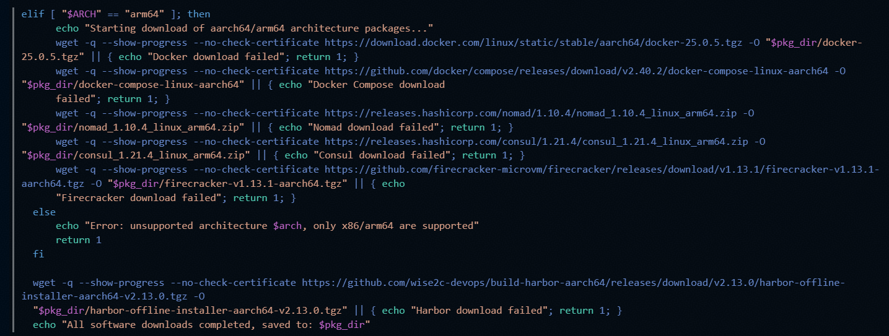
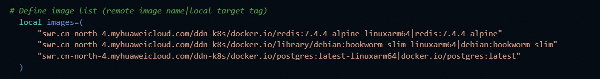
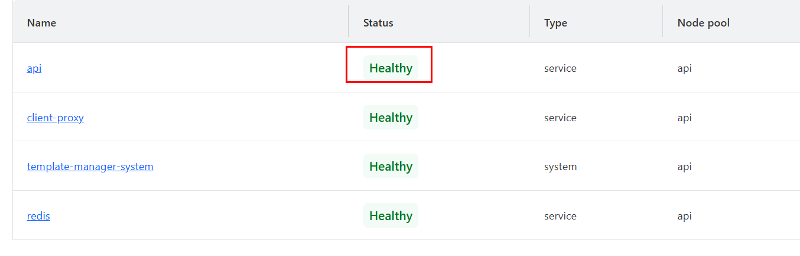

# E2B Deployment Guide

## Introduction

### Overview

English2Bits (E2B) is an open-source AI code sandbox platform that provides a secure and isolated code execution environment for AI agents. E2B supports quick creation and destruction of lightweight sandbox instances. Each sandbox runs in an independent container or VM, and the security of the execution environment is ensured through resource restriction and network isolation.

The core capabilities of the E2B management platform are as follows:

- **Sandbox orchestration**: Sandbox tasks are scheduled and their lifecycle is managed based on HashiCorp Nomad. Sandbox instances can be created and destroyed in batches based on templates.
- **Image repository**: Harbor is integrated as the container image repository to manage sandbox template images and runtime dependencies.
- **Service registration and discovery**: Consul is used to implement service registration, health check, and discovery of each component.
- **Configuration storage**: The PostgreSQL database is used to make sandbox configurations (such as timeout interval and maximum concurrency) persistent, and the configurations can be dynamically adjusted during runtime.
- **Template management**: `template-manager-system` defines and distributes sandbox templates, and resource quotas can be adjusted based on the service scale.

This document is intended for on-premises deployment and O&M personnel. It describes how to prepare the environment, install software, deploy services, modify configurations, verify services, and adjust resources for the E2B management platform on the Kunpeng Arm architecture.

### Version Requirements

**Table 1** Software versions

| Item| Version or Description| How to Obtain|
| --- | --- | --- |
| OS | openEuler 24.03 LTS SP3 AArch64| [openEuler 24.03 LTS SP3 AArch64](https://mirrors.huaweicloud.com/openeuler/openEuler-24.03-LTS-SP3/ISO/aarch64/openEuler-24.03-LTS-SP3-everything-aarch64-dvd.iso)|
| e2b-infra | `2026.09-3.oe2403sp3.aarch64` | [RPM package download](https://eulermaker.openeuler.openatom.cn/api/ems5/repositories/2403sp3/openEuler%3A24.03-LTS-SP3/aarch64/history/5bce9a46-4aad-11f1-a4a9-fa163e474048/last/Packages/e2b-infra-2026.09-3.oe2403sp3.aarch64.rpm)|
| Docker | Installed with the deployment script and used to pull and run images.| Use the Docker repository provided by the OS or onsite environment for installation.|
| PostgreSQL| Started in a container by using the E2B deployment script.| No separate installation is required. Execute the deployment script.|
| Harbor | Started in a container by using the E2B deployment script.| No separate installation is required. Execute the deployment script.|
| Nomad | Started by using the E2B deployment script.| No separate installation is required. Execute the deployment script.|
| Consul | Started by using the E2B deployment script.| No separate installation is required. Execute the deployment script.|

### Constraints

- This document uses the AArch64 architecture and openEuler 24.03 LTS SP3 as the basic environment.
- The `root` user or a user with equivalent permissions is required to install the RPM package, deploy services, and perform Docker operations.
- The deployment node must be able to access the addresses for downloading the RPM packages, dependent components, and Docker image repository. In an offline environment, you need to prepare the dependent packages and images in advance.
- The `4646` and `2900` ports must be enabled on the server for accessing Nomad and Harbor, respectively.
- If a Docker proxy is temporarily configured during the installation to pull images, the Docker proxy must be disabled before you run `bash build.sh --start`.
- E2B saves some configurations in PostgreSQL. After a sandbox is started, you can run SQL commands to adjust parameters such as the sandbox timeout interval and maximum concurrency.
- The upper limit of `template-manager-system` task resources needs to be adjusted based on the host machine resources and sandbox scale to prevent insufficient default resources from affecting concurrent sandbox running.

### Application Scenarios

- The E2B management platform is deployed on Kunpeng servers.
- E2B sandbox orchestration capabilities are provided for OpenClaw or other AI agent sandbox tasks.
- Nomad is used to check the running status of each E2B service.
- Harbor is used to manage E2B container images.
- The E2B timeout interval, maximum number of concurrent sandboxes, and resource upper limit are adjusted based on the number of sandboxes.

## Software Installation

### Environment Requirements

This document provides deployment guidance based on specific environments. Before performing operations, ensure that your hardware, OS, network, and ports meet the requirements.

**Table 2** Hardware requirements

| Item| Description|
| --- | --- |
| Processor architecture| `AArch64`. Kunpeng servers are recommended.|
| CPU | Planned based on the number of concurrent sandboxes. The more concurrent sandboxes, the more CPUs required for running Nomad tasks and sandboxes.|
| Memory| Planned based on the following formula: Memory of a single sandbox × Maximum number of sandboxes + Reserved memory for management components. It is recommended that 20 GB be reserved for `template-manager-system`.|
| Drive| The storage space must be sufficient for storing the RPM packages, dependency packages, Docker images, database data, sandbox templates, and run logs.|
| Network| The deployment node must be able to access the dependency and image repositories. If the deployment is performed offline, the dependency packages and images must be prepared in advance.|

**Table 3** OS and software requirements

| Item| Version or Requirement| Description|
| --- | --- | --- |
| OS | openEuler 24.03 LTS SP3 AArch64| Consistent with the version built by the RPM package.|
| RPM tool| Contained in the OS| Used to install `e2b-infra`.|
| Docker | Installed and running properly| The deployment script will pull and start Docker images.|
| wget | Installed| Used to download RPM packages.|
| bash | Installed| Used to execute `build.sh`.|
| Network port| `2900`, `4646`, `8500`, `5432`, `9000`, `9001`| Generally, `2900` and `4646` need to be opened to the O&M access end.|

**Table 4** Description of default ports

| Variable Name| Default Value| Meaning|
| --- | --- | --- |
| `PG_PORT` | `5432` | PostgreSQL container service port.|
| `MINIO_PORT` | `9000` | MinIO service port. MinIO is not required for single-node deployment.|
| `MINIO_CONSOLE_PORT` | `9001` | MinIO console port. MinIO is not required for single-node deployment.|
| `HARBOR_HTTP_PORT` | `2900` | Harbor service port. You can access the Harbor management system through `server_ip:2900`.|
| `NOMAD_PORT` | `4646` | Nomad service port. You can access the Nomad management system through `server_ip:4646`.|
| `NOMAD_HTTP_PORT` | `4646` | Nomad health check port.|
| `CONSUL_HTTP_PORT` | `8500` | Consul health check port.|

### Conducting a Pre-installation Check

1. Check the system architecture.

    ```bash
    uname -m
    ```

    Command description: Checks the current system architecture. The expected output is `aarch64`.

2. Check the OS version.

    ```bash
    cat /etc/os-release
    ```

    Command description: Checks the openEuler version information. Ensure that the environment matches openEuler 24.03 LTS SP3.

3. Check the Docker service status.

    ```bash
    systemctl status docker
    ```

    Command description: Checks that Docker has been installed and is running. If it is not running, start Docker first.

4. Check whether the key ports are occupied.

    ```bash
    ss -lntp | grep -E ':2900|:4646|:8500|:5432|:9000|:9001'
    ```

    Command description: Checks whether the default E2B ports are listened on by other processes. If a port is occupied, adjust the deployment configuration or release the port.

5. Check the current user permissions.

    ```bash
    id
    ```

    Command description: Checks whether the current user is the `root` user or has the execute permissions on RPM packages, Docker, and system service management.

### Installing the e2b-infra Software Package

This section describes how to install the E2B deployment scripts and basic files. After the installation is complete, the default installation directory is `/opt/e2b-infra`.

1. Download the RPM package.

    ```bash
    wget https://eulermaker.openeuler.openatom.cn/api/ems5/repositories/2403sp3/openEuler%3A24.03-LTS-SP3/aarch64/history/5f3f217a-2daa-11f1-9840-fa163e47408d/last/Packages/e2b-infra-2026.09-3.oe2403sp3.aarch64.rpm
    ```

    Command description: Downloads the `e2b-infra` RPM installation package from the openEuler build repository.

2. Uninstall the earlier version.

    ```bash
    rpm -e e2b-infra
    ```

    Command description: Uninstalls `e2b-infra` of the earlier version that has been installed in the system. If the earlier version is not installed in the system, a message indicating that the package is not installed may be displayed. In this case, proceed with the subsequent installation steps.

3. Install the new version.

    ```bash
    rpm -ivh e2b-infra-2026.09-3.oe2403sp3.aarch64.rpm
    ```

    Command description: Installs the specified RPM package. `-i` indicates installation, `-v` outputs detailed information, and `-h` displays the installation progress.

4. Check the installation directory.

    ```bash
    ls -l /opt/e2b-infra
    ```

    Command description: Checks whether the `/opt/e2b-infra` directory has been generated and whether the deployment script and configuration directory exist.

### Modifying the E2B Deployment Configuration

Before the deployment, you need to modify the `/opt/e2b-infra/dep/.env` file to configure at least `SERVER_IP`.

1. Modify the configuration file.

    ```bash
    vi /opt/e2b-infra/dep/.env
    ```

    Command description: Opens the E2B deployment configuration file.

2. Add or modify `SERVER_IP` in the first line of the `.env` file.

    ```bash
    SERVER_IP=<Local_IP_address>
    ```

    Configuration description: `SERVER_IP` indicates the IP address of the server node in the current cluster. Use spaces to separate the IP addresses of multiple server nodes. The server node refers to the node where the Nomad server is running.

3. Adjust key configurations as required.

    ```bash
    export NUM_SERVERS=1
    export REGISTRY_URL="{ip}:{port}/{repository_name}"
    export POSTGRES_CONNECTION_STRING="postgresql://{username}:{password}@{ip}:{port}/{database_name}?sslmode=disable"
    export HARBOR_HOST="{ip}:{port}"
    ```

    Configuration description:

    | Configuration Item| Default Value or Example| Description|
    | --- | --- | --- |
    | `NUM_SERVERS` | `1` | Number of server nodes in the current cluster.|
    | `REGISTRY_URL` | `$SERVER_IP:2900/e2b-orchestration` | Address of the Harbor image repository. The default port is `2900`.|
    | `POSTGRES_CONNECTION_STRING` | `postgresql://postgres:local@$SERVER_IP:5432/mydatabase?sslmode=disable` | PostgreSQL database connection address.| //pragma: allowlist secret
    | `HARBOR_HOST` | `$SERVER_IP:2900` | Address for accessing Harbor.|

4. Save the file and exit.

    ```text
    Esc
    :wq!
    Enter
    ```

    Operation description: Press `Esc` in the vi editor to exit the insert mode, and enter `:wq!` to save the file and exit.

### Deploying the E2B Services

This section describes how to use the `/opt/e2b-infra/build.sh` script to download dependencies, install components, and start the E2B services. If you need to customize the deployment logic, you can modify the `build.sh` script.

1. Go to the installation directory.

    ```bash
    cd /opt/e2b-infra
    ```

    Command description: Switches to the E2B installation directory. All subsequent commands are executed in this directory.

2. Download the dependency components.

    ```bash
    bash build.sh --download
    ```

    Command description: Executes the deployment script for downloading the dependencies required by the AArch64 architecture. If a network error occurs, you can manually download the required dependencies and upload them to the `/opt/e2b-infra/dep` directory.

    

3. Install the E2B service components.

    ```bash
    bash build.sh --install
    ```

    Command description: Installs the E2B dependent components and pulls the required Docker images. If the images fail to be pulled, you can temporarily configure a Docker proxy to manually pull the images.

    

4. Start the services.

    ```bash
    bash build.sh --start
    ```

    Command description: Starts the E2B management platform and related services. During the installation, you need to enter necessary information such as the email address. In addition, if the HTTP or Docker proxy is used during the installation, you need to disable it before running this command.

5. If the startup fails, clear the components and try again.

    ```bash
    bash build.sh --stop
    bash build.sh --uninstall
    bash build.sh --start
    ```

    Command description: `--stop` is used to stop the started services, `--uninstall` is used to clear the installed components, and `--start` is used to start the services again.

### Default Harbor Account

The default Harbor access information is as follows:

| Configuration Item| Default Value| Description|
| --- | --- | --- |
| Access address| `http://{server_ip}:2900` | Replace `{server_ip}` with the actual IP address of the server node.|
| `HARBOR_USER` | `admin` | Harbor administrator account.|
| `HARBOR_PASSWORD` | `Harbor12345` | Default password of the Harbor administrator.|

> **NOTE:** 
> In the production environment, you are advised to change the default password upon the first login and restrict the Harbor management page access based on the site security requirements.

## Service Verification

This section describes how to verify the deployment of the E2B management platform and how to adjust common running parameters.

### Checking the Nomad Service Status

1. Access the Nomad management page.

    ```text
    http://{server_ip}:4646
    ```

    NOTE: Replace `{server_ip}` with the actual IP address of the server node.

    

2. Obtain the token for logging in to Nomad.

    ```bash
    grep NOMAD_ACL_TOKEN /opt/e2b-infra/.env
    ```

    Command description: Checks the `NOMAD_ACL_TOKEN` field in the `/opt/e2b-infra/.env` file. The value of this field is the token for logging in to Nomad.

3. Check the service health status.

    Check the status of each service on the Nomad page. If the status of a service is `Healthy`, the service is started properly.

    

### Changing the Sandbox Timeout Interval

E2B saves the sandbox configuration in PostgreSQL. After a sandbox is started, you can run SQL commands to modify the sandbox configuration.

```bash
docker exec postgres2 psql -U postgres -d mydatabase -c "UPDATE tiers SET max_length_hours = 24 WHERE id = 'base_v1';"
```

Parameter description:

| Parameter| Description|
| --- | --- |
| `docker exec postgres2` | Accesses the PostgreSQL container named `postgres2` to run the command.|
| `psql -U postgres` | Connects to the database as the `postgres` user.|
| `-d mydatabase` | Specifies the database name. Replace it with the actual database name configured in `.env`.|
| `max_length_hours = 24` | Changes the maximum running time of the `base_v1` sandbox to 24 hours.|

### Changing the Maximum Number of Concurrent Instances in a Sandbox

```bash
docker exec postgres2 psql -U postgres -d mydatabase -c "UPDATE tiers SET concurrent_instances = 50 WHERE id = 'base_v1';"
```

Parameter description:

| Parameter| Description|
| --- | --- |
| `concurrent_instances = 50` | Changes the maximum number of concurrent instances in the `base_v1` sandbox to `50`.|
| `mydatabase` | Database name placeholder, which needs to be replaced with the actual database name.|

### Checking the Key Containers

```bash
docker ps
```

Command description: Checks whether the Docker containers of services such as PostgreSQL, Harbor, Nomad, and Consul are running.

### Checking the Listening of Key Ports

```bash
ss -lntp | grep -E ':2900|:4646|:8500|:5432'
```

Command description: Checks whether the ports of services such as Harbor, Nomad, Consul, and PostgreSQL are listened on.

## Resource Configuration

### Adjusting the template-manager-system Resources

The `template-manager-system` tasks in Nomad are set with the default upper limits for usage of resources such as CPU and memory in the job definition. You can adjust the resources based on the actual host resources and the number of concurrent sandboxes.

1. Log in to the Nomad management page.

    ```text
    http://{server_ip}:4646
    ```

2. Go to the `Jobs` page.

3. Click `template-manager-system`.

    

4. Go to the task details page and click the `Definition` tab.

    

5. Modify the configuration of resources, such as the CPU and memory.

6. Click `Plan` to save the settings.

### Recommended Memory Configuration

It is recommended that the memory of `template-manager-system` be allocated according to the following formula:

```text
Memory of template-manager-system = Memory of a single sandbox × Maximum number of sandboxes + 20 GB
```

The configuration unit is MB. For example, if the memory allocated to a single sandbox is 2 GB and the maximum number of sandboxes is 50, the recommended memory is at least:

```text
2 GB × 50 + 20 GB = 120 GB = 122880 MB
```

> **NOTE:** 
> This formula is used to estimate the upper limit of the `template-manager-system` memory. The actual configuration needs to be adjusted based on the total memory of the host machine, reserved system memory, resource usage of other services, and peak service concurrency.

## Common O&M Commands

### Description of build.sh Commands

| Command| Description| Application Scenario|
| --- | --- | --- |
| `bash build.sh --download` | Downloads the components on which the deployment depends.| Run this command when the deployment is performed for the first time or dependencies are missing.|
| `bash build.sh --install` | Installs the dependent components and pull the Docker images.| Run this command after the dependencies are downloaded.|
| `bash build.sh --start` | Starts E2B services.| Run this command to start services after the installation is complete.|
| `bash build.sh --stop` | Stops E2B services.| Run this command when the service is abnormal or before maintenance and uninstallation.|
| `bash build.sh --uninstall` | Uninstalls or clears the deployed components.| Run this command to clear the environment or redeploy the components after the startup fails.|

### Quick Deployment Commands

The following commands are used for quick deployment in the online environment. Before running the commands, modify the `/opt/e2b-infra/dep/.env` file based on the actual environment.

```bash
wget https://eulermaker.openeuler.openatom.cn/api/ems5/repositories/2403sp3/openEuler%3A24.03-LTS-SP3/aarch64/history/5bce9a46-4aad-11f1-a4a9-fa163e474048/last/Packages/e2b-infra-2026.09-3.oe2403sp3.aarch64.rpm
rpm -e e2b-infra
rpm -ivh e2b-infra-2026.09-3.oe2403sp3.aarch64.rpm
vi /opt/e2b-infra/dep/.env
cd /opt/e2b-infra
bash build.sh --download
bash build.sh --install
bash build.sh --start
```

### Common Check Commands

| Command| Description|
| --- | --- |
| `ls -l /opt/e2b-infra` | Checks the E2B installation directory.|
| `grep NOMAD_ACL_TOKEN /opt/e2b-infra/.env` | Checks the Nomad login token.|
| `docker ps` | Checks whether the E2B-related containers are running.|
| `ss -lntp \| grep -E ':2900\|:4646\|:8500\|:5432'` | Checks the listening status of key service ports.|
| `docker logs <container_name>` | Views logs of a specified container.|

## Troubleshooting

### Failed to Download Dependencies

Symptom: `bash build.sh --download` fails to be executed.

Solution:

1. Check whether the node can access the external network.
2. Check the DNS, proxy, and firewall configurations.
3. Manually download the dependency package and upload it to the `/opt/e2b-infra/dep` directory.
4. Perform `bash build.sh --download` or subsequent installation steps again.

### Failed to Pull Docker Images

Symptom: Image pulling fails during the execution of `bash build.sh --install`.

Solution:

1. Check whether Docker is running.
2. Check the image repository or proxy configuration.
3. Manually pull the image after the Docker proxy is temporarily configured.
4. Disable the Docker proxy before running `bash build.sh --start`.

### Failed to Start Services

Symptom: Services are not started properly after `bash build.sh --start` is executed.

Solution:

```bash
cd /opt/e2b-infra
bash build.sh --stop
bash build.sh --uninstall
bash build.sh --install
bash build.sh --start
```

Command description: Stops the services and clears the abnormal deployment status, and then deploys and starts the services again.

### Failed to Access the Nomad Page

Symptom: The `http://{server_ip}:4646` page cannot be accessed using a browser.

Solution:

1. Check whether `SERVER_IP` is correctly configured.
2. Check whether the `4646` port is listened on.

    ```bash
    ss -lntp | grep ':4646'
    ```

3. Check whether the security group, firewall, or local firewall of the server allows traffic to pass through port `4646`.
4. Check whether the Nomad-related containers or services are running properly.

    ```bash
    docker ps
    ```

### Failed to Access the Harbor Page

Symptom: The `http://{server_ip}:2900` page cannot be accessed using a browser.

Solution:

1. Check the `HARBOR_HOST` or `HARBOR_HTTP_PORT` configuration.
2. Check whether the `2900` port is listened on.

    ```bash
    ss -lntp | grep ':2900'
    ```

3. Check whether the firewall or security group allows traffic to pass through port `2900`.
4. Use the default account `admin` and password `Harbor12345` to log in. You are advised to change the default password after login in the production environment.
