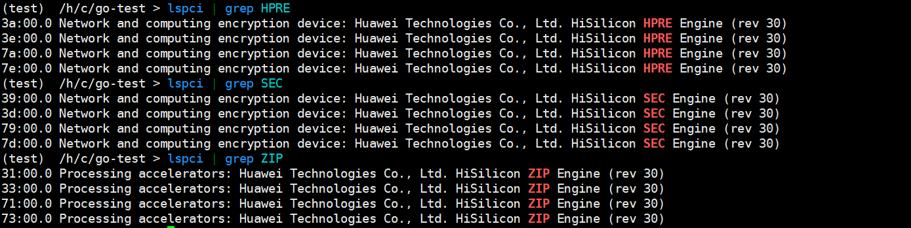
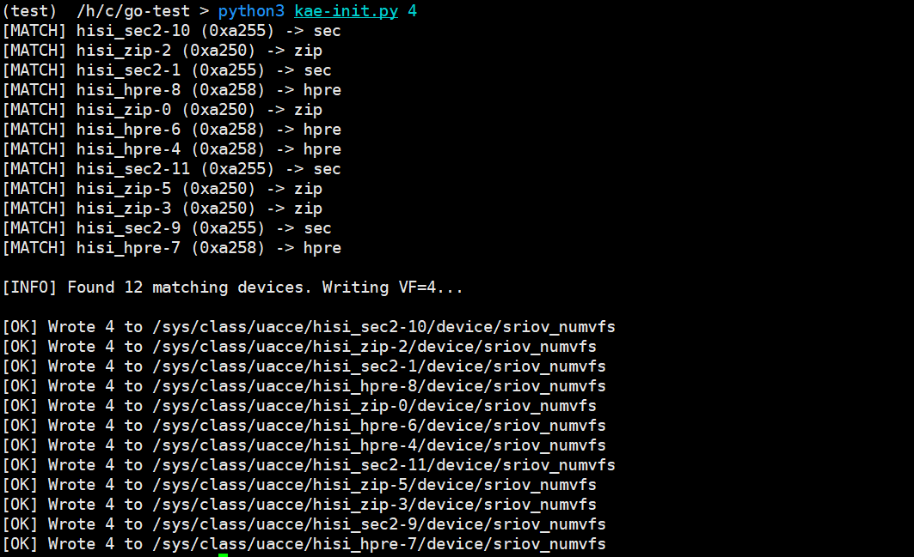

# KAE Device Plugin User Guide<a name="EN-US_TOPIC_0000002521251718"></a>

## Overview<a name="EN-US_TOPIC_0000002549772317"></a>

This document describes how to deploy and use the KAE device plugin on a server running the openEuler OS.

The Kunpeng Accelerator Engine (KAE) is a hardware-based acceleration solution built on Kunpeng 920 series processors. It supports encryption, decryption, and decompression. The KAE encryption and decryption module accelerates Secure Sockets Layer (SSL) and Transport Layer Security (TLS) applications. The KAE decompression modules accelerate data compression and decompression, greatly reducing processor consumption and improving efficiency. In addition, KAE abstracts the internal processing details from the application layer. You can quickly migrate services by using the standard OpenSSL, Tongsuo, BoringSSL, zlib, zstd, and LZ4 interfaces. This plugin automatically manages all KAE devices on the server and streamlines the KAE device passthrough operations. Using this plugin, you can pass through KAE devices to containers through simple statements to accelerate encryption, decryption, and data compression.

## Environment Requirements<a name="EN-US_TOPIC_0000002518412470"></a>

This document provides guidance based on specific environments. Before performing operations, ensure that your hardware and software meet the requirements.

**Hardware Requirements<a name="section8140133619490"></a>**

[**Table 1**](#hardware-requirement) lists the hardware requirement.

**Table 1** Hardware requirement<a id="hardware-requirement"></a>

|Item|Specifications|
|--|--|
|CPU|Kunpeng 920 series processor or Kunpeng 950 processor|


**OS and Software Requirements<a name="section21631338357"></a>**

The OS and software versions in the table have been verified. For other versions, necessary adaptation are required before using this plugin. If Kubernetes or containerd is not installed in your environment, install it as described in [**Table 2**](#verified-os-and-software-versions).

**Table 2** Verified OS and software versions<a id="verified-os-and-software-versions"></a>

|Software|Version|How to Obtain|
|--|--|--|
|OS|openEuler 24.03 LTS SP2|[Link](https://www.openeuler.org/en/download/#openEuler%2024.03%20LTS%20SP2)|
|Kubernetes|1.25.16|See [Kubernetes Deployment Guide (CentOS & openEuler)](https://www.hikunpeng.com/document/detail/en/kunpengcpfs/ecosystemEnable/Kubernetes/kunpengk8s_04_0001.html).|
|containerd|1.7.10|See [Containerd Installation Guide (CentOS 8.1 and openEuler 20.03)](https://www.hikunpeng.com/document/detail/en/kunpengcpfs/ecosystemEnable/Containerd/kunpengcontainerd_03_0001.html).|
|Docker|18.0.9|Install it using a Yum repository.|
|kae-device-plugin|1.0.0|[Link](https://gitcode.com/boostkit/cloud-native)|

## Plugin Compilation<a name="EN-US_TOPIC_0000002549892317"></a>

Before compiling the plugin, ensure that KAE devices are available and the KAE drivers have been installed in the cluster.

**Preparations<a name="section523822632720"></a>**

1. Obtain the software and code described in [OS and Software Requirements](#verified-os-and-software-versions).
2. Run the following commands to check whether KAE devices exist on the compute nodes:

    ```
    lspci | grep HPRE
    lspci | grep SEC
    lspci | grep ZIP
    ```

    - If KAE devices exist, an example command output is as follows:

        

    - If no command output is displayed, the license may not be installed on the compute nodes. In this case, install the license as instructed in [Obtaining a License](https://www.hikunpeng.com/document/detail/en/kunpengaccel/kae/usermanual/kunpengaccel_06_0008.html).

3. Run the following command to check whether the KAE drivers have been installed on the compute nodes:

    ```
    ls /sys/class/uacce
    ```

    An example command output is as follows. If no command output is displayed, the KAE drivers may not be installed. In this case, install the KAE drivers as instructed in [Installation Using Source Code](https://www.hikunpeng.com/document/detail/en/kunpengaccel/kae/usermanual/kunpengaccel_06_0012.html).

    

**Procedure<a name="section972652218309"></a>**

1. Obtain the plugin source code.

    ```
    git clone https://gitcode.com/boostkit/cloud-native.git
    ```

2. Compile the plugin code to obtain an image.

    ```
    cd /path/to/cloud-native
    make kae-device-plugin-docker
    ```

    > **NOTE:**
    >Before compiling the plugin, ensure that Go 1.25 or later has been installed.

3. Check whether the image is compiled successfully.

    ```
    docker images | grep kae-device-plugin
    ```

    If the following information is displayed, the image is compiled successfully.

    

4. Export the compiled image as `kae-device-plugin.tar`.

    ```
    docker save kae-device-plugin:1.0 -o kae-device-plugin.tar
    ```

5. Copy the exported TAR package to the compute nodes and run the following command to import the image:
    - If the container runtime used by Kubernetes is containerd, run the following command to import the image:

        ```
        ctr -n k8s.io images import /path/to/kae-device-plugin.tar
        ```

    - If the container runtime used by Kubernetes is Docker, run the following command to import the image:

        ```
        docker load -i /path/to/kae-device-plugin.tar
        ```

## Plugin Deployment<a name="EN-US_TOPIC_0000002518252546"></a>

Before deploying the plugin, create KAE virtual functions (VFs) on the compute nodes and then deploy the plugin on the control node.

1. Run the following commands to create VFs:

    ```
    cd /path/to/cloud-native/Boostkit_CloudNative/K8S/deployments/kae-device-plugin
    python3 kae-init.py 4
    ```

    The following is an example of the command output. The command creates four VFs for each KAE device. You can set the number of VFs as required.

    

2. Run the following commands on the control node to deploy the KAE device plugin:

    ```
    cd /path/to/cloud-native/Boostkit_CloudNative/K8S/deployments/
    kubectl apply -k kae-device-plugin/overlay/qos
    ```

3. Check whether the plugin is successfully deployed.

    ```
    kubectl get pod
    ```

    An example command output is as follows:

    

4. Check whether KAE devices have been managed.

    ```
    kubectl describe node <your compute node name>
    ```

    An example command output is as follows:

    

    If the KAE devices are available in the allocatable resources on the compute nodes, the devices have been successfully managed.

## Plugin Usage<a name="EN-US_TOPIC_0000002518412468"></a>

### KAE Device Passthrough<a name="EN-US_TOPIC_0000002549772319"></a>

This section uses the HPRE device as an example to describe how to pass through a KAE device to a container.

To pass through other devices, change the resource name to that of the corresponding device as described in [**Table 1**](#mapping-between-kae-devices-and-their-resource-names).

**Table 1** Mapping between KAE devices and KAE device resource names<a id="mapping-between-kae-devices-and-their-resource-names"></a>

|KAE Device|Device Resource Name|
|--|--|
|HPRE|kae.kunpeng.com/hisi_hpre|
|SEC|kae.kunpeng.com/hisi_sec2|
|ZIP|kae.kunpeng.com/hisi_zip|


> **NOTICE:**
>KAE devices require KAE libraries for normal running. Generally, KAE libraries are not installed in containers. In this example, KAE libraries on the host are mapped to the container. In practice, you can install KAE libraries in the container or map the KAE libraries on the host to the container as required.

1. Make the declaration in the YAML file of the Pod.

    The device to be used is declared by adding `kae.kunpeng.com/hisi_hpre: "1"` to `requests` and `limits` in `resources`.

    ```
    apiVersion: v1
    kind: Pod
    metadata:
      name: kae-test
    spec:
      containers:
      - name: kae-test
        image: kae-test:latest
        command: ["/bin/sh", "-c", "while true; do echo hello; sleep 300000; done"]
        imagePullPolicy: IfNotPresent
        resources:
          requests:
            kae.kunpeng.com/hisi_hpre: "1"
          limits:
            kae.kunpeng.com/hisi_hpre: "1"
        volumeMounts:
          - name: local-lib
            mountPath: /usr/local
      volumes:
        - name: local-lib
          hostPath:
            path: /usr/local/  
    ```

2. Deploy the Pod.

    ```
    kubectl apply -f kae-pod/kae-test-pod.yaml
    ```

3. After the deployment is complete, check the Pod status.

    ```
    kubectl get pod
    ```

    The command output is as follows. If the Pod status is `Running`, the installation is successful.

    ```
    NAME       READY   STATUS    RESTARTS   AGE
    kae-test   1/1     Running   0          3h20m
    ```

4. Access the Pod and check whether the KAE device has been mounted.

    ```
    kubectl exec -it kae-test bash
    ls /dev
    ```

    `kae-test` indicates the Pod name. Change it to the Pod name you have defined.

5. If the `hisi_hpre-<x>` device exists in the `/dev` directory, the KAE device has been mounted successfully.

    

### KAE Device QoS Setting<a name="EN-US_TOPIC_0000002518252550"></a>

KAE devices support the quality of service (QoS) function. You can set QoS to allocate different bandwidths for KAE devices in different containers. Setting a higher KAE QoS for high-priority containers can ensure that the KAE devices in the containers have higher bandwidth, thereby guaranteeing the service quality.

1. Add the annotation `qos.kae.kunpeng.com/hisi_hpre: "500"` to the YAML file of the Pod to declare the QoS of the KAE devices. For details about how to set the QoS of other devices, see [KAE device QoS annotations](#kae-device-qos-annotations).

    ```
    apiVersion: v1
    kind: Pod
    metadata:
      name: kae-test-qos
      annotations:
        qos.kae.kunpeng.com/hisi_hpre: "500"
    spec:
      containers:
      - name: kae-test-qos
        image: kae-test:latest
        command: ["/bin/sh", "-c", "while true; do echo hello; sleep 300000; done"]
        imagePullPolicy: IfNotPresent
        resources:
          requests:
            kae.kunpeng.com/hisi_hpre: "1"
          limits:
            kae.kunpeng.com/hisi_hpre: "1"
        volumeMounts:
          - name: local-lib
            mountPath: /usr/local
      volumes:
        - name: local-lib
          hostPath:
            path: /usr/local                                     
    ```

    **Table 1** KAE device QoS annotations<a id="kae-device-qos-annotations"></a>

|KAE Device|Annotation Name|
|--|--|
|HPRE|qos.kae.kunpeng.com/hisi_hpre|
|SEC|qos.kae.kunpeng.com/hisi_sec2|
|ZIP|qos.kae.kunpeng.com/hisi_zip|


2. Deploy the Pod as instructed in [KAE Device Passthrough](#kae-device-passthrough).
3. Access the container and run the following command to check whether the QoS of the KAE devices is set successfully:

    ```
    kubectl exec -it kae-test-qos -- bash
    # Execute the following command in the container:
    env
    ```

    An example command output is as follows. The PCI addresses of the KAE devices that are passed through to the container are displayed.

    

    Based on the PCI addresses, **run the following command on the physical machine** to retrieve the file to check whether the QoS value is the same as that declared in the annotation:

    ```
    cat /sys/kernel/debug/hisi_hpre/0000:3a:00.0/alg_qos
    ```

    An example command output is as follows. The result is consistent with the value declared in the annotation `qos.kae.kunpeng.com/hisi_hpre: "500"`, indicating that the QoS setting is successful.

    


## (Optional) Plugin Uninstallation<a name="EN-US_TOPIC_0000002549892315"></a>

Run the following command to uninstall the plugin:

```
kubectl delete -k kae-device-plugin/overlay/qos
```
