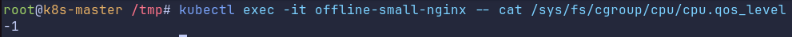
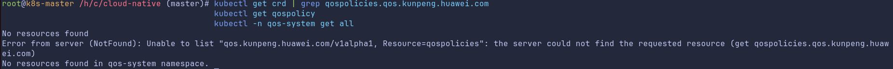

# Cloud Native Scenario Kunpeng Qos Controller User Guide

## Overview

`kunpeng-qos-controller` is a local node operator running in DaemonSet mode. After a user declares a resource control policy using `QoSPolicy`, the controller creates and configures a `resctrl` control group on the matching node, binds the pod process to the control group, and sets the container `cgroup` parameters as required. In this way, node-level QoS resource management and control are implemented.

Its main capabilities are as follows:

- Listens to `QoSPolicy` custom resources (CRs) and creates, updates, or deletes the corresponding `resctrl` control groups on the node.
- Binds a pod to the target control group (using the pod label `qos.kunpeng.huawei.com/group`).
- Performs additional operations (such as dynamic group labeling) for dynamic control of offline workloads (`qos.kunpeng.huawei.com/workload-class=offline`).
- Controls `cpu.qos_level` of the pod container `cgroup` via the `cpu.qosLevel` field of `QoSPolicy`.

## Application Scenarios

- The local `resctrl` of nodes in a Kubernetes cluster needs to be managed and controlled in a unified manner.
- Different QoS policies need to be allocated to pods based on service types (for example, offline and online tasks are isolated from each other).
- Policies need to be declared using custom resource definitions (CRDs), and the operator automatically creates control groups and delivers parameters.

## Principles

The system consists of two main Reconcilers:

- `QoSPolicyReconciler`:
  - Listens to `QoSPolicy`.
  - Determines whether a policy needs to take effect on the current node based on `nodeSelector`.
  - Creates or updates `resctrl` control groups for the matching node and writes the policy to `schemata`.
  - Performs local control group clearance when deleting the policy.
- `PodBindingReconciler`:
  - Listens to pods.
  - Adds a pod process to the specified cgroup based on the pod label `qos.kunpeng.huawei.com/group`.
  - Writes `cpu.qos_level` to the pod container based on `cpu.qosLevel` of the target `QoSPolicy`.

In the current implementation, `QoSPolicy.metadata.name` and the `resctrl` control group name are the same.

# Software Compilation

Run the following commands in the root directory of the repository.

## Local Binary Compilation

```bash
make kunpeng-qos-controller-build
```

Output path:

 `bin/kunpeng-qos-controller`

## Docker Image Compilation

```bash
make kunpeng-qos-controller-docker
```

NOTE: The image is built using `Dockerfile.kunpeng-qos-controller`.

If `containerd` is used for cluster runtime, you can export the image and then import it to the target node.

```bash
docker save kunpeng-qos-controller:0.1.0 -o kunpeng-qos-controller.tar
```

After copying `kunpeng-qos-controller.tar` to the target node, run the following command:

```bash
ctr -n k8s.io images import /path/to/kunpeng-qos-controller.tar
```

# Software Deployment

Prerequisites: The target node has the `resctrl` capability and `/sys/fs/resctrl` is mounted to the node. The container can access `/sys/fs/cgroup`.
>NOTE: If `/sys/fs/resctrl` is not mounted to the node, mount it by running the `mount -t resctrl resctrl /sys/fs/resctrl` command. If the `resctrl` directory does not exist in the `/sys/fs` directory, the MPAM function is not enabled in the kernel. You can enable the function by adding `arm64.mpam` to the kernel startup parameters.
## Deploying CRDs

```bash
kubectl apply -f config/kunpeng-qos-controller-config/crd/bases/qos.kunpeng.huawei.com_qospolicies.yaml
```

## Deploying the Operator (DaemonSet + RBAC)

```bash
kubectl apply -f config/kunpeng-qos-controller-config/samples/qos-controller-daemonset-v1alpha1.yaml
```

## Checking the Running Status

```bash
kubectl -n qos-system get pod -l app=qos-controller -o wide
kubectl -n qos-system logs -l app=qos-controller --tail=200
```

The possible command output is as follows. The status of `qos-controller` is `Running`, and no error is reported in the log.


## (Optional) Local Debugging and Running

```bash
export NODE_NAME=<Your_node_name>
./bin/kunpeng-qos-controller
  --kubeconfig ~/.kube/config
```

# Feature Usage

## Creating a Policy and Delivering It to Nodes

> NOTE: `cpu.qos_level` depends on the kernel capability and requires the kernel version to be `6.6.0-154.0.0` or later. 
> In addition, you need to add `xint` to the kernel startup parameters and run the following command to enable the scheduling feature after the system is started: 
> `echo SMT_TAG_PULL > /sys/kernel/debug/sched/features`

### QoSPolicy Field Description

| Field| Meaning| Range/Default Value| Description|
|---------|---------|---------|---------|
| `spec.nodeSelector` | Nodes where the policy takes effect.| Map (optional)| The policy is applied only to the nodes with matched node labels.|
| `spec.mb.hdl` | MBHDL switch.| 0–1. The default value is `1`.| Generally, `1` indicates that the function is enabled.|
| `spec.mb.pri` | MB priority.| 0–7. The default value is `3`.| A larger value indicates a higher priority.|
| `spec.mb.min` | Minimum memory bandwidth (MB) guarantee ratio.| 0–100. The default value is `0`.| Presented in percentages.|
| `spec.mb.max` | Maximum MB limit ratio.| 0–100. The default value is `100`.| Presented in percentages.|
| `spec.l3.pri` | L3 priority.| 0–3. The default value is `0`.| Controls the L3 priority.|
| `spec.l3.min` | Minimum L3 guarantee ratio.| 0–100. The default value is `0`.| Presented in percentages.|
| `spec.l3.max` | Maximum L3 limit ratio.| 0–100. The default value is `100`.| Presented in percentages.|
| `spec.l3.ways` | Number of allocated cache ways.| ≥ 1| The upper limit is determined by node hardware.|
| `spec.cpu.qosLevel` | Pod CPU QoS level.| `-1`/`0`/`1`. The default value is `0`.| `cpu.qos_level` written to the pod in the group. The value <code>-1</code> indicates a low-priority service, <code>0</code> indicates the default priority, and <code>1</code> indicates a high-priority service.|

### Example: Creating QoSPolicy.

```yaml
apiVersion: qos.kunpeng.huawei.com/v1alpha1
kind: QoSPolicy
metadata:
  name: offline-small
spec:
  nodeSelector:
    kubernetes.io/hostname: <your-node-name>
  mb:
    hdl: 1
    pri: 2
    min: 10
    max: 60
  l3:
    pri: 1
    min: 10
    max: 60
    ways: 4
  cpu:
    qosLevel: -1
```

Application:

```bash
kubectl apply -f qospolicy-offline-small.yaml
```

### Updating the Control Group Configuration (by Updating QoSPolicy)

The control group parameters are updated by modifying the `QoSPolicy` CR with the same name. The operator automatically synchronizes the updated configuration to the local `resctrl` control group.


```bash
kubectl edit qospolicy offline-small
```

You can modify the corresponding fields (such as `mb.max`, `l3.ways`, and `cpu.qosLevel`) under `spec` on the editing page, save the modification, and exit to trigger the update.

An example command output is as follows:

In this example, `mb.max` is changed from `60` to `50`, and `l3.ways` is changed from `4` to `1`.
> NOTE: `cpu.qos_level` can be modified only once. The default value is `0`. The value can be changed from `0` to `-1` or from `0` to `1`. However, the value cannot be changed after being set.
#### Verifying the Update

```bash
kubectl get qospolicy offline-small -o yaml
POD=$(kubectl -n qos-system get pod -l app=qos-controller -o name | head -n1)
kubectl -n qos-system exec -it "${POD#pod/}" -- cat /sys/fs/resctrl/offline-small/schemata
```
The possible command output is as follows. You can see that `mb.max` and `l3.ways` in the CR have been updated to `50` and `1`, respectively, and the values in `schemata` of the `resctrl` control group have been updated accordingly.


## Adding a Pod to a Specified Control Group

### Description

- `QoSPolicy.metadata.name = offline-small`
- The control group directory is `/sys/fs/resctrl/offline-small`.
- The pod label `qos.kunpeng.huawei.com/group` must be the same as the policy name.

### Example: Creating a Pod with the group Label

```yaml
apiVersion: v1
kind: Pod
metadata:
  name: offline-small-nginx
  labels:
    app: nginx
    qos.kunpeng.huawei.com/group: offline-small
spec:
  nodeSelector:
    kubernetes.io/hostname: <your-node-name>
  containers:
  - name: nginx
    image: nginx:1.25
```

Application:

```bash
kubectl apply -f pod-offline-small.yaml
```

### Verification
#### Checking Whether a Pod Is Added to a Specified Control Group
```bash
POD=$(kubectl -n qos-system get pod -l app=qos-controller -o name | head -n1)
kubectl -n qos-system exec -it "${POD#pod/}" -- cat /sys/fs/resctrl/offline-small/tasks
```
The possible command output is as follows. If `pid` exists in `tasks` of the `offline-small` control group, `offline-small-nginx` has been added to the `offline-small` control group.


#### Checking Whether qos_level Is Correctly Set for a Pod

```bash
kubectl exec -it offline-small-nginx -- cat /sys/fs/cgroup/cpu/cpu.qos_level
```
The possible command output is as follows. `cpu.qos_level` of `offline-small-nginx` is `-1`, indicating that `offline-small-nginx` has been added to the `offline-small` control group.


## Example of Deleting a Control Group

To delete a control group, you need to delete the corresponding `QoSPolicy`. After `QoSPolicy` is deleted, the operator will clear the `resctrl` control group with the same name on the local node.

```bash
kubectl delete qospolicy offline-small
```

### Verifying the Deletion

```bash
kubectl get qospolicy offline-small
POD=$(kubectl -n qos-system get pod -l app=qos-controller -o name | head -n1)
kubectl -n qos-system exec -it "${POD#pod/}" -- ls /sys/fs/resctrl
```

The possible command output is as follows. If no object is found in `qospolicy` and `offline-small` does not exist in the `resctrl` directory, the control group has been deleted.


## Common Path List

- CRD:
   `config/kunpeng-qos-controller-config/crd/bases/qos.kunpeng.huawei.com_qospolicies.yaml`
- Deployment example:
   `config/kunpeng-qos-controller-config/samples/qos-controller-daemonset-v1alpha1.yaml`
- `QoSPolicy` example:
   `config/kunpeng-qos-controller-config/samples/qospolicy-examples-v1alpha1.yaml`
- Pod example:
   `config/kunpeng-qos-controller-config/samples/pod-examples-for-qospolicy-v1alpha1.yaml`

# Feature Maintenance

## Uninstalling Software

You are advised to uninstall service resources and then control-plane resources to avoid residual objects.

### 1. Clearing the QoSPolicy CRs.

```bash
kubectl delete qospolicy --all
```

If you use policy files with specific names, you can delete CRs by file:

```bash
kubectl delete -f config/kunpeng-qos-controller-config/samples/qospolicy-examples-v1alpha1.yaml
```

### 2. (Optional) Clearing Service Pods That Use QoS

```bash
kubectl delete -f config/kunpeng-qos-controller-config/samples/pod-examples-for-qospolicy-v1alpha1.yaml
```

### 3. Uninstalling the Operator (DaemonSet + RBAC + ServiceAccount + Namespace)

```bash
kubectl delete -f config/kunpeng-qos-controller-config/samples/qos-controller-daemonset-v1alpha1.yaml
```

### 4. Deleting CRDs

```bash
kubectl delete -f config/kunpeng-qos-controller-config/crd/bases/qos.kunpeng.huawei.com_qospolicies.yaml
```

### 5. Verifying the Clearing Result

```bash
kubectl get crd | grep qospolicies.qos.kunpeng.huawei.com
kubectl get qospolicy
kubectl -n qos-system get all
```

The possible command output is as follows. If the corresponding resources cannot be found, the resources have been successfully cleared.



NOTE: If CRDs have been deleted, `kubectl get qospolicy` may display a message indicating that the resource type does not exist, which is expected.
