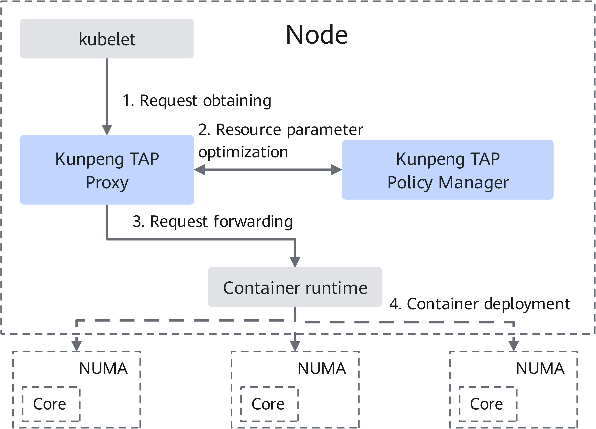
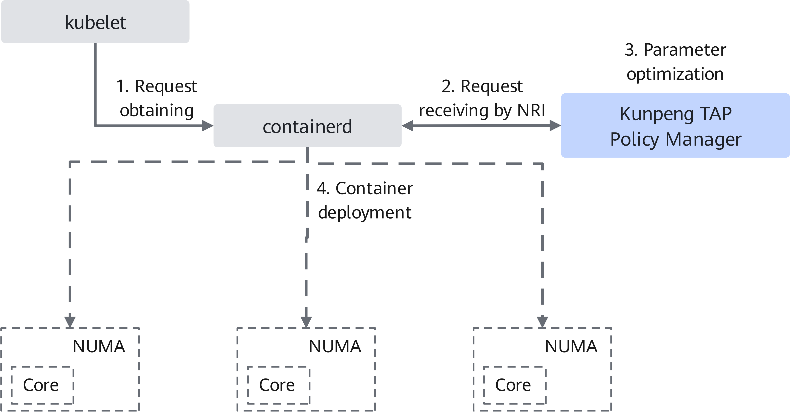
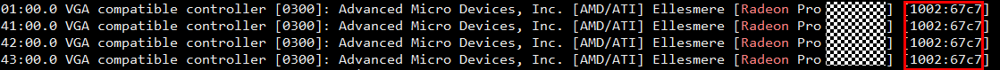
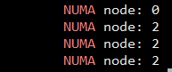

# Kunpeng Topology Affinity Plugin User Guide

## Introduction<a name="EN-US_TOPIC_0000002525264761"></a>

### Overview<a name="EN-US_TOPIC_0000002525344727"></a>

This document describes how to deploy and use the Kunpeng Topology Affinity Plugin (Kunpeng TAP) on servers running the openEuler OS.

In a Kubernetes cluster, if CPU isolation, memory, and NUMA affinity need to be optimized, it is required to enable the static policy of the CPU manager and set the topology manager policy to the best-effort or single-NUMA-node mode. In this case, only when the QoS attribute of the Pod (container management unit of Kubernetes) is of the `Guaranteed` type (that is, the resource request value is an integer equal to the limit value), the policy can optimize the effect. However, most cloud service providers need to deploy a large number of containers on a server, and the number of deployed containers even exceeds the number of physical cores of the server. In this scenario, the static policy of the CPU manager cannot be enabled due to physical resource restrictions. As a result, CPU affinity cannot be ensured during container running.

To solve this problem, Kunpeng BoostKit provides the Kunpeng TAP for Kubernetes cluster resource management. It helps compute nodes optimize system resource management and provides different allocation policies for resources such as CPU and memory, to meet high performance requirements in various scenarios. Currently, Kunpeng TAP provides the NUMA adaptation feature and implements a plugin-based Kubernetes NUMA affinity scheduling policy. This plugin takes effect when a Pod is deployed on a compute node. It automatically adjusts the CPU scheduling range of the Pod based on CPU resource allocation of the compute node. In this way, the restriction that the resource request value should be an integer equal to the limit value can be bypassed, and the NUMA affinity and Pod overcommitment features can be maintained.

Currently, this feature is incompatible with the open-source Kubernetes topology manager. It has been verified only on bare-metal Kubernetes clusters, and its full enablement in virtual machine (VM) environments cannot be guaranteed.

### Software Architecture<a name="EN-US_TOPIC_0000002493185050"></a>

Kunpeng TAP consists of Kunpeng TAP Policy Manager and Kunpeng TAP Proxy. It operates at the node level within a Kubernetes cluster and dynamically adjusts the CPU scheduling range of containers by acting as a proxy for container requests.

Kunpeng TAP can be deployed in proxy mode or Node Resource Interface (NRI) mode. [**Figure 1**](#kunpeng-tap-architecture) shows the architecture of the Kunpeng TAP in proxy mode, and [**Table 1**](#functions-of-kunpeng-tap-and-related-modules) describes the functions of each module.

**Figure 1** Kunpeng TAP architecture<a name="fig11864115615445"></a><a id="kunpeng-tap-architecture"></a><br>


Kunpeng TAP adopts a request proxy approach. It adjusts resource parameters for container creation requests between the kubelet and the container runtime.

1. Request obtaining: Kunpeng TAP connects to the kubelet to obtain container distribution requests.
2. Resource parameter optimization: Following user-configured policy options, Kunpeng TAP can perform NUMA topology-aware adjustments to a container's CPU scheduling range. It achieves this by considering system resources, the system topology, and the allocation of specific device resources like GPUs.
3. Request forwarding: Kunpeng TAP forwards optimized requests to the container runtime for container management.
4. Container deployment: The container runtime performs the deployment and the system runs the container process based on the optimized parameters.

**Table 1** Functions of Kunpeng TAP and related modules<a id="functions-of-kunpeng-tap-and-related-modules"></a>

|Module|Function|
|--|--|
|Kunpeng TAP Policy Manager|Based on NUMA affinity rules, dynamically adjusts the CPU allocation and combination of Pods/containers to make applications utilize hardware resources efficiently, which aims to align with the best practices of the NUMA architecture.|
|Kunpeng TAP Proxy|Transfers requests and responses between the kubelet and the container runtime, obtains the CPU usage of Pods on the current node, and provides function and data support for optimizing resource allocation.|
|kubelet|Runs on each node in a cluster to ensure that containers (Pods) run properly on nodes and manage the lifecycle of these containers.|
|Container runtime|Creates, manages, and runs containers.|

In NRI mode supported by containerd v1.7.0 and later versions, Kunpeng TAP communicates with containerd as a plugin, which does not interfere with the original container request link and provides better stability. See [**Figure 2**](#operating-architecture-in-nri-mode).

**Figure 2** Operating architecture in NRI mode<a name="fig19472125713354"></a><a id="operating-architecture-in-nri-mode"></a>



## Environment Requirements<a name="EN-US_TOPIC_0000002514027348"></a>

This document provides guidance based on openEuler environments. Before performing operations, ensure that your hardware and software meet the requirements.

**Table 1** Hardware requirement<a id="hardware-requirement"></a>

|Item|Description|
|--|--|
|Processor|Kunpeng 920 series processor or Kunpeng 950 processor|

**Table 2** OS and software requirements<a id="os-and-software-requirements"></a>

|Item|Version|How to Obtain|
|--|--|--|
|OS|openEuler 20.03 LTS SP3|[Link](https://repo.openeuler.org/openEuler-20.03-LTS-SP3/ISO/aarch64/)|
|OS|openEuler 22.03 LTS SP4|[Link](https://repo.openeuler.org/openEuler-22.03-LTS-SP4/ISO/aarch64/)|
|OS|openEuler 24.03 LTS SP3|[Link](https://repo.openeuler.org/openEuler-24.03-LTS-SP3/ISO/aarch64/)|
|Golang|1.25|[Link](https://golang.google.cn/dl/)<br>You are advised to configure a Chinese repository in the Golang environment so that the binary dependency package can be downloaded and installed.|
|Make|-|Install it using a Yum repository.|
|Kubernetes|1.23.6 or 1.25.16|-|
|Docker|20.10.14|Install it using a Yum repository.|
|Containerd|1.6.8 or 1.7.0 (The version must be later than 1.7.0 in NRI mode.)|[Link](https://github.com/containerd/containerd/releases/tag/v1.6.8)|
|Kunpeng TAP source code|release-0.3|[Link](https://gitcode.com/boostkit/cloud-native)|
|Kunpeng TAP|release-0.3|Executable file of Kunpeng TAP, which is obtained by compilation. For details, see [Compiling Kunpeng TAP](#compiling-kunpeng-tap).|

## Compiling Kunpeng TAP<a name="EN-US_TOPIC_0000002525264763"></a>

Compile the Kunpeng TAP source code and generate a plugin executable file.

1. Obtain the Kunpeng TAP source code of the latest version `kunpeng-tap-release-0.3.0-rc0` on the `Tags` tab.

    ```shell
    git clone --branch kunpeng-tap-release-0.3.0-rc0 https://gitcode.com/boostkit/cloud-native.git
    ```

2. Go to the `cloud-native` directory and download the dependencies required by the project.

    ```shell
    cd /path/to/cloud-native
    go mod tidy
    ```

    In the preceding command, replace `/path/to/cloud-native` with the actual path to the project source code.

3. Build the plugin.

    Run the following command to build the plugin:

    ```shell
    make kunpeng-tap-build
    ```

    The binary file `kunpeng-tap` is generated in the `bin` directory.

    For the NRI mode, you must also run the following command to build the plugin image:

    ```shell
    make kunpeng-tap-build-nri
    ```

    Use Docker to compile the `kunpeng-tap-nri:latest` container image. If the compilation fails, check whether the Docker image source is configured.

## Deploying Kunpeng TAP<a name="EN-US_TOPIC_0000002525264765"></a>

Deploy Kunpeng TAP on the target compute nodes and verify that the plugin is running properly.

**Prerequisites<a name="section4217106152916"></a>**

- Kunpeng TAP depends on the Kubernetes cluster and a container runtime (Docker or containerd). In the Docker scenario, use Dockershim as the communication component. Before deployment, ensure that the network configuration of the Kubernetes cluster is correct and container instances can be deployed and run properly.
- Kunpeng TAP is incompatible with the open-source Kubernetes topology manager. Before deploying the plugin, ensure that the open-source Kubernetes topology manager is disabled (disabled by default). You can check that `--topology-manager-policy` is set to `none` in the kubelet command line.
- The container-based deployment of Kunpeng TAP requires that the Kubernetes cluster use containerd (v1.7.0 or later) as the container runtime and the NRI function be enabled.

**systemd-based Deployment<a name="section640135084213"></a>**

1. Import the source code and executable file of Kunpeng TAP to the target compute nodes.
2. Deploy and start Kunpeng TAP.

    If Docker or containerd is used as the container runtime, Kunpeng TAP can be deployed in systemd service mode.

    **Method 1**: Deploy Kunpeng TAP based on systemd: Go to the source code directory and run the `make` commands to install and start Kunpeng TAP.

    1. Go to the source code directory.

        ```shell
        cd /path/to/cloud-native
        ```

        In the preceding command, replace `/path/to/cloud-native` with the actual path to the Kunpeng TAP source code.

    2. Install the plugin. By default, the plugin is started in Docker.

        ```shell
        make kunpeng-tap-install-service
        ```

        To explicitly specify Docker as the runtime, run the following command:

        ```shell
        make kunpeng-tap-install-service-docker
        ```

        If you need to modify startup parameters, modify the parameters under `ExecStart=` in the `hack/kunpeng-tap/kunpeng-tap.service.docker` file in the source code directory.

        ```txt
        [Unit]
        Description=Kunpeng Topology-Affinity Plugin Service
        After=network.target
        
        [Service]
        ExecStart=/usr/local/bin/kunpeng-tap --runtime-proxy-endpoint="/var/run/kunpeng/tap-runtime-proxy.sock" \
            --container-runtime-service-endpoint="/var/run/docker.sock" --container-runtime-mode="Docker" \
            --resource-policy="topology-aware"
        Restart=always
        RestartSec=5
        
        [Install]
        WantedBy=multi-user.target
        ```

        > **Note:**
        >To specify containerd as the runtime, use the following installation command. You can modify the parameters in the `hack/kunpeng-tap/kunpeng-tap.service.containerd` file in the source code directory.
        >
        >```shell
        >make kunpeng-tap-install-service-containerd
        >```

    3. After the installation is complete, run the following command to start the plugin and automatically check the service status after the plugin is started:

        ```shell
        make kunpeng-tap-start-service
        ```

    4. Check log information.

        ```shell
        journalctl -u kunpeng-tap
        ```

    **Method 2**: Start the plugin directly. This method is used only for development and testing. You are not advised to use this method in the production environment.

    - Example startup commands in Docker:

        ```shell
        kunpeng-tap --runtime-proxy-endpoint="/var/run/kunpeng/tap-runtime-proxy.sock" \
            --container-runtime-service-endpoint="/var/run/docker.sock" --container-runtime-mode="Docker" \
            --resource-policy="numa-aware"
        ```

    - Example startup commands in containerd:

        ```shell
        kunpeng-tap --runtime-proxy-endpoint="/var/run/kunpeng/tap-runtime-proxy.sock" \
            --container-runtime-service-endpoint="/var/run/containerd/containerd.sock" --container-runtime-mode="Containerd" \
            --resource-policy="numa-aware"
        ```

    > **Note:**
    >You can modify the parameters in the startup commands as required. [**Table 1**](#parameter-description) describes the parameters.

    **Table 1** Parameter description<a id="parameter-description"></a>

    |Parameter|Description|Default Value|Configuration Principle|
    |--|--|--|--|
    |container-runtime-mode|Container runtime connected to the plugin, which can be Docker, containerd, or NRI.|Docker|Determine the container runtime according to that used in the Kubernetes cluster.|
    |resource-policy|Container resource optimization policy. Currently, numa-aware and topology-aware are supported. numa-aware supports CPU NUMA affinity for containers of the Burstable type. topology-aware provides CPU affinity at the socket, die, and NUMA levels, and supports memory and GPU resource optimization.|topology-aware|Select a policy as required.|
    |enable-memory-topology|After the topology-aware policy is enabled (by setting `--resource-policy=topology-aware`), the memory NUMA optimization function is disabled by default. To enable NUMA affinity for container memory, set `--enable-memory-topology=true`.|false|This configuration is in the alpha phase.|
    |topology-cluster-affinity|Enables cluster-level identification and allocation on the Kunpeng 950 processor. Containers are preferentially allocated at the cluster level.|false|The value is determined based on the server model and performance tuning requirements.|
    |v or verbose|Log level. The value ranges from 2 to 5.|2|The higher the level, the more detailed the logs.|

3. Configure kubelet parameters on the compute nodes.

    To enable Kunpeng TAP to successfully process requests from kubelet, add a parameter to the kubelet command line configurations.

    - In the Docker scenario, add or modify the following kubelet startup parameter:

        ```shell
        --docker-endpoint=unix:///var/run/kunpeng/tap-runtime-proxy.sock
        ```

        For example, when using kubeadm to install a cluster, you can add the parameter to `/var/lib/kubelet/kubeadm-flags.env`.

        ```txt
        KUBELET_KUBEADM_ARGS="--network-plugin=cni --pod-infra-container-image=k8s.gcr.io/pause:3.6 --docker-endpoint=unix:///var/run/kunpeng/tap-runtime-proxy.sock"
        ```

    - In the containerd scenario, modify the following kubelet startup parameters.

        ```txt
        --container-runtime=remote --container-runtime-endpoint=unix:///var/run/kunpeng/tap-runtime-proxy.sock
        ```

        In this case, parameters in `/var/lib/kubelet/kubeadm-flags.env` can be:

        ```txt
        KUBELET_KUBEADM_ARGS="--network-plugin=cni --pod-infra-container-image=k8s.gcr.io/pause:3.6 --container-runtime=remote --container-runtime-endpoint=unix:///var/run/kunpeng/tap-runtime-proxy.sock"
        ```

4. After the kubelet parameters are modified, run the following commands to restart the kubelet:

    ```shell
    systemctl daemon-reload
    systemctl restart kubelet
    ```

**Container-based Deployment<a name="section465620784420"></a>**

1. Check whether the NRI function is enabled for containerd. Before the deployment, enable the NRI function in the containerd configuration file (`/etc/containerd/config.toml` by default) of compute nodes. If the configuration file does not exist, run the following command to create it:

    ```shell
    containerd config default > /etc/containerd/config.toml
    ```

2. Enable the NRI function in the configuration file. If the following information does not exist, add it to the configuration file.

    ```txt
    [plugins]
      ...
      # Add the following content:
      [plugins."io.containerd.nri.v1.nri"]
        disable = false  # Enable NRI.
        disable_connections = false
        plugin_config_path = "/etc/nri/conf.d"
        plugin_path = "/opt/nri/plugins"
        plugin_registration_timeout = "5s"
        plugin_request_timeout = "2s"
        socket_path = "/var/run/nri/nri.sock"
    ```

3. Restart containerd and check whether the restart is successful.

    ```shell
    systemctl daemon-reload
    systemctl restart containerd
    systemctl status containerd
    ```

4. Import the container image on nodes.

    After the image is compiled using Docker, export the image as a TAR package.

    ```shell
    docker save kunpeng-tap-nri:latest -o kunpeng-tap-latest.tar
    ```

    Then, import the above image to the worker nodes in the cluster.

    ```shell
    ctr -n k8s.io images import kunpeng-tap-latest.tar
    ```

5. Deploy the Kunpeng TAP container. The command depends on kubectl to send requests. Ensure that kubectl is installed on the server and you have the cluster access permission.

    The container will be deployed in the `kunpeng-tap` namespace. If the namespace does not exist, run the following command to create it:

    ```shell
    kubectl create namespace kunpeng-tap
    ```

    Perform the deployment:

    ```shell
    make kunpeng-tap-nri-deploy
    ```

    The deployment file of the Kunpeng TAP container is in `config/kunpeng-tap/nri-plugin/daemonset.yaml`. If you need to set options, add the following information:

    ```txt
            args:
              - "--container-runtime-mode=NRI"
              - "--nri-socket-path=/var/run/nri/nri.sock"
              - "--resource-policy=topology-aware"
              - "-v=2"
    ```

6. After the deployment is complete, run the `kubectl` command to check the running status. If `READY` is `1/1` and `STATUS` is `Running`, the container is running properly.

    ```txt
    # kubectl get pods -n kunpeng-tap -owide
    NAME                           READY   STATUS    RESTARTS      AGE           IP            NODE        NOMINATED NODE   READINESS GATES
    kunpeng-tap-nri-mhjwk   1/1     Running      0                  25h   10.244.2.59   compute01   <none>           <none>
    ```

7. (Optional) Run the following command to view log information:

    ```shell
    kubectl logs kunpeng-tap-nri-mhjwk -n kunpeng-tap
    ```

## Using Kunpeng TAP<a name="EN-US_TOPIC_0000002525344725"></a>

Kunpeng TAP allows you to specify CPU resource requirements during Pod deployment. The system automatically allocates resources based on NUMA affinity. By writing a YAML file and specifying the node selector, you can deploy a Pod on a specific node. After the plugin is deployed, you only need to specify the values of `request` and `limit` for CPU resources when deploying other Pods. The system automatically allocates resources based on NUMA affinity.

The following is an example YAML file for deploying a single-container Pod. The CPU resources requested by the Pod are 4 cores at minimum, and 8 cores at maximum. The memory is fixed to 4 GB. `busybox` is used as the container image.

1. Create a YAML file `example.yaml`, and write the following configuration into the file:

    ```yaml
    apiVersion: v1
    kind: Pod
    metadata:
      name: tap-test
      annotations:
    spec:
      containers:
      - name: tap-example # Replace it with the actual name.
        image: busybox:latest
        imagePullPolicy: IfNotPresent
        command: ["/bin/sh"]
        args: ["-c", "while true; do echo `date`; sleep 5; done"]
        resources:
          requests:
            cpu: "4"
            memory: "4Gi"
          limits:
            cpu: "8"
            memory: "4Gi"
    ```

2. For example, to make the Pod run on the `compute01` node, add the following content to the `spec` section in the YAML file.

    > **Note:**
    >In a Kubernetes cluster with multiple worker nodes, a Pod can be scheduled to different NUMA nodes. To make the Pod run on a specified node, add the `nodeSelector` field to the `spec` section in the YAML file and set `kubernetes.io/hostname` to the name of the target node.

    ```txt
      nodeSelector:
        kubernetes.io/hostname: compute01 # Replace this field with the actual node name.
    ```

3. Apply the YAML file on the management node to deploy the Pod.

    ```shell
    kubectl apply -f example.yaml
    ```

4. Check whether Kunpeng TAP takes effect.
    1. Using Docker as an example, access the `compute01` node specified by `nodeSelector` in step 2, run the `docker` command to query the `CpusetCpus` parameter of the container, and determine whether NUMA affinity has been established.
    2. Use `docker ps` to query container tasks running on the cluster nodes. In the `NAMES` column, find the `tap-example` container specified by `spec.containers.name` in step 1.

        ```txt
        # docker ps | grep tap-example
        ```

    3. Query the deployment parameter `CpusetCpus` of the target container based on its container ID. This parameter indicates the range of CPU cores that can be scheduled by the container.

        ```txt
        # docker inspect bf32de0d09fe | grep "CpusetCpus"
                    "CpusetCpus": "0-23",
        ```

        If memory binding is enabled, you can run the following command to check the corresponding node.

        ```txt
        # docker inspect bf32de0d09fe | grep "CpusetMems"
                    "CpusetMems": "0",
        ```

        > **Note:**
        >The bound NUMA nodes are not fixed on different servers, and the values of `CpusetCpus` may be different.

        In the containerd scenario, you can run the following command to check the schedulable CPU range of a container:

        ```txt
        # crictl inspect bf32de0d09fe | grep "cpuset_cpus"
                    "cpuset_cpus": "0-23",
        ```

        If NUMA node affinity configuration fails, the `cpuset_cpus` output may fail to be queried.

    4. Query the NUMA information of the system and compare it with the schedulable CPU core range of the container. The NUMA node matching the schedulable CPU core range is the affinity node of the container.

        ```txt
        # lscpu
        ...
        NUMA node0 CPU(s):               0-23
        NUMA node1 CPU(s):               24-47
        NUMA node2 CPU(s):               48-71
        NUMA node3 CPU(s):               72-95
        ...
        ```

        `node0` indicates the NUMA node whose index is `0`, and `0-23` indicates the CPU cores in this NUMA node.

5. (Optional) Before configuring GPU resource affinity for the container, run the following command to query the NUMA node distribution of GPUs in the system. The following uses the AMD Radeon GPUs as an example.

    ```shell
    lspci -nn|grep VGA|grep Radeon
    ```

    The command output is as follows:

    

    In the preceding figure, `1002:67c7` indicates the <*vendor*>:<*device ID*>, which is used for the next query.

    ```shell
    lspci -vvv -d 1002:67c7 | grep NUMA
    ```

    The command output is as follows:

    

## (Optional) Uninstalling Kunpeng TAP<a name="EN-US_TOPIC_0000002493185048"></a>

Stop and uninstall the plugin if it is not required. Uninstall the plugin on worker nodes.

**systemd Mode<a name="section14339193435217"></a>**

1. Delete the kubelet parameter.

    Delete the previously added parameter `--docker-endpoint=unix:///var/run/kunpeng/tap-runtime-proxy.sock` and restart the kubelet.

    ```shell
    systemctl daemon-reload
    systemctl restart kubelet
    systemctl status kubelet
    ```

2. On worker nodes, go to the `cloud-native` source code directory and run the following commands to uninstall the plugin:

    ```shell
    cd /path/to/cloud-native
    make uninstall-service
    ```

    In the preceding command, replace `/path/to/cloud-native` with the actual path to the Kunpeng TAP source code.

3. Check whether the plugin has been deleted.

    ```shell
    systemctl status kunpeng-tap
    ```

    If the following information is displayed, the plugin has been deleted.

    ```txt
    Unit kunpeng-tap.service could not be found.
    ```

**NRI Mode<a name="section207067317537"></a>**

1. Uninstall Kunpeng TAP.

    On worker nodes, go to the `cloud-native` source code directory and run the following commands to uninstall the plugin:

    ```shell
    cd /path/to/cloud-native
    make kunpeng-tap-nri-undeploy
    ```

    In the preceding command, replace `/path/to/cloud-native` with the actual path to the Kunpeng TAP source code.

2. Run the following command to check whether container instances are uninstalled. If no container instance is displayed, the uninstallation is successful.

    ```shell
    kubectl get pods -n kunpeng-tap -owide
    ```

## Acronyms and Abbreviations<a name="EN-US_TOPIC_0000002493025072"></a>

|**Acronym/Abbreviation**|**Full Spelling**|
|--|--|
|NUMA|non-uniform memory access|
|Kunpeng TAP|Kunpeng Topology Affinity Plugin|
|NRI|Node Resource Interface|
