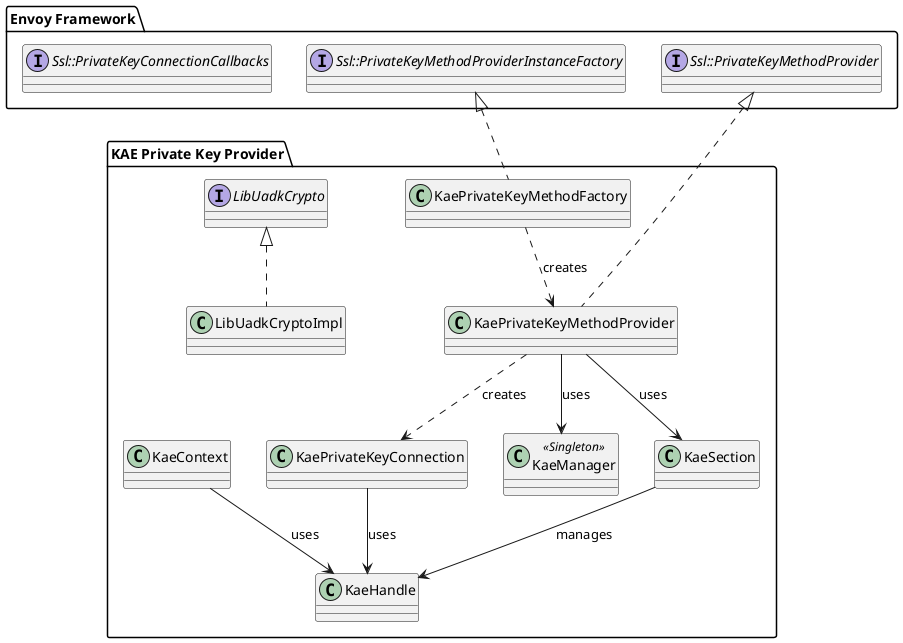
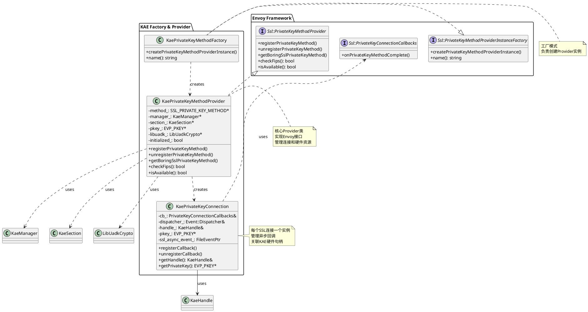
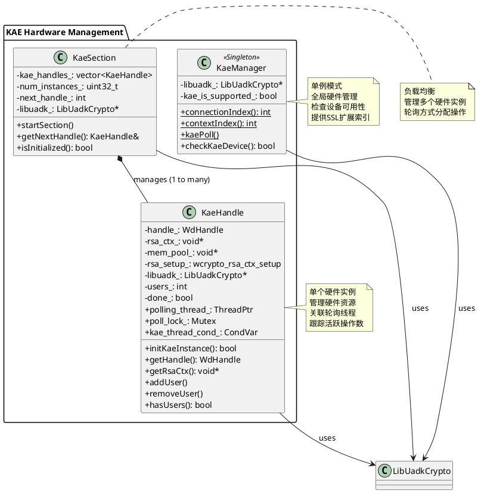
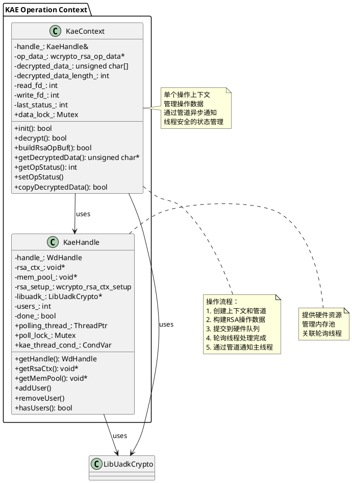
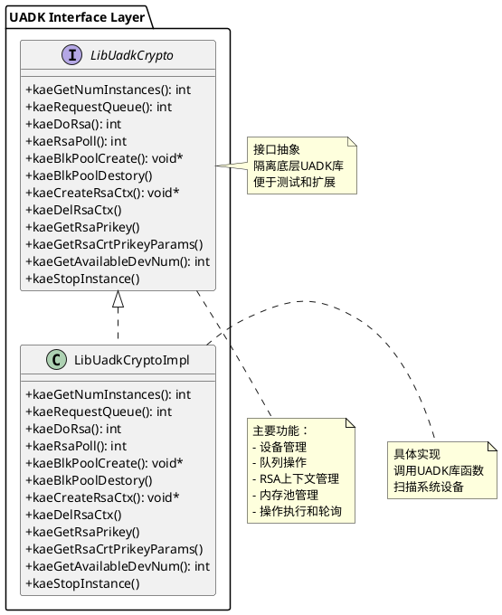
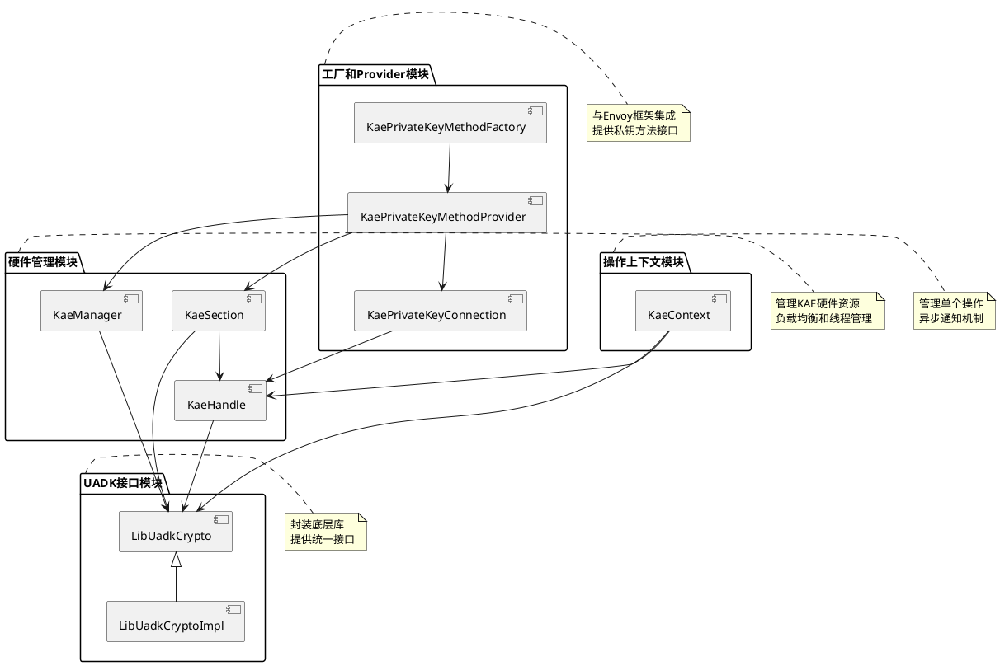
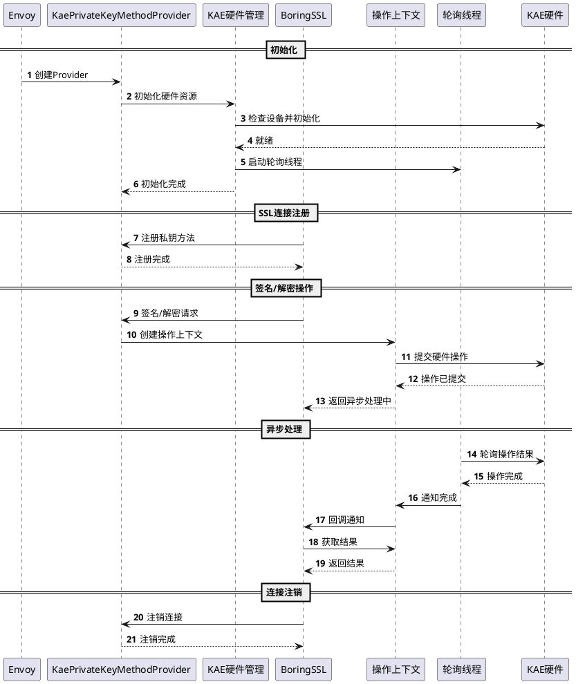
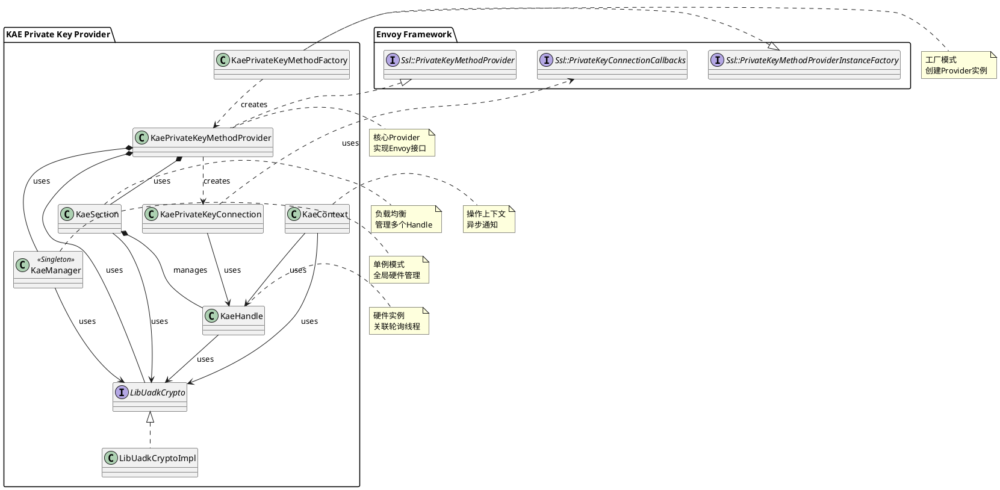

# KAE Private Key Provider 设计文档

## 1. 概述

KAE (Kunpeng Accelerator Engine) Private Key Provider 是 Envoy 的一个扩展，用于利用华为鲲鹏处理器的硬件加速能力来执行 RSA 私钥操作（签名和解密）。该实现通过 UADK (Unified Acceleration Development Kit) 库与硬件加速器交互。

## 2. 架构设计

### 2.1 设计目标

- **硬件加速**：利用 KAE 硬件加速器执行 RSA 加密/解密操作
- **异步操作**：支持异步非阻塞的私钥操作
- **负载均衡**：在多个 KAE 硬件实例之间进行负载均衡
- **线程安全**：支持多线程环境下的并发操作

### 2.2 核心组件

系统由以下核心组件组成：

1. **工厂类**：负责创建 Provider 实例
2. **Provider 类**：实现 Envoy 的 PrivateKeyMethodProvider 接口
3. **连接管理**：管理每个 SSL 连接的私钥操作
4. **硬件管理**：管理 KAE 硬件实例和资源
5. **操作上下文**：管理单个加密/解密操作的生命周期
6. **UADK 封装**：封装底层 UADK 库调用

## 3. 类设计

### 3.1 类关系图

类关系图按功能模块拆分为多个子图，便于理解各模块之间的关系。

#### 3.1.1 整体架构概览

#### 3.1.2 工厂和Provider模块

该模块负责与 Envoy 框架集成，提供私钥方法提供者功能。

#### 3.1.3 硬件管理模块

该模块负责管理 KAE 硬件实例，包括单例管理器、Section 配置和硬件句柄。

#### 3.1.4 操作上下文模块

该模块负责管理单个加密/解密操作的上下文和生命周期。

#### 3.1.5 UADK 接口模块

该模块封装了底层 UADK 库的调用，提供统一的接口抽象。

#### 3.1.6 模块间关系图

展示各模块之间的依赖和交互关系。

### 3.2 详细类说明

#### 3.2.1 KaePrivateKeyMethodFactory

**职责**：工厂类，负责创建 `KaePrivateKeyMethodProvider` 实例

**关键方法**：
- `createPrivateKeyMethodProviderInstance()`: 从配置创建 Provider 实例
- `name()`: 返回 "kae" 作为工厂名称

**依赖关系**：
- 实现 `Ssl::PrivateKeyMethodProviderInstanceFactory`
- 创建 `KaePrivateKeyMethodProvider` 和 `LibUadkCryptoImpl`

#### 3.2.2 KaePrivateKeyMethodProvider

**职责**：实现 Envoy 的 PrivateKeyMethodProvider 接口，提供私钥操作方法

**关键成员**：
- `method_`: BoringSSL 私钥方法结构体（包含 sign、decrypt、complete 回调）
- `manager_`: KAE 管理器单例
- `section_`: KAE Section 实例，管理硬件句柄
- `pkey_`: OpenSSL EVP_PKEY 私钥对象
- `libuadk_`: UADK 库封装接口

**关键方法**：
- `registerPrivateKeyMethod()`: 为 SSL 连接注册私钥方法
- `unregisterPrivateKeyMethod()`: 注销私钥方法
- `getBoringSslPrivateKeyMethod()`: 获取 BoringSSL 私钥方法
- `checkFips()`: 检查 FIPS 模式（返回 false）
- `isAvailable()`: 检查 Provider 是否可用

**工作流程**：
1. 构造函数中初始化 KAE 硬件和私钥
2. 为每个 SSL 连接创建 `KaePrivateKeyConnection`
3. 通过 BoringSSL 回调函数处理签名和解密请求

#### 3.2.3 KaePrivateKeyConnection

**职责**：管理单个 SSL 连接的私钥操作

**关键成员**：
- `cb_`: Envoy 私钥操作回调接口
- `dispatcher_`: 事件分发器，用于异步通知
- `handle_`: KAE 硬件句柄引用
- `pkey_`: 私钥对象
- `ssl_async_event_`: 文件事件，用于接收异步操作完成通知

**关键方法**：
- `registerCallback()`: 注册异步回调，监听操作完成事件
- `unregisterCallback()`: 注销回调
- `getHandle()`: 获取 KAE 句柄
- `getPrivateKey()`: 获取私钥对象

**工作流程**：
1. 创建时关联 SSL 连接和回调
2. 通过文件描述符监听异步操作完成
3. 操作完成时调用 `cb_.onPrivateKeyMethodComplete()`

#### 3.2.4 KaeManager

**职责**：单例管理器，负责 KAE 硬件的全局管理

**关键成员**：
- `libuadk_`: UADK 库封装
- `kae_is_supported_`: KAE 设备是否可用标志

**关键方法**：
- `checkKaeDevice()`: 检查 KAE 设备是否可用
- `connectionIndex()`: 获取 SSL 连接数据索引（静态方法）
- `contextIndex()`: 获取 SSL 上下文数据索引（静态方法）
- `kaePoll()`: 轮询线程函数，处理 KAE 操作完成事件

**设计模式**：
- 单例模式：通过 Envoy 的 SingletonManager 管理
- 静态方法：提供 SSL 扩展数据索引

#### 3.2.5 KaeSection

**职责**：管理 KAE Section 配置，在多个硬件实例间负载均衡

**关键成员**：
- `kae_handles_`: KAE 句柄数组
- `num_instances_`: 硬件实例数量
- `next_handle_`: 下一个要使用的句柄索引（用于轮询负载均衡）
- `libuadk_`: UADK 库封装

**关键方法**：
- `startSection()`: 初始化所有 KAE 硬件实例并启动轮询线程
- `getNextHandle()`: 获取下一个可用的 KAE 句柄（轮询方式）
- `isInitialized()`: 检查 Section 是否已初始化

**负载均衡策略**：
- 使用轮询（Round-Robin）方式在多个硬件实例间分配操作

#### 3.2.6 KaeHandle

**职责**：表示单个 KAE 硬件实例，管理硬件资源

**关键成员**：
- `handle_`: UADK 队列句柄
- `rsa_ctx_`: RSA 上下文
- `mem_pool_`: 内存池
- `polling_thread_`: 轮询线程
- `users_`: 当前使用该句柄的操作数量
- `done_`: 线程退出标志

**关键方法**：
- `initKaeInstance()`: 初始化 KAE 硬件实例
- `getHandle()`: 获取队列句柄
- `getRsaCtx()`: 获取 RSA 上下文
- `getMemPool()`: 获取内存池
- `addUser()`/`removeUser()`: 管理用户计数
- `hasUsers()`: 检查是否有活跃操作

**资源管理**：
- 管理硬件队列、内存池和 RSA 上下文
- 每个句柄关联一个轮询线程

#### 3.2.7 KaeContext

**职责**：管理单个 KAE 加密/解密操作的上下文

**关键成员**：
- `handle_`: 关联的 KAE 句柄
- `op_data_`: RSA 操作数据结构
- `decrypted_data_`: 解密后的数据缓冲区
- `decrypted_data_length_`: 解密数据长度
- `read_fd_`/`write_fd_`: 管道文件描述符，用于异步通知
- `last_status_`: 操作状态

**关键方法**：
- `init()`: 初始化上下文（创建管道）
- `decrypt()`: 执行 RSA 解密/签名操作
- `buildRsaOpBuf()`: 构建 RSA 操作缓冲区
- `copyDecryptedData()`: 复制解密后的数据
- `getDecryptedData()`: 获取解密数据
- `setOpStatus()`/`getOpStatus()`: 操作状态管理

**操作流程**：
1. 创建上下文并初始化管道
2. 构建 RSA 操作数据（包括密钥参数转换）
3. 提交操作到硬件队列
4. 轮询线程处理完成后通过管道通知
5. 主线程读取结果并返回

#### 3.2.8 LibUadkCrypto

**职责**：UADK 库的抽象接口

**关键方法**：
- `kaeGetNumInstances()`: 获取可用实例数量
- `kaeRequestQueue()`: 请求硬件队列
- `kaeDoRsa()`: 执行 RSA 操作
- `kaeRsaPoll()`: 轮询 RSA 操作结果
- `kaeBlkPoolCreate()`/`kaeBlkPoolDestory()`: 内存池管理
- `kaeCreateRsaCtx()`/`kaeDelRsaCtx()`: RSA 上下文管理
- `kaeGetRsaPrikey()`: 获取 RSA 私钥
- `kaeGetAvailableDevNum()`: 获取可用设备数量

**设计模式**：
- 接口隔离：通过接口抽象底层 UADK 库
- 便于测试：可以创建 Mock 实现

#### 3.2.9 LibUadkCryptoImpl

**职责**：UADK 库的具体实现

**实现细节**：
- 实现 `LibUadkCrypto` 接口的所有方法
- 直接调用 UADK 库函数（如 `wcrypto_do_rsa`、`wd_request_queue` 等）
- `kaeGetNumInstances()` 通过扫描 `/sys/class/uacce` 目录获取设备数量

## 4. 工作流程

### 4.1 整体时序图

以下时序图展示了 KAE Private Key Provider 的核心工作流程。

### 4.2 流程说明

#### 4.2.1 初始化流程

1. Envoy 启动时注册 `KaePrivateKeyMethodFactory`
2. 配置加载时创建 `KaePrivateKeyMethodProvider` 实例
3. 初始化 `KaeManager` 单例，检查 KAE 设备可用性
4. 读取私钥文件并解析
5. 创建 `KaeSection`，初始化所有硬件实例（`KaeHandle`）
6. 为每个 `KaeHandle` 启动轮询线程
7. 创建 BoringSSL 私钥方法结构体

#### 4.2.2 签名/解密操作流程

1. **连接注册**：SSL 连接建立时，创建 `KaePrivateKeyConnection` 并关联到 SSL
2. **操作请求**：BoringSSL 需要签名/解密时调用相应回调
3. **上下文创建**：创建 `KaeContext` 并初始化管道用于异步通知
4. **提交操作**：构建 RSA 操作数据，提交到硬件队列
5. **异步处理**：轮询线程定期检查操作完成，硬件完成后通过回调通知
6. **结果返回**：主线程通过管道接收通知，获取结果并返回给 BoringSSL

**签名与解密的区别**：
- 签名操作需要先计算消息摘要并添加 RSA 填充（PSS 或 PKCS1）
- 解密操作直接使用原始密文数据，使用 `RSA_NO_PADDING` 模式

#### 4.2.3 连接注销流程

1. SSL 连接关闭时调用 `unregisterPrivateKeyMethod()`
2. 注销异步回调
3. 删除 `KaePrivateKeyConnection` 对象
4. 清理所有关联资源

## 5. 线程模型

### 5.1 线程结构

- **主线程**：处理 SSL 连接和事件循环
- **轮询线程**：每个 `KaeHandle` 关联一个轮询线程，负责：
  - 定期调用 `kaeRsaPoll()` 检查操作完成
  - 处理硬件回调
  - 通过管道通知主线程

### 5.2 同步机制

- **互斥锁**：
  - `KaeHandle::poll_lock_`: 保护用户计数和线程状态
  - `KaeContext::data_lock_`: 保护操作状态和数据
  - `KaeSection::handle_lock_`: 保护句柄选择

- **条件变量**：
  - `KaeHandle::kae_thread_cond_`: 唤醒轮询线程

- **管道通信**：
  - 每个 `KaeContext` 创建一对管道文件描述符
  - 轮询线程写入状态，主线程读取

## 6. 错误处理

### 6.1 初始化错误

- KAE 设备不可用：`checkKaeDevice()` 返回 false，Provider 不可用
- 私钥读取失败：抛出 `EnvoyException`
- 硬件初始化失败：记录警告日志，Provider 不可用

### 6.2 运行时错误

- 操作失败：返回 `ssl_private_key_failure`
- 操作繁忙：返回 `ssl_private_key_retry`，等待完成
- 数据长度错误：返回 `ssl_private_key_failure`

## 7. 配置

### 7.1 配置参数

- `private_key`: 私钥数据源（文件路径或内联数据）
- `poll_delay`: 轮询延迟（毫秒，默认 5ms）

### 7.2 环境要求

- ARM64 架构（通过 `KAE_DISABLED` 宏控制）
- KAE 硬件设备可用
- UADK 库已安装

## 8. 性能考虑

### 8.1 硬件加速优势

- 利用专用硬件执行 RSA 操作，性能显著提升
- 减少 CPU 负载

### 8.2 优化点

- **负载均衡**：多个硬件实例间轮询分配
- **异步操作**：非阻塞操作，不占用主线程
- **内存池**：预分配内存块，减少分配开销
- **批量轮询**：轮询线程批量处理完成的操作

## 9. 扩展性

### 9.1 支持更多算法

当前实现仅支持 RSA，可以扩展支持：
- ECDSA 签名
- 其他加密算法

### 9.2 改进方向

- 事件驱动：替代轮询机制（如果 UADK 支持）
- 动态负载均衡：根据负载情况选择句柄
- 更多配置选项：如实例数量限制、超时设置等

## 10. UML 类图总结

详细的 UML 类图已按功能模块拆分在第 3.1 节中，包括：

1. **整体架构概览**（3.1.1）：展示系统整体结构和主要模块
2. **工厂和Provider模块**（3.1.2）：Factory、Provider 和 Connection 类的关系
3. **硬件管理模块**（3.1.3）：Manager、Section 和 Handle 的管理关系
4. **操作上下文模块**（3.1.4）：Context 和 Handle 的交互关系
5. **UADK接口模块**（3.1.5）：接口和实现的抽象关系
6. **模块间关系图**（3.1.6）：各模块之间的依赖关系

以下是一个完整的类关系总览图，展示所有类及其关系：

## 11. 总结

KAE Private Key Provider 通过以下设计实现了高效的硬件加速私钥操作：

1. **分层架构**：清晰的职责分离，从工厂到硬件操作各司其职
2. **异步处理**：非阻塞操作，充分利用硬件加速能力
3. **资源管理**：合理的资源生命周期管理和线程模型
4. **负载均衡**：多实例支持，提高吞吐量
5. **接口抽象**：通过接口隔离底层库，便于测试和扩展

该实现充分利用了华为鲲鹏处理器的硬件加速能力，为 Envoy 提供了高性能的 TLS 私钥操作支持。

