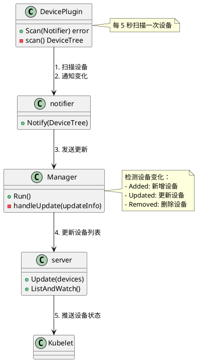
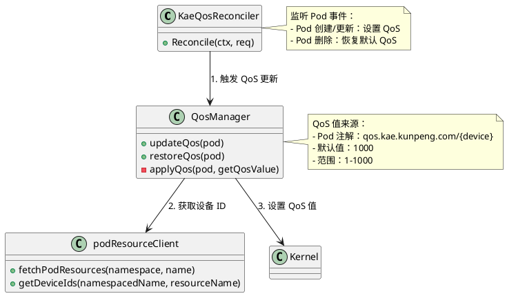

# KAE Device Plugin 设计文档

## 1. 系统概述

KAE Device Plugin 是一个 Kubernetes 设备插件，用于管理和暴露鲲鹏加速引擎（KAE）设备给 Kubernetes 集群中的 Pod 使用。系统支持以下功能：

- **设备发现与注册**：自动扫描并发现系统中的 KAE 设备（hisi_hpre、hisi_zip、hisi_sec2）
- **设备分配**：通过 Kubernetes Device Plugin API 将设备分配给 Pod
- **QoS 管理**（可选）：为 Pod 中的 KAE 设备设置服务质量参数

## 2. 架构设计

### 2.1 模块划分

系统主要分为三个核心模块：

1. **device-plugin**：设备插件框架，提供设备管理、gRPC 服务等基础设施
2. **kae-plugin**：KAE 设备扫描器，实现设备发现逻辑
3. **kae-qos**：QoS 管理器，提供设备 QoS 配置功能（可选）

### 2.2 工作流程

```
┌─────────────┐
│   main.go   │
└──────┬──────┘
       │
       ├─────────────────┐
       │                 │
       ▼                 ▼
┌──────────────┐  ┌──────────────┐
│   Manager    │  │ QosManager   │
│  (device-    │  │  (kae-qos)   │
│   plugin)    │  │              │
└──────┬───────┘  └──────┬───────┘
       │                 │
       │                 │
       ▼                 ▼
┌──────────────┐  ┌──────────────┐
│   Server     │  │ Reconciler   │
│  (gRPC)      │  │  (Controller)│
└──────┬───────┘  └──────┬───────┘
       │                 │
       ▼                 ▼
┌──────────────┐  ┌──────────────┐
│  DevicePlugin│  │ PodResource  │
│  (Scanner)   │  │   Client     │
└──────────────┘  └──────────────┘
```

## 3. 核心组件设计

### 3.1 device-plugin 模块

#### 3.1.1 DeviceInfo
设备信息结构体，包含设备的完整信息。

**字段：**
- `mounts []pluginapi.Mount`：设备挂载点信息
- `envs map[string]string`：环境变量
- `annotations map[string]string`：注解信息
- `health string`：设备健康状态
- `devices []pluginapi.DeviceSpec`：设备规格

#### 3.1.2 DeviceTree
设备树结构，用于组织设备信息。

**结构：** `map[string]map[string]DeviceInfo`
- 第一层 key：设备类型（如 hisi_hpre）
- 第二层 key：设备 ID（如 PCI BDF）
- 值：DeviceInfo

#### 3.1.3 Notifier 接口
接收设备扫描结果，检测变化并通知 Manager。

**方法：**
- `Notify(DeviceTree)`：通知设备树变化

#### 3.1.4 Scanner 接口
设备扫描器接口，由具体的设备插件实现。

**方法：**
- `Scan(Notifier) error`：扫描设备并通知 Notifier

#### 3.1.5 Manager
设备插件管理器，负责管理设备插件的生命周期。

**职责：**
- 启动设备扫描器
- 管理 gRPC 服务器
- 处理设备变化（新增、更新、删除）

**关键方法：**
- `NewManager(namespace, devicePlugin Scanner) *Manager`：创建管理器
- `Run()`：启动事件循环
- `handleUpdate(updateInfo)`：处理设备更新

#### 3.1.6 server
gRPC 服务器实现，与 kubelet 通信。

**职责：**
- 实现 Device Plugin API
- 注册到 kubelet
- 处理设备分配请求

**关键方法：**
- `Serve(namespace string) error`：启动 gRPC 服务
- `Stop() error`：停止服务
- `Update(devices map[string]DeviceInfo)`：更新设备列表
- `ListAndWatch()`：实现 ListAndWatch API
- `Allocate()`：实现设备分配 API

### 3.2 kae-plugin 模块

#### 3.2.1 DevicePlugin
KAE 设备插件实现，实现 Scanner 接口。

**职责：**
- 扫描 PCI 设备目录，发现 KAE VF 设备
- 获取设备健康状态
- 构建设备信息树

**关键方法：**
- `NewDevicePlugin(drivers string) (*DevicePlugin, error)`：创建插件实例
- `Scan(notifier Notifier) error`：实现扫描逻辑
- `scan() (DeviceTree, error)`：执行设备扫描
- `getVfDevices(driver string) ([]string, error)`：获取 VF 设备列表
- `getDeviceName(bdf string) (string, error)`：获取设备名称

**设备驱动映射：**
```go
var kaeDeviceDriver = map[string]string{
    "a259": "hisi_hpre",  // 硬件压缩加速器
    "a251": "hisi_zip",   // 压缩加速器
    "a256": "hisi_sec2",  // 安全加速器
}
```

### 3.3 kae-qos 模块

#### 3.3.1 QosManager
QoS 管理器，负责设置和管理设备 QoS。

**职责：**
- 从 Pod 注解中读取 QoS 配置
- 设置设备 QoS 值
- 恢复设备默认 QoS

**关键方法：**
- `NewQosManager(waitTime time.Duration) (*QosManager, error)`：创建 QoS 管理器
- `updateQos(pod *corev1.Pod) error`：更新 Pod 设备 QoS
- `restoreQos(pod *corev1.Pod) error`：恢复设备默认 QoS
- `applyQos(pod *corev1.Pod, getQosValue func(string) string) error`：应用 QoS 设置

#### 3.3.2 KaeQosReconciler
Kubernetes Controller，监听 Pod 变化并触发 QoS 更新。

**职责：**
- 监听运行中的 Pod
- 检测 Pod 是否请求了 KAE 设备
- 在 Pod 创建/更新时设置 QoS
- 在 Pod 删除时恢复默认 QoS

**关键方法：**
- `Reconcile(ctx context.Context, req ctrl.Request) (ctrl.Result, error)`：协调逻辑
- `SetupWithManager(mgr ctrl.Manager, nodeName string) error`：设置控制器

#### 3.3.3 podResourceClient
Pod 资源客户端，从 kubelet 获取 Pod 的设备分配信息。

**职责：**
- 通过 gRPC 连接 kubelet PodResources API
- 获取 Pod 分配到的设备 ID
- 缓存设备分配信息

**关键方法：**
- `NewPodResourceClient(waitTime time.Duration) (*podResourceClient, error)`：创建客户端
- `fetchPodResources(namespace, name string) error`：获取 Pod 资源
- `getDeviceIds(namespacedName, resourceName string) []string`：获取设备 ID 列表
- `checkEnablePodResourcesGet() bool`：检查 API 是否可用

## 4. UML 类图

### 4.1 完整类图

```plantuml
@startuml
package "device-plugin" {
    interface Notifier {
        +Notify(DeviceTree)
    }
    
    interface Scanner {
        +Scan(Notifier) error
    }
    
    class DeviceInfo {
        -mounts []pluginapi.Mount
        -envs map[string]string
        -annotations map[string]string
        -health string
        -devices []pluginapi.DeviceSpec
        +NewDeviceInfo(...) DeviceInfo
    }
    
    class DeviceTree {
        +AddDevice(devType, id, info)
        +NewDeviceTree() DeviceTree
    }
    
    class notifier {
        -deviceTree DeviceTree
        -updatesCh chan<- updateInfo
        +Notify(DeviceTree)
    }
    
    class updateInfo {
        +Added DeviceTree
        +Updated DeviceTree
        +Removed DeviceTree
    }
    
    class Manager {
        -devicePlugin Scanner
        -servers map[string]devicePluginServer
        -namespace string
        -createServer func(string) devicePluginServer
        +NewManager(namespace, devicePlugin) *Manager
        +Run()
        -handleUpdate(updateInfo)
    }
    
    interface devicePluginServer {
        +Serve(namespace string) error
        +Stop() error
        +Update(devices map[string]DeviceInfo)
    }
    
    class server {
        -grpcServer *grpc.Server
        -devices map[string]DeviceInfo
        -updatesCh chan map[string]DeviceInfo
        -devType string
        -state serverState
        -stateMutex sync.Mutex
        +Serve(namespace string) error
        +Stop() error
        +Update(devices map[string]DeviceInfo)
        +ListAndWatch(...) error
        +Allocate(...) (*AllocateResponse, error)
        -setupAndServe(...) error
        -registerWithKubelet(...) error
    }
    
    enum serverState {
        uninitialized
        serving
        terminating
    }
    
    Notifier <|.. notifier
    Scanner <|.. DevicePlugin
    Manager --> Scanner : uses
    Manager --> devicePluginServer : manages
    devicePluginServer <|.. server
    Manager --> notifier : creates
    notifier --> updateInfo : sends
    Manager --> updateInfo : handles
    server --> DeviceInfo : contains
    DeviceTree --> DeviceInfo : contains
}

package "kae-plugin" {
    class DevicePlugin {
        -scanTicker *time.Ticker
        -scanDone chan bool
        -pciDriverDir string
        -pciDeviceDir string
        -uacceDir string
        -drivers []string
        +NewDevicePlugin(drivers string) (*DevicePlugin, error)
        +Scan(notifier Notifier) error
        -scan() (DeviceTree, error)
        -getVfDevices(driver string) ([]string, error)
        -getDeviceName(bdf string) (string, error)
        -getDeivceHealth(bdf string) (string, error)
        -getDeviceSpecs(deviceName string) []DeviceSpec
        -getMounts(deviceName string) []Mount
    }
    
    DevicePlugin ..|> Scanner
}

package "kae-qos" {
    class QosManager {
        -client *podResourceClient
        +NewQosManager(waitTime time.Duration) (*QosManager, error)
        +updateQos(pod *corev1.Pod) error
        +restoreQos(pod *corev1.Pod) error
        -applyQos(pod *corev1.Pod, getQosValue func(string) string) error
    }
    
    class KaeQosReconciler {
        -QosManager *QosManager
        -Client client.Client
        +Reconcile(ctx, req) (ctrl.Result, error)
        +SetupWithManager(mgr, nodeName) error
    }
    
    class podResourceClient {
        -podResources map[string]ResourceInfo
        -resourcesMutex sync.Mutex
        -timemout time.Duration
        -client podresourcesapi.PodResourcesListerClient
        -podResourcesGetEnabled bool
        +NewPodResourceClient(waitTime) (*podResourceClient, error)
        +init()
        +fetchPodResources(namespace, name string) error
        +getDeviceIds(namespacedName, resourceName) []string
        -checkEnablePodResourcesGet() bool
        -getPodResources(namespace, name) error
        -listPodResources() error
    }
    
    class ResourceInfo {
        <<map[string][]string>>
    }
    
    QosManager --> podResourceClient : uses
    KaeQosReconciler --> QosManager : uses
    podResourceClient --> ResourceInfo : contains
}

note right of Manager
  管理设备插件的生命周期：
  1. 启动 Scanner 扫描设备
  2. 接收设备变化通知
  3. 创建/更新/删除 gRPC 服务器
end note

note right of server
  实现 Device Plugin API：
  1. ListAndWatch: 向 kubelet 报告设备列表
  2. Allocate: 处理设备分配请求
  3. 自动重连机制
end note

note right of DevicePlugin
  扫描 KAE 设备：
  1. 遍历 PCI 驱动目录
  2. 识别 VF 设备
  3. 获取设备信息
  4. 构建设备树
end note

note right of QosManager
  QoS 管理：
  1. 从 Pod 注解读取 QoS 值
  2. 通过 /sys/kernel/debug 设置 QoS
  3. Pod 删除时恢复默认值
end note

@enduml
```

### 4.2 设备扫描流程类图



### 4.3 QoS 管理流程类图



## 5. 关键数据结构

### 5.1 DeviceTree
```go
type DeviceTree map[string]map[string]DeviceInfo
```
- 第一层：设备类型（如 "hisi_hpre"）
- 第二层：设备 ID（如 PCI BDF "0000:31:00.1"）
- 值：DeviceInfo

### 5.2 DeviceInfo
```go
type DeviceInfo struct {
    mounts      []pluginapi.Mount
    envs        map[string]string
    annotations map[string]string
    health      string
    devices     []pluginapi.DeviceSpec
}
```

### 5.3 updateInfo
```go
type updateInfo struct {
    Added   DeviceTree
    Updated DeviceTree
    Removed DeviceTree
}
```

### 5.4 ResourceInfo
```go
type ResourceInfo map[string][]string
```
- Key：资源名称（如 "kae.kunpeng.com/hisi_hpre"）
- Value：设备 ID 列表

## 6. 接口定义

### 6.1 Notifier 接口
```go
type Notifier interface {
    Notify(DeviceTree)
}
```

### 6.2 Scanner 接口
```go
type Scanner interface {
    Scan(Notifier) error
}
```

### 6.3 devicePluginServer 接口
```go
type devicePluginServer interface {
    Serve(namespace string) error
    Stop() error
    Update(devices map[string]DeviceInfo)
}
```

## 7. 主要流程

### 7.1 设备发现流程

1. **初始化**：main.go 创建 DevicePlugin 和 Manager
2. **启动扫描**：Manager.Run() 启动 DevicePlugin.Scan()
3. **设备扫描**：DevicePlugin 每 5 秒扫描一次 PCI 设备
4. **构建设备树**：将发现的设备组织成 DeviceTree
5. **通知变化**：通过 Notifier 通知 Manager
6. **更新服务器**：Manager 创建/更新/删除对应的 gRPC 服务器
7. **注册到 kubelet**：server 向 kubelet 注册并推送设备列表

### 7.2 设备分配流程

1. **Pod 请求设备**：Pod 在资源限制中请求 KAE 设备
2. **kubelet 调用**：kubelet 通过 gRPC 调用 server.Allocate()
3. **验证设备**：server 验证设备存在且健康
4. **返回配置**：返回设备路径、挂载点、环境变量等
5. **容器启动**：kubelet 将设备挂载到容器中

### 7.3 QoS 管理流程（可选）

1. **启用 QoS**：通过 `--enable-qos` 参数启用
2. **启动 Controller**：创建 KaeQosReconciler
3. **监听 Pod**：Controller 监听运行中的 Pod
4. **检测设备请求**：检查 Pod 是否请求了 KAE 设备
5. **获取设备 ID**：通过 podResourceClient 从 kubelet 获取分配的设备
6. **设置 QoS**：通过 `/sys/kernel/debug/{device}/alg_qos` 设置 QoS 值
7. **Pod 删除**：Pod 删除时恢复默认 QoS 值

## 8. 配置说明

### 8.1 命令行参数

- `--kernel-vf-drivers`：KAE VF 设备驱动列表，逗号分隔（默认：hisi_hpre）
  - 支持：hisi_hpre, hisi_zip, hisi_sec2
- `--enable-qos`：启用 QoS 管理功能（默认：false）

### 8.2 环境变量

- `NODE_NAME`：节点名称（QoS 功能必需）

### 8.3 Pod QoS 注解

格式：`qos.kae.kunpeng.com/{device_type}`

示例：
```yaml
annotations:
  qos.kae.kunpeng.com/hisi_hpre: "500"
  qos.kae.kunpeng.com/hisi_zip: "800"
```

QoS 值范围：1-1000（默认：1000）

## 9. 依赖关系

### 9.1 外部依赖

- Kubernetes Device Plugin API
- Kubernetes Controller Runtime
- gRPC
- fsnotify（文件系统监控）

### 9.2 系统路径

- `/sys/bus/pci/devices`：PCI 设备目录
- `/sys/bus/pci/drivers`：PCI 驱动目录
- `/sys/class/uacce`：UACCE 设备目录
- `/dev/{device_name}`：设备节点
- `/sys/kernel/debug/{device}/alg_qos`：QoS 配置文件
- `/var/lib/kubelet/pod-resources/kubelet.sock`：kubelet PodResources API

## 10. 错误处理

### 10.1 设备扫描错误

- 扫描失败会导致程序 panic（Fatal）
- 单个设备错误会被记录但不会中断扫描

### 10.2 gRPC 服务器错误

- 服务器启动失败会导致程序 panic（Fatal）
- 连接 kubelet 失败会重试
- Socket 被删除会自动重启服务器

### 10.3 QoS 错误

- PodResources API 不可用时会降级到 List API
- QoS 设置失败会记录错误并重试
- Pod 资源未同步时会返回错误等待重试

## 11. 扩展性

### 11.1 添加新设备类型

1. 在 `kaeDeviceDriver` 中添加设备 ID 映射
2. 在 `supportDeivce` 中添加资源名称映射
3. 确保系统中有对应的驱动和设备

### 11.2 自定义扫描逻辑

实现 `Scanner` 接口，创建自定义设备插件。

### 11.3 自定义 QoS 策略

修改 `QosManager.applyQos()` 方法，实现自定义 QoS 策略。

