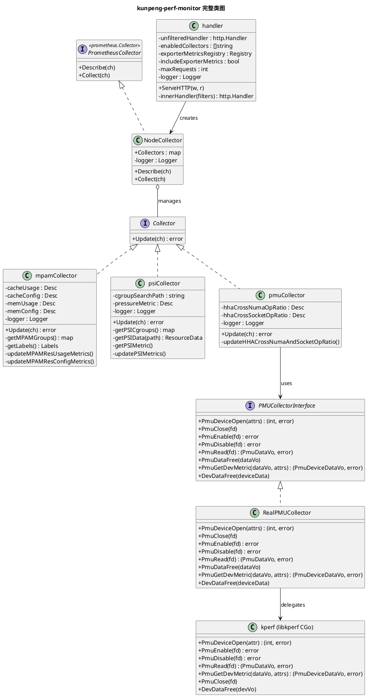
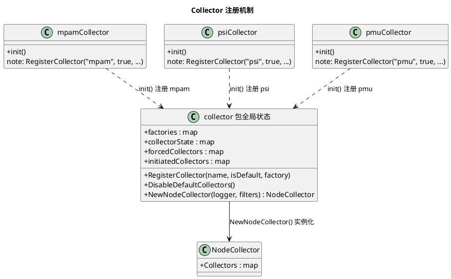
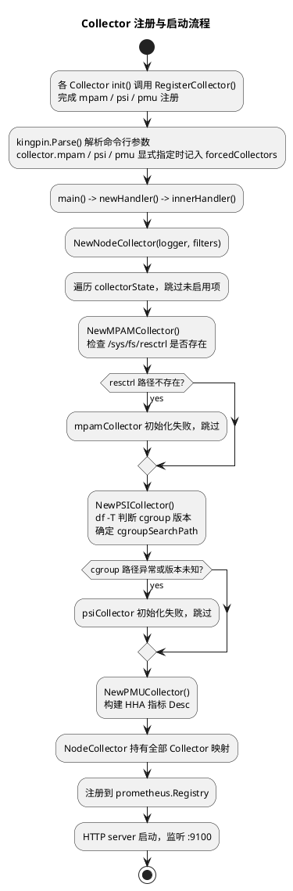
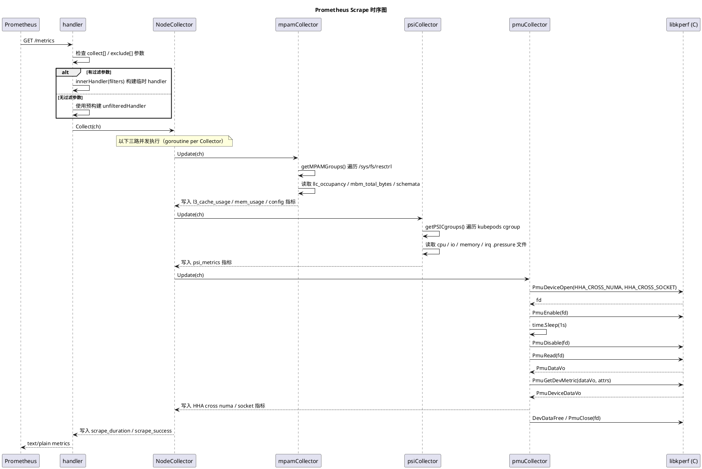
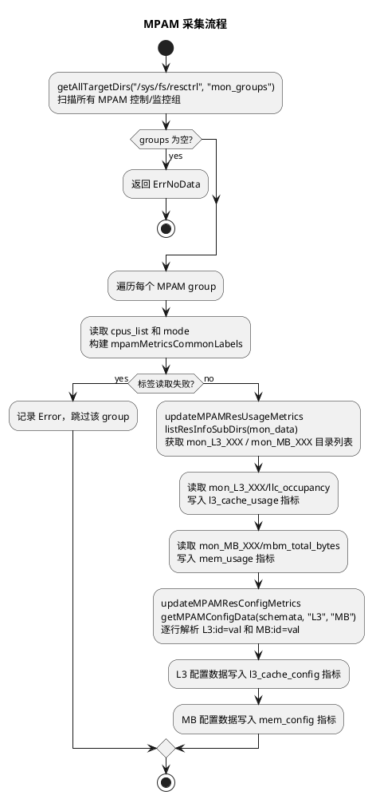
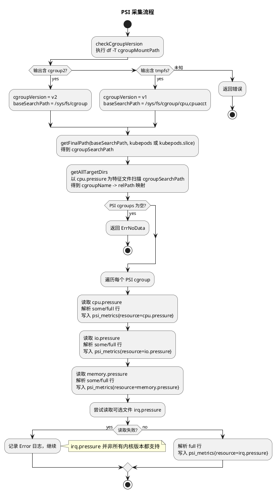
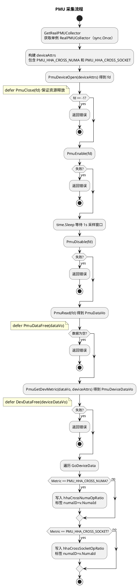

# kunpeng-perf-monitor 设计文档

## 1. 系统概述

kunpeng-perf-monitor 是一个面向鲲鹏服务器的 Prometheus Exporter，以 DaemonSet 方式部署在 Kubernetes 集群每个节点上，采集节点级的硬件与内核性能指标。系统支持以下功能：

- **MPAM 采集**：读取 resctrl 文件系统中各 MPAM 组的 L3 cache 与内存带宽使用量和配置信息
- **PSI 采集**：读取 cgroup（v1/v2）中 kubepods 下各容器组的压力停顿信息（cpu/io/memory/irq）
- **PMU 采集**：通过 libkperf C 库（CGo 桥接）采集鲲鹏 HHA 跨 NUMA/Socket 操作比率
- **动态过滤**：支持通过 URL 参数 `collect[]`/`exclude[]` 对每次 scrape 按需选择 Collector

## 2. 架构设计

### 2.1 模块划分

系统主要分为三个层次：

1. **HTTP 层**（`cmd/kunpeng-perf-monitor/main.go`）：命令行解析、HTTP handler、Prometheus registry 管理
2. **Collector 框架**（`collector/collector.go`）：Collector 注册、并发抓取调度、scrape 元指标上报
3. **三类 Collector**：独立实现，互不依赖
   - `mpamCollector`：解析 resctrl MPAM 文件
   - `psiCollector`：解析 cgroup PSI 文件
   - `pmuCollector`：调用 libkperf 采集硬件 PMU 设备指标

### 2.2 工作流程

```
┌──────────────────────────────────────────────────┐
│               main.go                            │
└────────────────────┬─────────────────────────────┘
                     │
                     ▼
┌──────────────────────────────────────────────────┐
│               handler                            │
│    (ServeHTTP / collect[] / exclude[] 过滤)       │
└────────────────────┬─────────────────────────────┘
                     │ 每次 scrape
                     ▼
┌──────────────────────────────────────────────────┐
│             NodeCollector                        │
│          (prometheus.Collector)                  │
└───────────┬──────────────┬──────────────┬────────┘
            │              │              │
            ▼              ▼              ▼
   ┌──────────────┐  ┌───────────┐  ┌───────────┐
   │mpamCollec-   │  │psiCollec- │  │pmuCollec- │
   │   tor        │  │   tor     │  │   tor     │
   └──────┬───────┘  └─────┬─────┘  └─────┬─────┘
          │                │              │
          ▼                ▼              ▼
   /sys/fs/resctrl  /sys/fs/cgroup  ┌──────────────┐
                                    │  libkperf    │
                                    │  (CGo 桥接)  │
                                    └──────────────┘
```

## 3. 核心组件设计

### 3.1 handler

HTTP 请求处理器，包装 Prometheus 指标端点。

**字段：**
- `unfilteredHandler http.Handler`：启动时预构建的无过滤处理器
- `enabledCollectors []string`：已启用的 Collector 名称列表，用于过滤逻辑
- `exporterMetricsRegistry *prometheus.Registry`：exporter 自身指标的独立 registry
- `includeExporterMetrics bool`：是否暴露 `process_*`、`go_*` 等 exporter 自身指标
- `maxRequests int`：最大并发 scrape 请求数

**关键方法：**
- `newHandler(includeExporterMetrics bool, maxRequests int, logger *slog.Logger) *handler`：创建 handler，预构建无过滤处理器
- `ServeHTTP(w http.ResponseWriter, r *http.Request)`：处理请求，根据 `collect[]`/`exclude[]` 参数决定使用预构建处理器还是按需构建过滤处理器
- `innerHandler(filters ...string) (http.Handler, error)`：内部方法，创建 NodeCollector 并注册到 registry

### 3.2 NodeCollector

实现 `prometheus.Collector` 接口，管理所有已注册 Collector 的生命周期。

**字段：**
- `Collectors map[string]Collector`：已实例化的 Collector 映射
- `logger *slog.Logger`：日志对象

**职责：**
- 在 `Collect()` 中对所有子 Collector 并发调用 `Update()`，通过 goroutine + WaitGroup 汇聚指标
- 记录每个 Collector 的 scrape 耗时（`kunpeng_node_scrape_collector_duration_seconds`）和成功状态（`kunpeng_node_scrape_collector_success`）
- 通过全局 `collectorState` 映射管理 Collector 的启用/禁用状态，支持命令行参数覆盖

**关键方法：**
- `RegisterCollector(collector string, isDefaultEnabled bool, factory func(*slog.Logger) (Collector, error))`：Collector 自注册入口，在 `init()` 阶段调用
- `NewNodeCollector(logger *slog.Logger, filters ...string) (*NodeCollector, error)`：根据过滤器实例化 Collector
- `DisableDefaultCollectors()`：将所有未被命令行显式指定的 Collector 设为禁用

### 3.3 mpamCollector

采集 resctrl 文件系统中各 MPAM 组的资源使用量和配置信息。

**字段：**
- `cacheUsage *prometheus.Desc`：L3 cache 使用量描述符
- `cacheConfig *prometheus.Desc`：L3 cache schemata 配置描述符
- `memUsage *prometheus.Desc`：内存带宽使用量描述符
- `memConfig *prometheus.Desc`：内存带宽 schemata 配置描述符
- `logger *slog.Logger`

**职责：**
- 遍历 resctrl 目录，以 `mon_groups` 子目录作为特征识别 MPAM 控制/监控组
- 从每个组的 `cpus_list` 和 `mode` 文件读取标签信息
- 从 `mon_data/mon_L3_XXX/llc_occupancy` 读取 L3 cache 使用量
- 从 `mon_data/mon_MB_XXX/mbm_total_bytes` 读取内存带宽使用量
- 从 `schemata` 文件读取 L3 和 MB 资源配置值

**关键方法：**
- `NewMPAMCollector(logger *slog.Logger) (Collector, error)`：创建采集器，校验 resctrl 路径
- `getMPAMGroups() (map[string]string, error)`：扫描 resctrl 目录，返回 MPAM 组映射
- `getLabels(mpamGroupName, mpamGroupRelPath string) (mpamMetricsCommonLabels, error)`：读取 cpus_list 和 mode
- `updateMPAMResUsageMetrics(ch, mpamGroupRelPath, labels)`：更新 L3/MB 使用量指标
- `updateMPAMResConfigMetrics(ch, mpamGroupRelPath, labels)`：更新 schemata 配置指标
- `Update(ch chan<- prometheus.Metric) error`：实现 Collector 接口

### 3.4 psiCollector

采集 Kubernetes 节点上各 Pod cgroup 的 PSI（Pressure Stall Information）指标。

**字段：**
- `cgroupSearchPath string`：kubepods cgroup 根搜索路径（初始化时确定）
- `pressureMetric *prometheus.Desc`：PSI 指标描述符，标签为 `group`/`resource`/`item`/`id`
- `logger *slog.Logger`

**职责：**
- 初始化时通过 `df -T` 判断 cgroup 版本，确定实际搜索路径
- 支持 cgroupfs（路径含 `kubepods`）和 systemd cgroup driver（路径含 `kubepods.slice`）
- 遍历搜索路径，以 `cpu.pressure` 文件作为特征识别 PSI cgroup
- 按 cgroup 组逐一读取 `cpu.pressure`、`io.pressure`、`memory.pressure`（必须）和 `irq.pressure`（可选）

**关键方法：**
- `NewPSICollector(logger *slog.Logger) (Collector, error)`：创建采集器，初始化 `cgroupSearchPath`
- `getCgroupSearchPath(logger *slog.Logger) (string, error)`：判断 cgroup 版本并确定搜索路径
- `getPSICgroups() (map[string]string, error)`：递归扫描，返回 PSI cgroup 名称到相对路径的映射
- `getPSIData(psiFilePath string) (PSICgroupResourceData, error)`：逐行解析 PSI 压力文件
- `parsePSILine(line string, delimiter string) (PSICgroupResourceData, error)`：解析单行 PSI 数据
- `Update(ch chan<- prometheus.Metric) error`：实现 Collector 接口

### 3.5 pmuCollector

通过 libkperf 采集鲲鹏 HHA（Home-node Hardware Agent）跨域操作比率。

**字段：**
- `hhaCrossNumaOpRatio *prometheus.Desc`：HHA 跨 NUMA 操作比率指标描述符
- `hhaCrossSocketOpRatio *prometheus.Desc`：HHA 跨 Socket 操作比率指标描述符
- `logger *slog.Logger`

**职责：**
- 通过 `PMUCollectorInterface` 抽象 libkperf 调用，支持测试时替换为 fake 实现
- 采集时打开设备任务、使能采样、等待 1 秒、禁用、读取数据、提取设备指标，完成后释放资源

**关键方法：**
- `NewPMUCollector(logger *slog.Logger) (Collector, error)`：创建采集器实例
- `getHHACrossNumaAndSocketDataWithCollector(pmuCollector PMUCollectorInterface) (kperf.PmuDeviceDataVo, error)`：执行完整 PMU 采集流程
- `updateHHACrossNumaAndSocketOpRatio(ch chan<- prometheus.Metric, pmuCollector PMUCollectorInterface) error`：将采集结果写入 channel
- `Update(ch chan<- prometheus.Metric) error`：实现 Collector 接口

**关键依赖：**
- `GetRealPMUCollector()`（单例，`sync.Once` 保证 libkperf 资源唯一持有）
- `kperf.PmuDeviceOpen`、`kperf.PmuGetDevMetric`

### 3.6 libkperf 绑定层

通过 CGo 封装 libkperf 和 libsym C 库，提供 Go 可调用的 PMU 采集接口。

**职责：**
- 封装 PMU 任务完整生命周期：`PmuOpen/PmuDeviceOpen` → `PmuEnable/PmuDisable` → `PmuRead` → `PmuClose`
- 封装设备级指标查询：`PmuDeviceOpen`（L3/DDRC/PCIe/SMMU/HHA 等）、`PmuGetDevMetric`
- 封装采样模式（COUNTING/SAMPLING/SPE_SAMPLING）、系统调用追踪、CPU 频率采样
- 负责 Go 结构体与 C 结构体之间的内存转换（`ToCPmuAttr`、`transferCPmuDataToGoData`）
- `sym` 包封装 `libsym` 符号解析接口（供 PMU 采样场景使用）

**CGo 编译配置：**
```
#cgo CFLAGS:  -I ../include
#cgo !static LDFLAGS: -L ../lib -lkperf -lsym
#cgo static  LDFLAGS: -L ../static_lib -lkperf -lsym -lelf++ -ldwarf++ -lstdc++ -lnuma
```

## 4. UML 类图

### 4.1 完整类图



### 4.2 Collector 注册机制类图



## 5. 关键数据结构

### 5.1 MPAM 配置数据结构

```go
// 单个配置项（如 L3、MB）对应的 id→value 映射
// e.g. ConfigItemData["1"] = 16777215
type ConfigItemData map[string]float64

// 配置文件（schemata）的解析结果
// e.g. ConfigData["L3"]["1"] = 16777215
//      ConfigData["MB"]["1"] = 100
type ConfigData map[string]ConfigItemData
```

### 5.2 MPAM 指标公共标签

```go
type mpamMetricsCommonLabels struct {
    groupName string  // MPAM 组名（resctrl 目录名）
    cpuList   string  // 组绑定的 CPU 列表
    mode      string  // 组模式（shareable/exclusive 等）
}
```

### 5.3 PSI 数据结构

```go
// PSI cgroup 中单个压力项（some/full）的指标数据
type PSICgroupResourceItemData map[string]float64

// PSI cgroup 中单个资源（cpu/io/memory/irq）的完整数据
// e.g. PSICgroupResourceData["full"]["avg10"] = 0.00
type PSICgroupResourceData map[string]PSICgroupResourceItemData
```

### 5.4 PMU 设备数据

```go
type PmuDeviceAttr struct {
    Metric C.enum_PmuDeviceMetric  // 指标类型（如 PMU_HHA_CROSS_NUMA）
    Bdf    string                   // PCIe BDF 地址（用于 PCIe/SMMU 指标）
    Port   string                   // 端口（用于 PCIe 延迟指标）
}

type PmuDeviceData struct {
    Metric    C.enum_PmuDeviceMetric
    Count     float64                 // 指标值
    Mode      C.enum_PmuMetricMode    // 维度模式（percore/pernuma/percluster/perchannel）
    CoreId    uint32
    NumaId    uint32
    ClusterId uint32
    Bdf       string
    Port      string
    DdrDataStructure                  // perchannel 时的 DDR 拓扑信息
}
```

## 6. 接口定义

### 6.1 Collector 接口

```go
type Collector interface {
    Update(ch chan<- prometheus.Metric) error
}
```

### 6.2 PMUCollectorInterface

```go
type PMUCollectorInterface interface {
    PmuDeviceOpen(attrs []kperf.PmuDeviceAttr) (int, error)
    PmuClose(fd int)
    PmuEnable(fd int) error
    PmuDisable(fd int) error
    PmuRead(fd int) (kperf.PmuDataVo, error)
    PmuDataFree(dataVo kperf.PmuDataVo)
    PmuGetDevMetric(dataVo kperf.PmuDataVo, attrs []kperf.PmuDeviceAttr) (kperf.PmuDeviceDataVo, error)
    DevDataFree(deviceData kperf.PmuDeviceDataVo)
}
```

设计要点：通过接口隔离 libkperf C 库调用，使 `pmuCollector` 的单元测试无需依赖真实硬件，可用 `test/kunpeng-perf-monitor/fake/fake_collector.go` 中的 fake 实现替代。

## 7. 主要流程

### 7.1 Collector 注册与启动流程



### 7.2 Prometheus Scrape 时序图



### 7.3 MPAM 采集流程



### 7.4 PSI 采集流程



### 7.5 PMU 采集流程



## 8. 配置说明

### 8.1 命令行参数

| 参数 | 默认值 | 说明 |
|------|--------|------|
| `--web.listen-address` | `:9100` | HTTP 监听地址 |
| `--web.telemetry-path` | `/metrics` | 指标暴露路径 |
| `--web.disable-exporter-metrics` | `false` | 是否排除 `process_*`、`go_*` 等 exporter 自身指标 |
| `--web.max-requests` | `40` | 最大并发 scrape 请求数，0 表示不限制 |
| `--collector.disable-defaults` | `false` | 将所有默认开启的 Collector 设为禁用 |
| `--collector.mpam` | `true` | 启用/禁用 MPAM 采集器 |
| `--collector.psi` | `true` | 启用/禁用 PSI 采集器 |
| `--collector.pmu` | `true` | 启用/禁用 PMU 采集器 |
| `--collector.mpam.resctl.path` | `/sys/fs/resctrl` | resctrl 挂载点 |
| `--collector.cgroup.path` | `/sys/fs/cgroup` | cgroup 挂载点 |

### 8.2 容器安全上下文

PMU 采集器需要 `SYS_ADMIN` Capability 才能调用底层 perf 相关系统调用：

```yaml
securityContext:
  privileged: false
  capabilities:
    add: ["SYS_ADMIN"]
    drop: ["ALL"]
  readOnlyRootFilesystem: true
  runAsUser: 0
```

> 若仅使用 MPAM/PSI 采集器，可去掉 `SYS_ADMIN` 并以非 root 用户运行。

### 8.3 DaemonSet 挂载卷

| 容器内路径 | 宿主机路径 | 用途 |
|-----------|-----------|------|
| `/sys/fs/resctrl` | `/sys/fs/resctrl` | MPAM 采集器数据源 |
| `/sys/fs/cgroup` | `/sys/fs/cgroup` | PSI 采集器数据源 |
| `/sys/devices/system/cpu` | `/sys/devices/system/cpu` | PMU CPU 拓扑信息 |
| `/sys/bus/event_source/devices` | `/sys/bus/event_source/devices` | PMU perf 事件枚举 |

## 9. 依赖关系

### 9.1 外部依赖

- Prometheus Go 客户端库（`github.com/prometheus/client_golang`）
- Prometheus exporter toolkit web（`github.com/prometheus/exporter-toolkit/web`）
- kingpin v2（命令行参数解析）
- libkperf（C 库，来自 openEuler 社区 gitee.com/openeuler/libkperf）
- libsym（C 库，随 libkperf 提供，用于符号解析）

### 9.2 系统路径

- `/sys/fs/resctrl`：MPAM 数据目录（resctrl 文件系统）
- `/sys/fs/cgroup`：PSI 数据目录
- `/sys/devices/system/cpu`：CPU 拓扑（PMU 采集）
- `/sys/bus/event_source/devices`：perf 事件源（PMU 采集）

## 10. 错误处理

### 10.1 Collector 初始化错误

- `mpamCollector` 初始化时 resctrl 路径不存在，返回错误，该 Collector 不会被加载
- `psiCollector` 初始化时 cgroup 路径不存在或版本识别失败，返回错误，该 Collector 不会被加载
- `NodeCollector` 中任意 Collector 初始化失败会导致整个 handler 构建失败并 panic

### 10.2 MPAM 采集错误

- 单个文件读取失败（如 `llc_occupancy`）记录 Error 日志并跳过，不中断整组采集
- `L3CacheUsageDirs` 或 `MemUsageDirs` 为空时记录 Error 日志并跳过对应指标

### 10.3 PSI 采集错误

- `irq.pressure` 读取失败记录 Error 日志但不中断本次 scrape（非所有内核版本均支持）
- 单个 cgroup 组处理失败记录 Error 日志并跳过该组，不影响其他组的采集

### 10.4 PMU 采集错误

- `PmuDeviceOpen` 失败返回错误，`Update()` 上报该次 scrape 失败
- `PmuRead` 返回空数据或 -1 均视为错误
- fd 资源通过 `defer PmuClose` 保证释放，不会发生泄漏

## 11. 扩展性

### 11.1 添加新 Collector

1. 在 `pkg/kunpeng-perf-monitor/collector/` 下新建文件
2. 实现 `Collector` 接口（`Update(ch chan<- prometheus.Metric) error`）
3. 在 `init()` 中调用 `RegisterCollector("xxx", defaultEnabled, NewXXXCollector)`
4. 新 Collector 自动获得命令行开关 `--collector.xxx` 和 URL 过滤支持

### 11.2 自定义 PSI 采集范围

默认只采集 `kubepods`/`kubepods.slice` 下的 cgroup。若需扩展至其他路径，修改 `psi.go` 中的 `targetDirForCgroupDrivers` 变量即可。

### 11.3 添加新 PMU 设备指标

1. 在 `pmu.go` 的 `deviceAttrs` 中追加对应 `PmuDeviceAttr.Metric`
2. 新增对应 `prometheus.Desc` 字段和标签定义
3. 在 `updateHHACrossNumaAndSocketOpRatio()` 中按 `Metric` 类型分发写入 channel
4. 需确认 libkperf 版本已支持该枚举值（参见 `kperf.go` 中 `PmuDeviceMetric` 定义）
