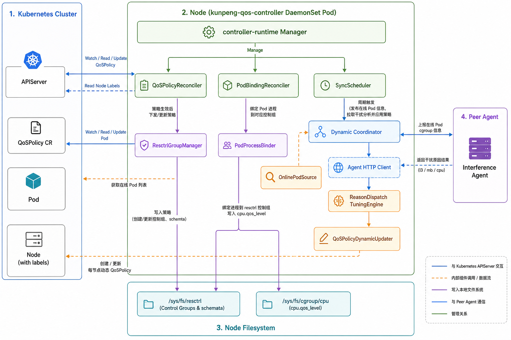
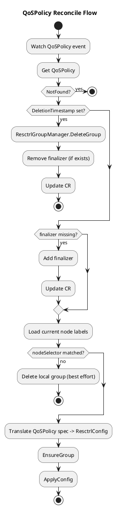
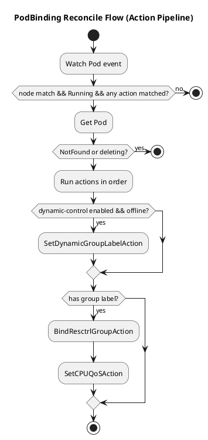
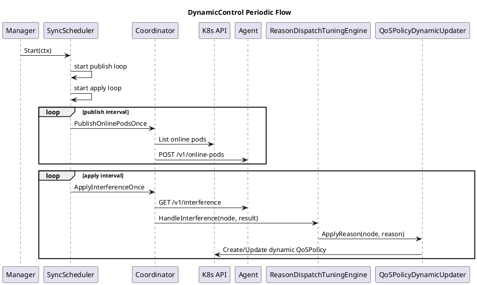

# kunpeng-qos-controller 整体架构设计

本文面向当前代码实现，说明：
- 整体架构与部署形态
- 各模块职责与边界
- 关键交互流程（含图示）

## 1. 设计目标

- 以 DaemonSet 方式部署在每个节点，本地实例只处理本节点生效的策略。
- 通过 `QoSPolicy` CR 统一管理 `resctrl` 控制组与资源配置。
- 支持静态策略（CR 驱动）与动态策略（Agent 分析驱动）并存。
- 支持按 Pod 标签自动绑定控制组，并按策略设置 Pod 对应容器的 `cpu.qos_level`。

## 2. 整体架构

### 2.1 组件图

### 2.2 CRD 定义（QoSPolicy）

CRD Go 类型定义文件：
- `api/kunpeng-qos-controller/v1alpha1/qospolicy_types.go`

Group/Version：
- `qos.kunpeng.huawei.com/v1alpha1`

核心结构：
- `QoSPolicy.spec.mb`：内存带宽相关策略（`hdl/pri/min/max`）
- `QoSPolicy.spec.l3`：L3 cache 相关策略（`pri/min/max/ways`）
- `QoSPolicy.spec.cpu`：CPU 相关策略（`qosLevel`）
- `QoSPolicy.spec.nodeSelector`：指定策略生效节点

设计要点：
- 用户输入的基础合法性通过 CRD 校验约束在 apply 阶段尽早拦截。
- `ways` 等与硬件拓扑强相关的限制由节点侧运行时结合本机能力处理。

## 3. 模块职责

### 3.1 QoSPolicyReconciler

文件：
- `pkg/kunpeng-qos-controller/controller/qospolicy_reconciler.go`

职责：
- 监听 `QoSPolicy` 事件。
- 维护 finalizer，保证删除时先执行本地清理。
- 判断 `spec.nodeSelector` 是否匹配当前节点。
- 将 CR spec 翻译后写入本地 `/sys/fs/resctrl/<group>`。

关键依赖：
- `NodeIdentity`
- `ResctrlGroupManager`

### 3.2 PodBindingReconciler（Action Pipeline）

文件：
- `pkg/kunpeng-qos-controller/controller/pod_binding_reconciler.go`
- `pkg/kunpeng-qos-controller/controller/pod_binding_actions.go`

职责：
- 监听本节点满足条件的 Pod。
- 通过 `PodAction` 管线执行可组合动作，避免在 Reconcile 主逻辑堆叠分支。

默认动作顺序：
1. `SetDynamicGroupLabelAction`（仅启用 dynamic-control 时）
   - 对 `qos.kunpeng.huawei.com/workload-class=offline` Pod 自动补充
     `qos.kunpeng.huawei.com/group=qos-dynamic-offline-<node>`。
2. `BindResctrlGroupAction`
   - 根据 `qos.kunpeng.huawei.com/group` 将 Pod 进程写入对应 resctrl 组。
3. `SetCPUQoSAction`
   - 读取 group 同名 `QoSPolicy` 的 `spec.cpu.qosLevel`，写入 Pod 容器 `cpu.qos_level`。

### 3.3 ResctrlGroupManager

文件：
- `pkg/kunpeng-qos-controller/controller/resctrl_group_manager.go`

职责：
- 本地创建/删除 resctrl 控制组。
- 生成并写入 `schemata`。
- 过滤当前机器不支持的 schemata key，避免跨机型因能力差异写入失败。

### 3.4 PodProcessBinder

文件：
- `pkg/kunpeng-qos-controller/controller/pod_process_binder.go`

职责：
- 解析 Pod 容器对应 cgroup 路径并收集进程 PID。
- 把 PID 写入 `/sys/fs/resctrl/<group>/tasks` 完成加组。
- 提供 `cpu.qos_level` 写入能力，并保证幂等（值一致则跳过）。

### 3.5 dynamiccontrol 模块

目录：
- `pkg/kunpeng-qos-controller/dynamiccontrol`

职责：
- 周期发布在线 Pod cgroup 路径到外部 Agent。
- 周期拉取干扰分析结果（`l3/mb/cpu`）。
- 根据干扰原因更新每节点动态 `QoSPolicy`。

关键对象：
- `SyncScheduler`：定时任务调度（由 manager 托管）。
- `Coordinator`：单次发布链路 + 单次应用链路编排。
- `LocalOnlinePodSource`：在线 Pod 发现。
- `HTTPAgentClient`：HTTP 通信客户端（当前使用 TCP HTTP）。
- `ReasonDispatchTuningEngine`：按干扰原因分发处理。
- `QoSPolicyDynamicUpdater`：upsert 动态策略 CR。

## 4. 关键交互流程

### 4.1 静态策略生效（QoSPolicy -> resctrl）

### 4.2 Pod 绑定流程（Action Pipeline）

### 4.3 动态控制流程（Scheduler + Agent）

## 5. 配置与标签约定

### 5.1 Pod 相关标签

- `qos.kunpeng.huawei.com/group`
  - 指定 Pod 要加入的 resctrl 组。
- `qos.kunpeng.huawei.com/workload-class`
  - `online`：参与动态分析输入。
  - `offline`：触发离线相关动作（动态组自动打标等）。

### 5.2 动态组命名

- 规则：`qos-dynamic-offline-<nodeName标准化>`
- 用途：
  - 离线 Pod 自动补组标签。
  - 动态策略 CR 命名与该组保持一致语义。

## 6. 部署与配置路径

- CRD：
  - `config/kunpeng-qos-controller-config/crd/bases/qos.kunpeng.huawei.com_qospolicies.yaml`
- DaemonSet：
  - `config/kunpeng-qos-controller-config/samples/qos-controller-daemonset-v1alpha1.yaml`
- QoSPolicy 示例：
  - `config/kunpeng-qos-controller-config/samples/qospolicy-examples-v1alpha1.yaml`
- Pod 示例：
  - `config/kunpeng-qos-controller-config/samples/pod-examples-for-qospolicy-v1alpha1.yaml`
