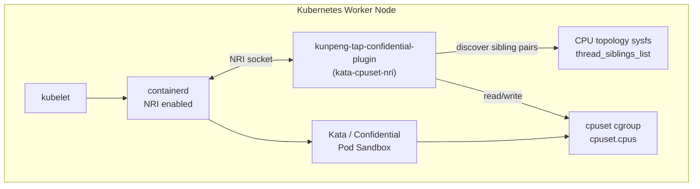
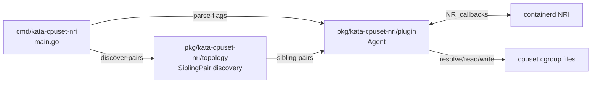
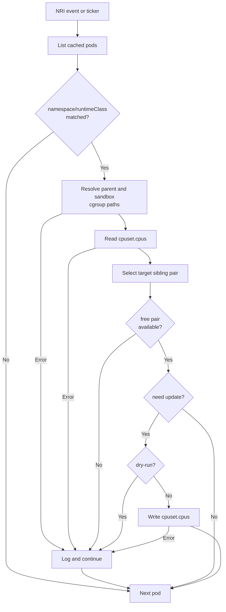

# Kunpeng-TAP Confidential Plugin 功能设计说明

| 标题 | Kunpeng-TAP Confidential Plugin 功能设计说明 |
| --- | --- |
| 状态 | Draft |
| 作者 | Kunpeng Boostkit Team |
| 创建日期 | 2026-07-16 |
| 实现载体 | `kata-cpuset-nri` |
| 目标场景 | Kata / Confidential Containers Pod 级 cpuset 收敛 |

## 1. 功能概述

`kunpeng-tap-confidential-plugin` 面向基于 Kata 的机密容器运行场景，当前实现载体为 `kata-cpuset-nri`。插件通过 NRI 接入 containerd，在 Pod sandbox 生命周期事件和周期扫描中，对符合白名单条件的 Kata Pod 执行 Pod 级 cpuset 收敛，将 Pod 的 2 个逻辑 CPU 绑定到同一个物理核心的 SMT sibling pair。

该能力用于解决机密容器场景中 Pod 运行在轻量虚拟机内时，CPU 亲和关系不稳定或默认 cpuset 过宽的问题。插件不替代 Kubernetes 调度器和 kubelet CPUManager，只在节点本地对已经创建的 Kata Pod cgroup 进行约束，使目标 Pod 获得更稳定的同核双线程 CPU 绑定结果。

核心功能如下：

- 基于 NRI 标准接口监听 `RunPodSandbox`、`StopPodSandbox`、`RemovePodSandbox` 和 `Synchronize`。
- 通过 namespace 白名单和 runtimeClass 白名单限定处理范围，默认处理 `default` namespace 和 `kata` runtimeClass。
- 从 sysfs 发现同一物理核心上的 SMT sibling pair，仅保留恰好包含 2 个逻辑 CPU 的 sibling pair。
- 从 NRI PodSandbox 信息和 cpuset cgroup 根路径解析 Pod parent cgroup 与 Kata sandbox cgroup。
- 对匹配 Pod 的 `cpuset.cpus` 执行收敛，同一轮扫描内避免多个 Pod 绑定到同一对 sibling。
- 支持 `dry-run` 模式，仅打印目标收敛结果，不写入 cgroup 文件，便于灰度验证。

功能边界如下：

- 仅处理 Pod 层级 cpuset，不处理单 container 级独立策略。
- 仅支持目标 Pod 使用固定 `2` CPU request/limit 的场景。
- 不做跨节点资源协调，不影响 Kubernetes 节点级调度决策。
- 不维护持久化分配状态，插件重启后依赖 NRI `Synchronize` 和当前 cgroup 文件重新收敛。
- 不提供机密计算证明、镜像加密、密钥注入等安全能力，只服务于 Kata / 机密容器运行时的 CPU 绑定稳定性。

## 2. 实现思路

插件采用“事件触发 + 周期调和”的实现思路。NRI 事件负责及时感知 Pod sandbox 的新增、停止和删除，周期扫描负责处理 NRI 连接重建、事件丢失、cgroup 创建时序滞后等情况。实际 cpuset 分配不依赖内存中的历史结果，而是每轮从当前 `cpuset.cpus` 重新构造占用关系。

整体处理逻辑如下：

1. 进程启动时读取运行参数，自动发现 cpuset cgroup 根路径，并从 `/sys/devices/system/cpu/cpu*/topology/thread_siblings_list` 发现 sibling pair。
2. 插件通过 NRI stub 注册到 containerd，订阅 Pod sandbox 生命周期事件。
3. `Synchronize` 收到运行时当前 Pod 快照后，刷新内存中的 Pod 元数据缓存。
4. `RunPodSandbox` 将新 Pod 写入缓存，`StopPodSandbox` 和 `RemovePodSandbox` 从缓存删除 Pod。
5. 每次事件处理后向调和通道发送一次异步调和请求；后台 ticker 也按 `scan-interval` 周期触发调和。
6. 调和阶段按 namespace、Pod 名称、Pod ID 对 Pod 排序，保证单轮处理顺序稳定。
7. 对命中白名单的 Pod 解析 cgroup 路径，读取当前 `cpuset.cpus`，并计算目标 sibling pair。
8. 如果当前 cpuset 已经是可用 sibling pair 且未被本轮其他 Pod 占用，则保持不变；否则选择第一个未占用 sibling pair。
9. 对 Pod parent cgroup 和 Kata sandbox cgroup 的 `cpuset.cpus` 做一致性检查，发现不一致时写入目标值。
10. 单 Pod 解析、读取或写入失败时记录错误并继续处理后续 Pod。

## 3. 实现设计

### 3.1 总体架构



插件以 DaemonSet 形式在每个节点运行一个实例。每个实例只管理本节点的 Pod，不与其他节点通信。容器内需要挂载 NRI socket 目录、CPU topology sysfs 和 cpuset cgroup 文件系统。

### 3.2 模块划分



主要模块职责如下：

| 模块 | 路径 | 职责 |
| --- | --- | --- |
| 进程入口 | `cmd/kata-cpuset-nri/main.go` | 解析 CLI 参数、发现 sibling pair、创建 Agent、处理退出信号。 |
| NRI Agent | `pkg/kata-cpuset-nri/plugin/agent.go` | 实现 NRI 回调、维护 Pod 元数据缓存、调度调和循环、解析 cgroup 并写入 cpuset。 |
| 拓扑发现 | `pkg/kata-cpuset-nri/topology/siblings.go` | 读取 CPU sysfs sibling 信息，生成稳定排序的 sibling pair 列表。 |
| 部署清单 | `config/kata-cpuset-nri/daemonset.yaml` | 定义 DaemonSet、挂载、启动参数和安全上下文。 |

### 3.3 调和流程



调和过程不要求全局成功。每个 Pod 独立处理，失败只影响当前 Pod，不阻塞同一轮中的其他 Pod。

### 3.4 cgroup 路径解析

Kata 场景下 Pod parent cgroup 与 sandbox cgroup 可能不是简单父子关系，因此插件会生成多个候选路径并同时收敛命中的路径。

解析顺序如下：

1. 使用 NRI `PodSandbox.Linux.CgroupParent` 原始路径，如果该路径下存在 `cpuset.cpus` 则直接使用。
2. 当配置了 `cgroup-root` 时，将 root 与去掉前导 `/` 的 cgroup parent 拼接。
3. 对 `kubepods-*.slice:cri-containerd:<sandboxID>` 形态生成 systemd scope 路径。
4. 对 `kubepods-*.slice` 形态结合 sandbox ID 生成 Kata sandbox cgroup 候选路径。
5. 如果前面均未命中，在 `cgroup-root` 下按 basename 做兜底查找。

命中的所有 cgroup 路径都会参与一致性检查和写入，避免 parent 已收敛但 Kata sandbox 仍保留全量 CPU 的情况。

### 3.5 sibling pair 分配策略

插件将 `thread_siblings_list` 中解析到的每个同核双线程 pair 作为候选资源。每轮调和使用临时 `occupied` 集合记录本轮已经分配或保持的目标 pair。

选择规则如下：

- 若 Pod 当前 `cpuset.cpus` 规范化后等于某个 sibling pair，且该 pair 本轮未占用，则继续使用当前 pair。
- 若当前 cpuset 不是合法 sibling pair，或该 pair 已被其他 Pod 占用，则选择第一个未占用 sibling pair。
- 若没有可用 sibling pair，则跳过该 Pod 并记录日志。
- Pod 列表按 namespace、Pod 名称、Pod ID 排序，降低不同扫描轮次的结果抖动。

## 4. 实现接口设计

### 4.1 命令行接口

插件通过二进制 `kata-cpuset-nri` 启动，主要参数如下：

| 参数 | 默认值 | 说明 |
| --- | --- | --- |
| `--nri-socket-path` | `/var/run/nri/nri.sock` | containerd NRI socket 路径。 |
| `--scan-interval` | `10s` | 周期调和间隔，NRI 事件也会触发一次异步调和。 |
| `--cgroup-root` | 空 | cpuset cgroup 根路径。为空时从 `/proc/self/mountinfo` 自动发现。 |
| `--namespace-whitelist` | `default` | namespace 白名单，多个值用英文逗号分隔。 |
| `--runtimeclass-whitelist` | `kata` | runtimeClass/runtime handler 白名单，多个值用英文逗号分隔。 |
| `--dry-run` | `false` | 为 `true` 时只记录计划写入，不修改 cgroup 文件。 |

DaemonSet 当前示例参数：

```yaml
args:
- --nri-socket-path=/var/run/nri/nri.sock
- --scan-interval=10s
- --namespace-whitelist=default
- --runtimeclass-whitelist=kata,kata-clh
- --dry-run=true
```

### 4.2 NRI 插件接口

插件通过 `github.com/containerd/nri/pkg/stub` 实现 NRI plugin callback，注册信息如下：

| 项目 | 值 |
| --- | --- |
| PluginName | `kata-cpuset-nri` |
| PluginIdx | `01` |
| EventMask | `RunPodSandbox,StopPodSandbox,RemovePodSandbox` |

NRI 回调设计：

| 回调 | 输入 | 输出 | 行为 |
| --- | --- | --- | --- |
| `Configure(ctx, config, runtime, version)` | NRI 配置信息 | `EventMask` | 返回插件订阅的事件掩码。 |
| `Synchronize(ctx, pods, containers)` | 当前运行时 Pod/Container 快照 | `[]*api.ContainerUpdate` | 用 Pod 快照替换本地缓存并触发调和；当前不返回容器更新。 |
| `RunPodSandbox(ctx, pod)` | 新建 Pod sandbox | `error` | 将 Pod 信息写入缓存并触发调和。 |
| `StopPodSandbox(ctx, pod)` | 停止 Pod sandbox | `error` | 从缓存删除 Pod 并触发调和。 |
| `RemovePodSandbox(ctx, pod)` | 删除 Pod sandbox | `error` | 从缓存删除 Pod 并触发调和。 |

### 4.3 内部数据结构

`Config` 保存启动配置：

```go
type Config struct {
    SocketPath     string
    ScanInterval   time.Duration
    CgroupRoot     string
    Namespaces     []string
    RuntimeClasses []string
    DryRun         bool
}
```

`podInfo` 是调和所需的最小 Pod 元数据：

```go
type podInfo struct {
    id           string
    name         string
    namespace    string
    runtimeClass string
    cgroupPath   string
}
```

`SiblingPair` 表示同一物理核心的两个逻辑 CPU：

```go
type SiblingPair struct {
    CPU0 int
    CPU1 int
}
```

### 4.4 文件系统接口

插件依赖以下节点本地文件接口：

| 路径 | 权限 | 用途 |
| --- | --- | --- |
| `/var/run/nri/nri.sock` | 连接 Unix socket | 连接 containerd NRI。 |
| `/proc/self/mountinfo` | 只读 | 自动发现 cpuset cgroup 挂载点。 |
| `/sys/devices/system/cpu/cpu*/topology/thread_siblings_list` | 只读 | 发现同核 SMT sibling pair。 |
| `/sys/fs/cgroup/cpuset/**/cpuset.cpus` | 读写 | 读取和写入 Pod parent / sandbox cpuset。 |

## 5. 可用性、可靠性保证和错误处理

### 5.1 可用性设计

- **节点本地部署**：DaemonSet 每节点一个实例，节点间无共享状态，单节点故障不影响其他节点。
- **白名单控制范围**：通过 namespace 和 runtimeClass 双白名单限制处理对象，降低误写非目标 Pod 的风险。
- **dry-run 灰度**：首次部署可保持 `--dry-run=true`，确认 NRI 注册、Pod 匹配和目标 sibling 计算正确后再开启写入。
- **最小写入面**：只写命中的 `cpuset.cpus` 文件，不修改 Pod spec、容器镜像、运行时配置和机密容器安全链路。
- **无外部服务依赖**：调和只依赖 containerd NRI、本机 sysfs 和 cgroup，不依赖 kube-apiserver 查询路径。

### 5.2 可靠性设计

- **事件与周期双触发**：NRI 事件提供及时性，周期扫描提供最终一致性。
- **重启可恢复**：插件重启或 NRI 重连后，通过 `Synchronize` 重建 Pod 元数据缓存，并基于当前 cgroup 重新计算占用。
- **无持久化分配状态**：分配结果不写入数据库，避免插件状态与 cgroup 事实不一致；每轮以 cgroup 当前值为准。
- **稳定扫描顺序**：Pod 排序后再调和，降低同一批 Pod 在不同扫描轮次中的目标变化。
- **单 Pod 故障隔离**：路径解析、读取、写入失败均只记录当前 Pod 错误，不中断整个调和循环。
- **多 cgroup 一致性**：同时检查 parent 和 sandbox cgroup，避免 Kata VM 实际所在 cgroup 与 Pod parent cgroup 不一致。

### 5.3 错误处理策略

| 错误场景 | 处理方式 | 影响 |
| --- | --- | --- |
| 未发现 sibling pair | 进程启动失败并输出错误 | 插件不运行，避免无拓扑依据时误写。 |
| NRI stub 创建失败 | 进程启动失败 | 需要检查 NRI socket、containerd NRI 配置和挂载。 |
| cpuset cgroup 根路径自动发现失败 | 进程启动失败 | 可通过 `--cgroup-root` 显式指定。 |
| Pod 不在白名单内 | 直接跳过 | 不影响非目标 Pod。 |
| Pod 缺少 cgroup parent | 记录日志并跳过 | 等待后续事件或周期扫描再次处理。 |
| cgroup 路径解析失败 | 记录错误并跳过当前 Pod | 其他 Pod 继续调和。 |
| 读取 `cpuset.cpus` 失败 | 记录错误并跳过当前 Pod | 其他 Pod 继续调和。 |
| 可用 sibling pair 不足 | 记录日志并跳过当前 Pod | 超量 Pod 保持原 cpuset。 |
| 写入 `cpuset.cpus` 失败 | 记录错误并继续下一个 cgroup/Pod | 可能出现部分 cgroup 未收敛，下一轮会再次尝试。 |
| NRI 运行时连接异常 | `Run` 返回错误并退出 | 由 DaemonSet 重启策略拉起新实例。 |

### 5.4 运维观测与验证

可通过以下方式确认插件可用性：

- 查看 DaemonSet rollout 和 Pod 状态。
- 查看插件日志中是否出现 `Using kata cpuset nri config`、`Pod cpuset updated` 或 `Dry-run pod cpuset update`。
- 检查日志中是否存在 `Resolve pod cgroup path failed`、`Write pod cpuset failed`、`No free sibling pair for pod` 等异常。
- 在节点上读取目标 Pod 对应 parent cgroup 和 sandbox cgroup 的 `cpuset.cpus`，确认二者一致且没有重复 sibling pair。

建议的上线顺序：

1. 以 `--dry-run=true` 部署，确认目标 Pod 匹配范围和 sibling 规划。
2. 缩小 namespace/runtimeClass 白名单，在小规模 Kata workload 上开启写入。
3. 通过日志和 cgroup 文件确认 parent/sandbox cpuset 一致。
4. 扩大白名单范围或副本规模，观察是否出现 sibling pair 不足和重复绑定。
