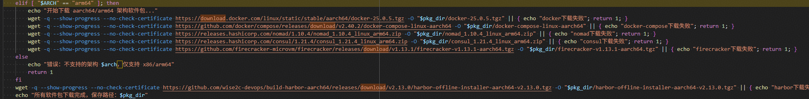
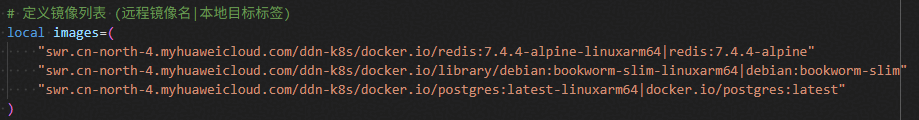
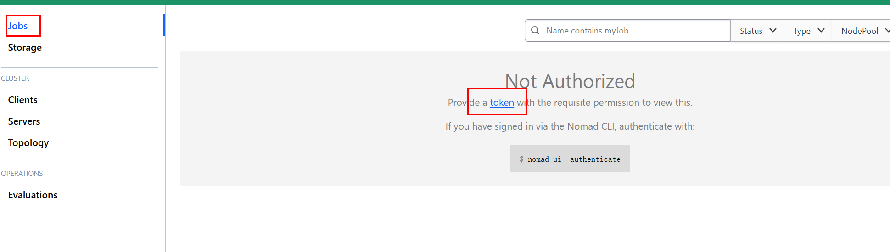
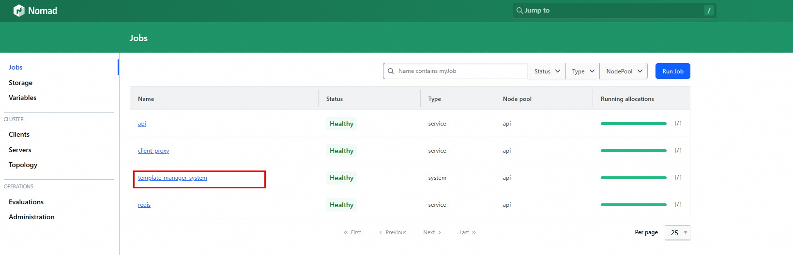
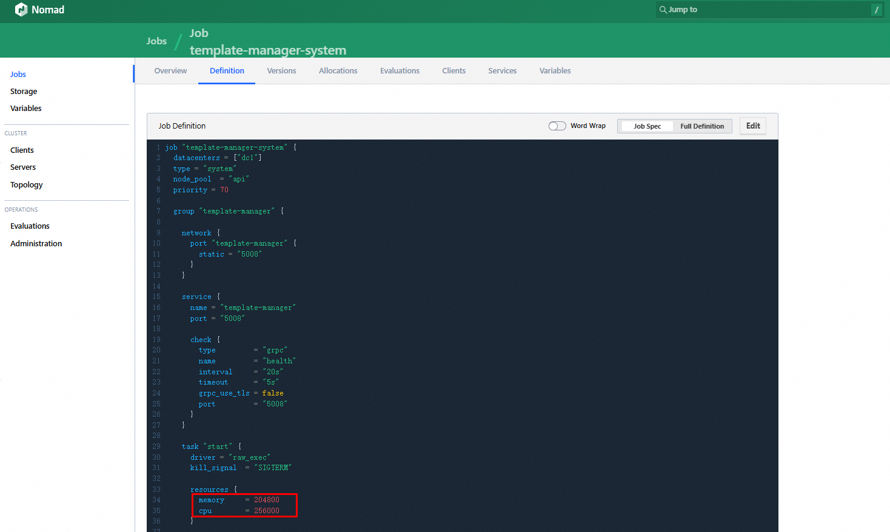

# E2B部署指南

## 概述

### 简介

E2B（English2Bits）是一个开源的AI代码沙箱平台，为AI Agent提供安全、隔离的代码执行环境。E2B支持快速创建和销毁轻量级沙箱实例，每个沙箱运行在独立的容器或虚拟机中，通过资源限制和网络隔离确保执行环境的安全性。

E2B 管理平台的核心能力包括：

- **沙箱编排**：基于HashiCorp Nomad实现沙箱任务的调度和生命周期管理，支持按模板批量创建和销毁沙箱实例。
- **镜像仓库**：集成Harbor作为容器镜像仓库，管理沙箱模板镜像及运行时依赖。
- **服务注册发现**：通过Consul实现各组件的服务注册、健康检查和发现。
- **配置存储**：使用Postgres数据库持久化沙箱配置（超时时间、并发上限等），支持运行时动态调整。
- **模板管理**：`template-manager-system`负责沙箱模板的定义与分发，可根据业务规模调整资源配额。

本文档面向本地部署和运维人员，提供E2B管理平台在鲲鹏 ARM 架构上的环境准备、软件安装、服务部署、配置修改、服务验证和资源调整方法。

### 版本支持

**表 1** 软件版本

| 项目 | 版本或说明 | 获取方法 |
| --- | --- | --- |
| OS | openEuler 24.03 LTS SP3，aarch64 | [openEuler 24.03 LTS SP3 aarch64](https://mirrors.huaweicloud.com/openeuler/openEuler-24.03-LTS-SP3/ISO/aarch64/openEuler-24.03-LTS-SP3-everything-aarch64-dvd.iso) |
| e2b-infra | `2026.09-3.oe2403sp3.aarch64` | [RPM 包下载](https://eulermaker.openeuler.openatom.cn/api/ems5/repositories/2403sp3/openEuler%3A24.03-LTS-SP3/aarch64/history/5bce9a46-4aad-11f1-a4a9-fa163e474048/last/Packages/e2b-infra-2026.09-3.oe2403sp3.aarch64.rpm) |
| Docker | 随部署脚本用于拉取和运行镜像 | 请使用操作系统或现场环境提供的 Docker 源安装 |
| Postgres | 由 E2B 部署脚本拉起容器服务 | 无需单独安装，按部署脚本执行 |
| Harbor | 由 E2B 部署脚本拉起容器服务 | 无需单独安装，按部署脚本执行 |
| Nomad | 由 E2B 部署脚本拉起服务 | 无需单独安装，按部署脚本执行 |
| Consul | 由 E2B 部署脚本拉起服务 | 无需单独安装，按部署脚本执行 |

### 约束与限制

- 本文档以`aarch64`架构、openEuler 24.03 LTS SP3为基础环境。
- 需要使用`root`用户或具备等效权限的用户执行RPM安装、服务部署和Docker操作。
- 部署节点需要能够访问RPM包下载地址、依赖组件下载地址以及Docker镜像源；离线环境需要提前准备依赖包和镜像。
- 服务器需要开放`4646`和`2900`端口，分别用于访问Nomad和Harbor。
- 若安装过程中临时配置Docker代理拉取镜像，执行`bash build.sh --start`前需要关闭Docker代理。
- E2B将部分配置保存在Postgres中，沙箱启动后可通过SQL命令调整沙箱超时时间、最大并发量等参数。
- `template-manager-system`任务资源上限需要根据宿主机资源和沙箱规模调整，避免默认资源不足影响并发沙箱运行。

### 应用场景

- 在鲲鹏服务器上部署E2B管理平台。
- 为OpenClaw或其他AI Agent沙箱任务提供E2B沙箱编排能力。
- 通过Nomad查看E2B各服务运行状态。
- 通过Harbor管理E2B相关容器镜像。
- 根据沙箱数量调整E2B的超时时间、最大并发量和资源上限。

## 软件安装

### 环境要求

本文基于特定环境提供部署指导。在正式操作前，请确保硬件、操作系统、网络和端口均满足要求。

**表 2** 硬件要求

| 项目 | 说明 |
| --- | --- |
| 处理器架构 | `aarch64`，建议使用鲲鹏服务器。 |
| CPU | 按沙箱并发规模规划。并发沙箱越多，Nomad任务和沙箱运行时需要的CPU越多。 |
| 内存 | 按“单个沙箱内存 * 最大沙箱数 + 管理组件预留内存”规划。`template-manager-system`建议额外预留`20GB`。 |
| 磁盘 | 需要满足RPM包、依赖包、Docker镜像、数据库数据、沙箱模板和运行日志存储需求。 |
| 网络 | 部署节点需要可访问依赖源和镜像源；离线部署时需要提前准备依赖包和镜像。 |

**表 3** 操作系统和软件要求

| 项目 | 版本或要求 | 说明 |
| --- | --- | --- |
| OS | openEuler 24.03 LTS SP3 aarch64 | 与RPM包构建版本一致。 |
| RPM 工具 | 系统自带 | 用于安装`e2b-infra`。 |
| Docker | 已安装并可正常运行 | 部署脚本会拉取并启动Docker镜像。 |
| wget | 已安装 | 用于下载RPM包。 |
| bash | 已安装 | 用于执行`build.sh`。 |
| 网络端口 | `2900`、`4646`、`8500`、`5432`、`9000`、`9001` | 其中`2900`和`4646`通常需要对运维访问端开放。 |

**表 4** 默认端口说明

| 变量名 | 默认值 | 含义 |
| --- | --- | --- |
| `PG_PORT` | `5432` | Postgres容器服务端口。 |
| `MINIO_PORT` | `9000` | MinIO服务端口；单机部署无需MinIO。 |
| `MINIO_CONSOLE_PORT` | `9001` | MinIO控制台端口；单机部署无需MinIO。 |
| `HARBOR_HTTP_PORT` | `2900` | Harbor服务端口，可通过`server_ip:2900`访问Harbor管理系统。 |
| `NOMAD_PORT` | `4646` | Nomad服务端口，可通过`server_ip:4646`访问Nomad管理系统。 |
| `NOMAD_HTTP_PORT` | `4646` | Nomad健康检查端口。 |
| `CONSUL_HTTP_PORT` | `8500` | Consul健康检查端口。 |

### 安装前检查

1. 检查系统架构。

    ```bash
    uname -m
    ```

    命令说明：查看当前系统架构。预期输出为`aarch64`。

2. 检查操作系统版本。

    ```bash
    cat /etc/os-release
    ```

    命令说明：查看openEuler版本信息，确认环境与openEuler 24.03 LTS SP3匹配。

3. 检查Docker服务状态。

    ```bash
    systemctl status docker
    ```

    命令说明：确认Docker已安装并处于运行状态。若未运行，需要先启动Docker。

4. 检查关键端口是否被占用。

    ```bash
    ss -lntp | grep -E ':2900|:4646|:8500|:5432|:9000|:9001'
    ```

    命令说明：查看E2B默认端口是否已被其他进程监听。若端口被占用，需要调整部署配置或释放端口。

5. 检查当前用户权限。

    ```bash
    id
    ```

    命令说明：确认当前用户是否为`root`，或是否具备执行RPM、Docker和系统服务管理的权限。

### 安装 e2b-infra软件包

本章节用于安装E2B部署脚本和基础文件。安装完成后，默认安装目录为`/opt/e2b-infra`。

1. 下载RPM包。

    ```bash
    wget https://eulermaker.openeuler.openatom.cn/api/ems5/repositories/2403sp3/openEuler%3A24.03-LTS-SP3/aarch64/history/5f3f217a-2daa-11f1-9840-fa163e47408d/last/Packages/e2b-infra-2026.09-3.oe2403sp3.aarch64.rpm
    ```

    命令说明：从openEuler构建仓库下载`e2b-infra` RPM安装包。

2. 卸载旧版本。

    ```bash
    rpm -e e2b-infra
    ```

    命令说明：卸载系统中已安装的旧版`e2b-infra`。如果系统未安装旧版本，可能提示包未安装，可继续执行后续安装步骤。

3. 安装新版本。

    ```bash
    rpm -ivh e2b-infra-2026.09-3.oe2403sp3.aarch64.rpm
    ```

    命令说明：安装指定RPM包，`-i`表示安装，`-v`输出详细信息，`-h`显示安装进度。

4. 检查安装目录。

    ```bash
    ls -l /opt/e2b-infra
    ```

    命令说明：确认`/opt/e2b-infra`目录已生成，并检查部署脚本和配置目录是否存在。

### 修改E2B部署配置

部署前需要修改`/opt/e2b-infra/dep/.env`文件，至少需要配置`SERVER_IP`。

1. 编辑配置文件。

    ```bash
    vi /opt/e2b-infra/dep/.env
    ```

    命令说明：打开E2B部署配置文件。

2. 在`.env`文件第一行增加或修改`SERVER_IP`。

    ```bash
    SERVER_IP=本机地址
    ```

    配置说明：`SERVER_IP`为当前集群server节点IP，多个server节点IP使用空格分隔。这里的server节点指Nomad server端运行所在节点。

3. 按需调整关键配置。

    ```bash
    export NUM_SERVERS=1
    export REGISTRY_URL="{ip}:{port}/{repository_name}"
    export POSTGRES_CONNECTION_STRING="postgresql://{username}:{password}@{ip}:{port}/{database_name}?sslmode=disable"
    export HARBOR_HOST="{ip}:{port}"
    ```

    配置说明：

    | 配置项 | 默认值或示例 | 说明 |
    | --- | --- | --- |
    | `NUM_SERVERS` | `1` | 当前集群server节点数量。 |
    | `REGISTRY_URL` | `$SERVER_IP:2900/e2b-orchestration` | Harbor镜像仓库地址，默认端口为`2900`。 |
    | `POSTGRES_CONNECTION_STRING` | `postgresql://postgres:local@$SERVER_IP:5432/mydatabase?sslmode=disable` | Postgres数据库连接地址。 | //pragma: allowlist secret
    | `HARBOR_HOST` | `$SERVER_IP:2900` | Harbor访问地址。 |

4. 保存并退出文件。

    ```text
    Esc
    :wq!
    Enter
    ```

    操作说明：在`vi`中按`Esc`退出编辑模式，输入`:wq!`保存并退出。

### 部署E2B服务

本章节通过`/opt/e2b-infra/build.sh`脚本下载依赖、安装组件并启动E2B服务。若需要定制部署逻辑，可基于`build.sh`脚本内容进行修改。

1. 进入安装目录。

    ```bash
    cd /opt/e2b-infra
    ```

    命令说明：切换到E2B安装目录，后续命令均在该目录执行。

2. 下载依赖组件。

    ```bash
    bash build.sh --download
    ```

    命令说明：执行部署脚本的依赖下载阶段，下载arm64所需依赖包。若遇到网络问题，可手动下载相关依赖并上传至`/opt/e2b-infra/dep`目录。

    

3. 安装E2B服务组件。

    ```bash
    bash build.sh --install
    ```

    命令说明：安装E2B依赖组件并拉取所需Docker镜像。若镜像拉取失败，可临时配置Docker代理手动拉取镜像。

    

4. 启动服务。

    ```bash
    bash build.sh --start
    ```

    命令说明：启动E2B管理平台及相关服务，安装过程需要输入邮箱等必要信息。此外，若安装阶段使用过HTTP或Docker代理，执行该命令前需要关闭。

5. 启动失败时清理并重试。

    ```bash
    bash build.sh --stop
    bash build.sh --uninstall
    bash build.sh --start
    ```

    命令说明：`--stop`用于停止已启动服务，`--uninstall`用于清理已安装组件，最后重新执行`--start`启动服务。

### Harbor默认账号

Harbor默认访问信息如下：

| 配置项 | 默认值 | 说明 |
| --- | --- | --- |
| 访问地址 | `http://{server_ip}:2900` | `{server_ip}`替换为实际server节点IP。 |
| `HARBOR_USER` | `admin` | Harbor管理员账号。 |
| `HARBOR_PASSWORD` | `Harbor12345` | Harbor管理员默认密码。 |

> **说明：**  
> 生产环境建议首次登录后修改默认密码，并按现场安全要求限制Harbor管理页面访问范围。

## 服务验证

本章节用于验证E2B管理平台是否部署成功，并说明常见运行参数的调整方法。

### 查看Nomad服务状态

1. 访问Nomad管理页面。

    ```text
    http://{server_ip}:4646
    ```

    说明：将`{server_ip}`替换为实际server节点IP。

    

2. 获取Nomad登录Token。

    ```bash
    grep NOMAD_ACL_TOKEN /opt/e2b-infra/.env
    ```

    命令说明：从`/opt/e2b-infra/.env`文件中查看`NOMAD_ACL_TOKEN`字段，该字段值即为Nomad登录Token。

3. 检查服务健康状态。

    在Nomad页面中查看各服务状态。如果服务状态显示为`Healthy`，表示服务启动正常。

    

### 修改沙箱超时时间

E2B将沙箱配置保存在Postgres中。沙箱启动后，可通过SQL命令修改沙箱配置。

```bash
docker exec postgres2 psql -U postgres -d mydatabase -c "UPDATE tiers SET max_length_hours = 24 WHERE id = 'base_v1';"
```

命令说明：

| 参数 | 说明 |
| --- | --- |
| `docker exec postgres2` | 进入名为`postgres2`的Postgres容器执行命令。 |
| `psql -U postgres` | 使用`postgres`用户连接数据库。 |
| `-d mydatabase` | 指定数据库名称，需要替换为`.env`中配置的实际数据库名。 |
| `max_length_hours = 24` | 将`base_v1`沙箱最大运行时间修改为24小时。 |

### 修改沙箱最大并发量

```bash
docker exec postgres2 psql -U postgres -d mydatabase -c "UPDATE tiers SET concurrent_instances = 50 WHERE id = 'base_v1';"
```

命令说明：

| 参数 | 说明 |
| --- | --- |
| `concurrent_instances = 50` | 将`base_v1`沙箱最大并发实例数修改为50。 |
| `mydatabase` | 数据库名称占位符，需要替换为实际数据库名。 |

### 检查关键容器

```bash
docker ps
```

命令说明：查看当前运行中的Docker容器，确认Postgres、Harbor、Nomad、Consul等相关服务容器处于运行状态。

### 检查关键端口监听

```bash
ss -lntp | grep -E ':2900|:4646|:8500|:5432'
```

命令说明：确认Harbor、Nomad、Consul和Postgres等服务端口已被监听。

## 资源配置

### 调整template-manager-system资源

Nomad中的`template-manager-system`任务在Job Definition中对CPU、内存等资源设定了默认上限。可根据主机实际资源和沙箱并发规模进行调整。

1. 登录Nomad管理页面。

    ```text
    http://{server_ip}:4646
    ```

2. 进入`Jobs`页面。

3. 找到`template-manager-system`。

    

4. 进入任务详情，打开`Definition`页签。

    

5. 修改CPU、内存等资源配置。

6. 单击`Plan`按钮保存。

### 内存配置建议

`template-manager-system`的内存建议按如下公式分配：

```text
template-manager-system 内存 = 单个沙箱内存 * 最大沙箱数 + 20GB
```

配置单位为MB。例如，单个沙箱分配`2GB`，最大沙箱数为`50`，则建议内存至少为：

```text
2GB * 50 + 20GB = 120GB = 122880MB
```

> **说明：**  
> 该公式用于估算`template-manager-system`的内存上限。实际配置还需要结合宿主机总内存、系统预留、其他服务资源占用和业务并发峰值调整。

## 常用运维命令

### build.sh命令说明

| 命令 | 说明 | 使用场景 |
| --- | --- | --- |
| `bash build.sh --download` | 下载部署依赖组件。 | 首次部署或依赖缺失时执行。 |
| `bash build.sh --install` | 安装依赖组件并拉取Docker镜像。 | 下载依赖完成后执行。 |
| `bash build.sh --start` | 启动E2B服务。 | 安装完成后启动服务。 |
| `bash build.sh --stop` | 停止E2B服务。 | 服务异常、维护或卸载前执行。 |
| `bash build.sh --uninstall` | 卸载或清理部署组件。 | 启动失败后清理环境或重新部署时执行。 |

### 快速部署命令

以下命令适用于在线环境快速部署。执行前请根据实际环境修改`/opt/e2b-infra/dep/.env`。

```bash
wget https://eulermaker.openeuler.openatom.cn/api/ems5/repositories/2403sp3/openEuler%3A24.03-LTS-SP3/aarch64/history/5bce9a46-4aad-11f1-a4a9-fa163e474048/last/Packages/e2b-infra-2026.09-3.oe2403sp3.aarch64.rpm
rpm -e e2b-infra
rpm -ivh e2b-infra-2026.09-3.oe2403sp3.aarch64.rpm
vi /opt/e2b-infra/dep/.env
cd /opt/e2b-infra
bash build.sh --download
bash build.sh --install
bash build.sh --start
```

### 常用检查命令

| 命令 | 说明 |
| --- | --- |
| `ls -l /opt/e2b-infra` | 查看E2B安装目录。 |
| `grep NOMAD_ACL_TOKEN /opt/e2b-infra/.env` | 查看Nomad登录Token。 |
| `docker ps` | 查看E2B相关容器是否运行。 |
| `ss -lntp | grep -E ':2900|:4646|:8500|:5432'` | 查看关键服务端口监听情况。 |
| `docker logs <container_name>` | 查看指定容器日志。 |

## 故障处理

### 依赖下载失败

现象：执行`bash build.sh --download`失败。

处理方法：

1. 检查节点是否可以访问外部网络。
2. 检查DNS、代理和防火墙配置。
3. 手动下载依赖包并上传至`/opt/e2b-infra/dep`目录。
4. 重新执行`bash build.sh --download`或后续安装步骤。

### Docker镜像拉取失败

现象：执行`bash build.sh --install`时镜像拉取失败。

处理方法：

1. 检查Docker是否运行。
2. 检查镜像源或代理配置。
3. 临时配置Docker代理后手动拉取镜像。
4. 执行`bash build.sh --start`前关闭Docker代理。

### 服务启动失败

现象：执行`bash build.sh --start`后服务未正常启动。

处理方法：

```bash
cd /opt/e2b-infra
bash build.sh --stop
bash build.sh --uninstall
bash build.sh --install
bash build.sh --start
```

命令说明：先停止并清理异常部署状态，再重新部署和启动服务。

### 无法访问Nomad页面

现象：浏览器无法访问`http://{server_ip}:4646`。

处理方法：

1. 检查`SERVER_IP`是否配置正确。
2. 检查`4646`端口是否监听。

    ```bash
    ss -lntp | grep ':4646'
    ```

3. 检查服务器安全组、防火墙或本机防火墙是否放通`4646`端口。
4. 检查Nomad相关容器或服务是否正常运行。

    ```bash
    docker ps
    ```

### 无法访问Harbor页面

现象：浏览器无法访问`http://{server_ip}:2900`。

处理方法：

1. 检查`HARBOR_HOST`或`HARBOR_HTTP_PORT`配置。
2. 检查`2900`端口是否监听。

    ```bash
    ss -lntp | grep ':2900'
    ```

3. 检查防火墙或安全组是否放通`2900`端口。
4. 使用默认账号`admin`和默认密码`Harbor12345`登录；生产环境建议登录后修改默认密码。
