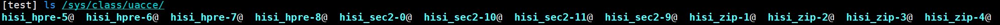
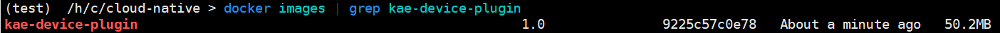
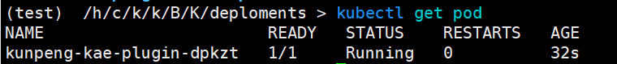
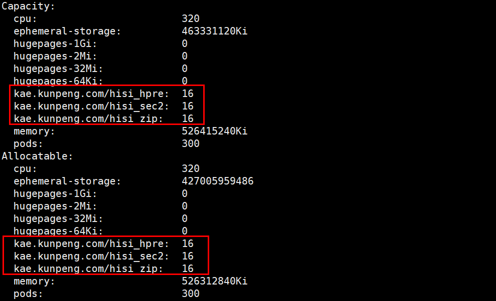
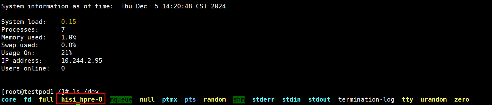
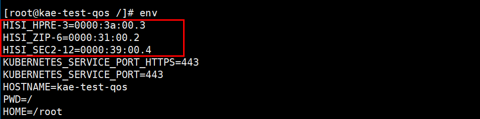
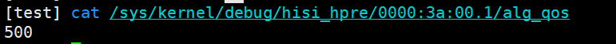

# KAE Device Plugin 用户指南

## 简介<a name="ZH-CN_TOPIC_0000002549772317"></a>

本文主要介绍如何在使用openEuler操作系统的服务器中部署和使用KAE设备直通插件（KAE Device Plugin）。

KAE（Kunpeng Accelerator Engine，鲲鹏加速引擎）是基于鲲鹏处理器提供的硬件加速解决方案，包含了KAE加解密和KAE解压缩。KAE加解密用于加速SSL（Secure Sockets Layer）/TLS（Transport Layer Security）应用，KAE解压缩用于加速数据压缩、解压，可以显著降低处理器消耗，提高处理器效率。

本插件的主要功能是自动管理服务器上所有的KAE设备，并简化KAE设备的直通操作，让用户可以通过简单的声明将KAE设备直通到容器中来加速加解密和数据压缩场景。


## 环境要求<a name="ZH-CN_TOPIC_0000002518412470"></a>

本文基于特定环境提供指导，在正式操作前请确保软硬件均满足要求。

**硬件要求<a name="section8140133619490"></a>**

如[**表 1** 硬件要求](#硬件要求)所示。

**表 1** 硬件要求<a id="硬件要求"></a>

|项目|规格|
|--|--|
|CPU|鲲鹏920系列处理器、鲲鹏950处理器|


**操作系统和软件要求<a name="section21631338357"></a>**

此处列的操作系统版本和软件版本为已验证的版本，其他版本也可使用本插件，需要自行调整适配。如果环境未安装K8s或Containerd，可参见[**表 2** 已验证的操作系统和软件版本](#已验证的操作系统和软件版本)进行安装。

**表 2** 已验证的操作系统和软件版本<a id="已验证的操作系统和软件版本"></a>

|软件|版本|获取地址|
|--|--|--|
|OS|openEuler 24.03 LTS SP2|[获取链接](https://www.openeuler.org/en/download/#openEuler%2024.03%20LTS%20SP2)|
|Kubernetes|1.25.16|请参见《[Kubernetes 部署指南（CentOS&openEuler）](https://www.hikunpeng.com/document/detail/zh/kunpengcpfs/ecosystemEnable/Kubernetes/kunpengk8s_04_0001.html)》进行下载部署。|
|Containerd|1.7.10|请参见《[Containerd 安装指南（CentOS 8.1&openEuler 20.03）](https://www.hikunpeng.com/document/detail/zh/kunpengcpfs/ecosystemEnable/Containerd/kunpengcontainerd_03_0001.html)》进行下载部署。|
|Docker|18.0.9|通过配置Yum源方式安装|
|kae-device-plugin|1.0.0|[获取链接](https://gitcode.com/boostkit/cloud-native)|

## 编译插件<a name="ZH-CN_TOPIC_0000002549892317"></a>

编译插件前请确保当前集群中有KAE相关设备并且已经安装了KAE相关驱动。

**编译前准备<a name="section523822632720"></a>**

1. 请确保已经获取[操作系统和软件要求](#已验证的操作系统和软件版本)中的软件和代码。
2. 使用如下命令查看计算节点上是否有KAE设备。

    ```
    lspci | grep HPRE
    lspci | grep SEC
    lspci | grep ZIP
    ```

    - 如果有KAE相关设备可能的回显结果如下。

        

    - 如果没有结果输出，可能是当前计算节点没有安装License，请参见[获取License](https://www.hikunpeng.com/document/detail/zh/kunpengaccel/kae/usermanual/kunpengaccel_06_0008.html)安装对应的License。

3. 使用如下命令查看计算节点是否已经安装KAE相关驱动。

    ```
    ls /sys/class/uacce
    ```

    可能的回显如下，如果没有结果输出，可能是没有安装KAE相关驱动，请参见[源码安装](https://www.hikunpeng.com/document/detail/zh/kunpengaccel/kae/usermanual/kunpengaccel_06_0012.html)安装KAE驱动。

    

**操作步骤<a name="section972652218309"></a>**

1. 获取插件源码。

    ```
    git clone https://gitcode.com/boostkit/cloud-native.git
    ```

2. 编译插件代码获取镜像。

    ```
    cd /path/to/cloud-native
    make kae-device-plugin-docker
    ```

    > **说明：** 
    >编译插件之前请确保已经安装go1.25或以上版本。

3. 查看镜像是否编译成功。

    ```
    docker images | grep kae-device-plugin
    ```

    出现如下结果说明镜像已经编译成功。

    

4. 将编译好的镜像导出为kae-device-plugin.tar。

    ```
    docker save kae-device-plugin:1.0 -o kae-device-plugin.tar
    ```

5. 把导出的tar包复制到计算节点上后，执行如下命令导入镜像。
    - Kubernetes使用的容器运行时是Containerd时，使用如下命令导入镜像。

        ```
        ctr -n k8s.io images import /path/to/kae-device-plugin.tar
        ```

    - Kubernetes使用的容器运行时是Docker时，使用如下命令导入镜像。

        ```
        docker load -i /path/to/kae-device-plugin.tar
        ```

## 部署插件<a name="ZH-CN_TOPIC_0000002518252546"></a>

在部署插件之前，需要先在计算节点上创建KAE的VF，再在控制节点部署插件。

1. 使用如下命令创建VF。

    ```
    cd /path/to/cloud-native/Boostkit_CloudNative/K8S/deployments/kae-device-plugin
    python3 kae-init.py 4
    ```

    可能的回显如下，示例命令是为每个KAE设备创建4个VF，可根据实际需要进行调整。

    

2. 在控制节点上执行如下命令部署KAE Device Plugin。

    ```
    cd /path/to/cloud-native/Boostkit_CloudNative/K8S/deployments/
    kubectl apply -k kae-device-plugin/overlay/qos
    ```

3. 查看插件是否部署成功。

    ```
    kubectl get pod
    ```

    可能的回显结果如下。

    

4. 查看是否已经纳管KAE相关设备。

    ```
    kubectl describe node <your compute node name>
    ```

    可能的回显如下。

    

    发现当前计算节点可分配资源中已经有KAE相关设备，说明已经部署成功。

## 使用插件<a name="ZH-CN_TOPIC_0000002518412468"></a>

### KAE设备直通<a id="KAE设备直通"></a>

本节以直通HPRE设备为例，简单介绍如何将KAE设备直通到容器中。

如果需要直通其他设备，根据[**表 1** KAE设备与KAE设备资源名对照表](#KAE设备与KAE设备资源名对照表)将资源名修改为对应设备的资源名即可。

**表 1** KAE设备与KAE设备资源名对照表<a id="KAE设备与KAE设备资源名对照表"></a>

|KAE设备|设备资源名|
|--|--|
|HPRE|kae.kunpeng.com/hisi_hpre|
|SEC|kae.kunpeng.com/hisi_sec2|
|ZIP|kae.kunpeng.com/hisi_zip|


> **须知：** 
>KAE设备正常运行需要KAE相关的库，容器内一般并没有安装KAE相关的库。本例是通过把主机上的KAE库映射到容器中来完成的。实际使用过程中请根据需要自行选择在容器中安装KAE相关的库，或者把主机上的KAE库映射到容器中。

1. 在Pod的yaml文件中进行声明。

    对需要使用的设备在**resources**中通过**requests**和**limits**来进行声明。在**resources**中的**requests**和**limits**添加**kae.kunpeng.com/hisi\_hpre: "1"** 即可。

    ```
    apiVersion: v1
    kind: Pod
    metadata:
      name: kae-test
    spec:
      containers:
      - name: kae-test
        image: kae-test:latest
        command: ["/bin/sh", "-c", "while true; do echo hello; sleep 300000; done"]
        imagePullPolicy: IfNotPresent
        resources:
          requests:
            kae.kunpeng.com/hisi_hpre: "1"
          limits:
            kae.kunpeng.com/hisi_hpre: "1"
        volumeMounts:
          - name: local-lib
            mountPath: /usr/local
      volumes:
        - name: local-lib
          hostPath:
            path: /usr/local/  
    ```

2. 部署Pod。

    ```
    kubectl apply -f kae-pod/kae-test-pod.yaml
    ```

3. 部署完成之后，查看Pod的运行状态。

    ```
    kubectl get pod
    ```

    回显如下所示，Pod是**Running**状态说明部署成功。

    ```
    NAME       READY   STATUS    RESTARTS   AGE
    kae-test   1/1     Running   0          3h20m
    ```

4. 进入Pod内查看KAE设备是否已经挂载。

    ```
    kubectl exec -it kae-test bash
    ls /dev
    ```

    kae-test为Pod的名字，请根据用户自定义的Pod名字进行修改。

5. 发现“/dev”目录下有名为hisi\_hpre-x的设备说明KAE设备已经挂载成功。

    

### 设置KAE设备QoS<a id="设置KAE设备QoS"></a>

KAE设备支持QoS（Quality of Service，服务质量）功能。通过设置QoS，可以为不同容器中的KAE设备分配不同的KAE设备带宽。为高优先级容器设置较高的KAE QoS可以确保高优先级容器内的KAE设备拥有较高的带宽，从而保障服务质量。

1. 在Pod的yaml文件中添加注解**qos.kae.kunpeng.com/hisi\_hpre: "500"** 声明KAE设备的QoS，如果要设置其他设备的QoS参考[KAE设备QoS注解对照表](#KAE设备QoS注解对照表)。

    ```
    apiVersion: v1
    kind: Pod
    metadata:
      name: kae-test-qos
      annotations:
        qos.kae.kunpeng.com/hisi_hpre: "500"
    spec:
      containers:
      - name: kae-test-qos
        image: kae-test:latest
        command: ["/bin/sh", "-c", "while true; do echo hello; sleep 300000; done"]
        imagePullPolicy: IfNotPresent
        resources:
          requests:
            kae.kunpeng.com/hisi_hpre: "1"
          limits:
            kae.kunpeng.com/hisi_hpre: "1"
        volumeMounts:
          - name: local-lib
            mountPath: /usr/local
      volumes:
        - name: local-lib
          hostPath:
            path: /usr/local                                     
    ```

    **表 1** KAE设备QoS注解对照表<a id="KAE设备QoS注解对照表"></a>

   |KAE设备|注解名|
   |--|--|
   |HPRE|qos.kae.kunpeng.com/hisi_hpre|
   |SEC|qos.kae.kunpeng.com/hisi_sec2|
   |ZIP|qos.kae.kunpeng.com/hisi_zip|


2. 按照[KAE设备直通](#KAE设备直通)的步骤部署Pod即可。
3. 进入容器执行如下命令，检查KAE设备的QoS是否设置成功。

    ```
    kubectl exec -it kae-test-qos -- bash
    # 在容器中执行
    env
    ```

    可能的回显如下，找到直通到容器中的KAE设备的PCI地址。

    

    根据得到的PCI地址读取如下文件查看QoS值是否与Annotation中声明的一致，**下面命令在物理机上执行**。

    ```
    cat /sys/kernel/debug/hisi_hpre/0000:3a:00.0/alg_qos
    ```

    可能的回显如下，发现与Annotation中声明的**qos.kae.kunpeng.com/hisi\_hpre: "500"** 一致，说明QoS设置成功。

    


## （可选）卸载插件<a name="ZH-CN_TOPIC_0000002549892315"></a>

执行如下命令卸载插件。

```
kubectl delete -k kae-device-plugin/overlay/qos
```


