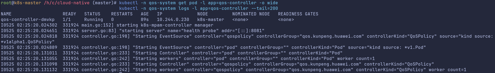
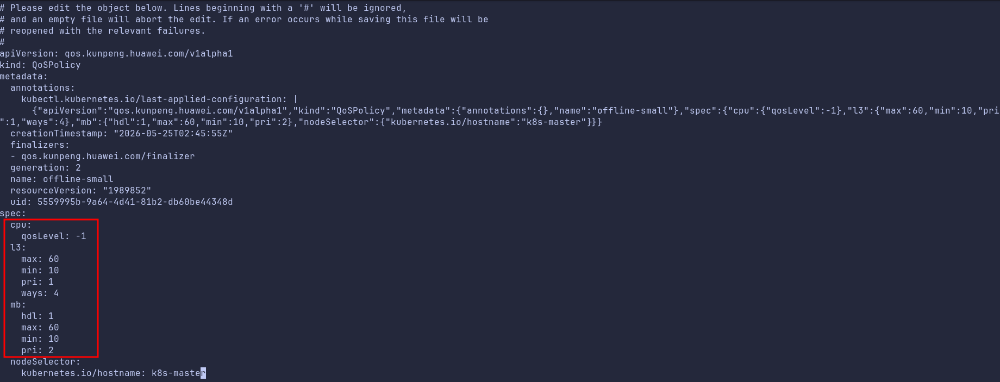
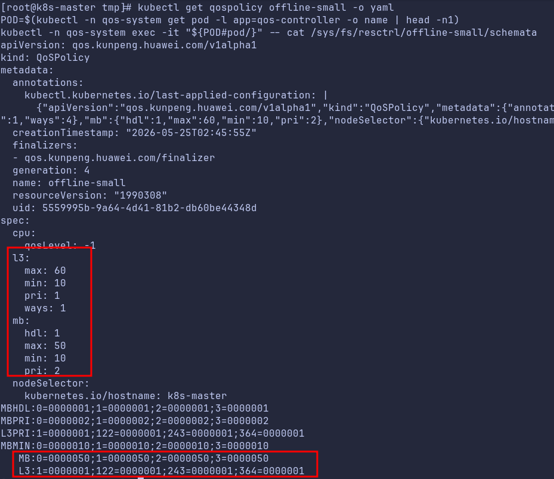
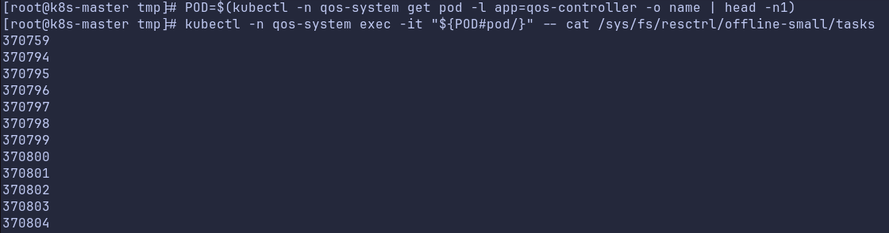
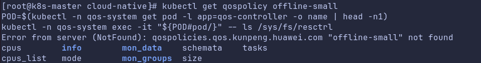

# 特性描述

## 简介

`kunpeng-qos-controller` 是一个以 DaemonSet 方式运行的节点本地 Operator，用于把 Kubernetes 配置映射到节点的 `resctrl`/`cgroup` 控制能力，实现节点级 QoS 资源管控。

当前主要能力：

- 监听 `QoSPolicy` CR，并在本节点创建、更新、删除对应 `resctrl` 控制组。
- 将 Pod 绑定到目标控制组（通过 Pod 标签 `qos.kunpeng.huawei.com/group`）。
- 对离线负载（`qos.kunpeng.huawei.com/workload-class=offline`）执行动态控制相关附加动作（例如动态组打标）。
- 可通过 `QoSPolicy` 的 `cpu.qosLevel` 字段控制组内 Pod 的 `cpu.qos_level`。

## 应用场景

- 需要在 Kubernetes 集群中对节点本地 `resctrl` 进行统一管控。
- 需要按业务类型给 Pod 分配不同 QoS 策略（例如离线与在线任务隔离）。
- 需要通过 CRD 声明策略，并由 Operator 自动完成控制组创建和参数下发。

## 原理描述

系统由两个主要 Reconciler 组成：

- `QoSPolicyReconciler`：
  - 监听 `QoSPolicy`。
  - 依据 `nodeSelector` 判断当前节点是否需要生效。
  - 对匹配节点创建/更新 `resctrl` 控制组并写入 `schemata`。
  - 删除策略时执行本地控制组清理。
- `PodBindingReconciler`：
  - 监听 Pod。
  - 根据 Pod 标签 `qos.kunpeng.huawei.com/group` 把 Pod 进程加入指定控制组。
  - 根据目标 `QoSPolicy` 的 `cpu.qosLevel` 对 Pod 容器写入 `cpu.qos_level`。

当前实现中，`QoSPolicy.metadata.name` 与 `resctrl` 控制组名为 1:1 映射。

# 软件编译

以下命令在仓库根目录执行。

## 本地二进制编译

```bash
make kunpeng-qos-controller-build
```

输出路径：

 `bin/kunpeng-qos-controller`

## Docker 镜像编译

```bash
make kunpeng-qos-controller-docker
```

说明：镜像通过 `Dockerfile.kunpeng-qos-controller` 构建。

如果集群运行时使用的是 `containerd`，可先导出镜像，再在目标节点导入：

```bash
docker save kunpeng-qos-controller:0.1.0 -o kunpeng-qos-controller.tar
```

将 `kunpeng-qos-controller.tar` 复制到目标节点后，执行：

```bash
ctr -n k8s.io images import /path/to/kunpeng-qos-controller.tar
```

# 软件部署

前提：目标节点已具备 `resctrl` 能力并挂载了 `/sys/fs/resctrl`，容器可访问 `/sys/fs/cgroup`。
>说明：如果节点未挂载 `/sys/fs/resctrl`，请先挂载。执行命令`mount -t resctrl resctrl /sys/fs/resctrl`。如果`/sys/fs`下面没有`resctrl`目录，说明内核没有开启MPAM功能。在内核启动参数中添加`arm64.mpam`即可开启。
>
## 部署 CRD

```bash
kubectl apply -f config/kunpeng-qos-controller-config/crd/bases/qos.kunpeng.huawei.com_qospolicies.yaml
```

## 部署 Operator（DaemonSet + RBAC）

```bash
kubectl apply -f config/kunpeng-qos-controller-config/samples/qos-controller-daemonset-v1alpha1.yaml
```

## 检查运行状态

```bash
kubectl -n qos-system get pod -l app=qos-controller -o wide
kubectl -n qos-system logs -l app=qos-controller --tail=200
```

可能的回显结果如下, qos-controller 运行状态为 `Running`，并且日志中没有报错。


## 本地调试运行（可选）

```bash
export NODE_NAME=<你的节点名>
./bin/kunpeng-qos-controller
  --kubeconfig ~/.kube/config
```

# 使用特性

## 创建策略并下发到节点

> 说明：`cpu.qos_level` 依赖内核能力，要求内核版本为 `6.6.0-154.0.0` 之后版本。  
> 同时需要在内核启动参数中添加 `xint`，并在系统启动后执行以下命令启用调度特性：  
> `echo SMT_TAG_PULL > /sys/kernel/debug/sched/features`

### QoSPolicy 字段说明

| 字段 | 含义 | 取值范围/默认值 | 说明 |
|---------|---------|---------|---------|
| `spec.nodeSelector` | 指定策略在哪些节点生效 | map，可选 | 与节点标签匹配的节点才应用该策略。 |
| `spec.mb.hdl` | MB 开关 | `0~1`，默认 `1` | 一般 `1` 表示开启。 |
| `spec.mb.pri` | MB 优先级 | `0~7`，默认 `3` | 数值越高表示优先级越高。 |
| `spec.mb.min` | MB 最小保障比例 | `0~100`，默认 `0` | 百分比语义。 |
| `spec.mb.max` | MB 最大上限比例 | `0~100`，默认 `100` | 百分比语义。 |
| `spec.l3.pri` | L3 优先级 | `0~3`，默认 `0` | L3 的优先级控制。 |
| `spec.l3.min` | L3 最小保障比例 | `0~100`，默认 `0` | 百分比语义。 |
| `spec.l3.max` | L3 最大上限比例 | `0~100`，默认 `100` | 百分比语义。 |
| `spec.l3.ways` | 分配的 Cache way 数量 | `>=1` | 上限由节点硬件决定。 |
| `spec.cpu.qosLevel` | Pod CPU QoS 级别 | `-1/0/1`，默认 `0` | 写入组内 Pod 的 `cpu.qos_level`。 -1 表示低优先级业务，0 表示默认优先级，1 表示高优先级业务。 |

### 示例：创建 QoSPolicy

```yaml
apiVersion: qos.kunpeng.huawei.com/v1alpha1
kind: QoSPolicy
metadata:
  name: offline-small
spec:
  nodeSelector:
    kubernetes.io/hostname: <your-node-name>
  mb:
    hdl: 1
    pri: 2
    min: 10
    max: 60
  l3:
    pri: 1
    min: 10
    max: 60
    ways: 4
  cpu:
    qosLevel: -1
```

应用：

```bash
kubectl apply -f qospolicy-offline-small.yaml
```

### 更新控制组配置（通过更新 QoSPolicy）

控制组参数更新通过修改同名 `QoSPolicy` CR 实现，Operator 会自动将更新后的配置同步到本地 `resctrl` 控制组。

```bash
kubectl edit qospolicy offline-small
```

在编辑界面中修改 `spec` 下对应字段（例如 `mb.max`、`l3.ways`、`cpu.qosLevel`）后保存退出即可触发更新。

可能的回显结果如下

这里把`mb.max`从`60`改为`50`,`l3.ways`从`4`改为`1`
> 注意：cpu.qos_level只能设置一次，默认值是`0`。可以从0设置到-1，也可以从0设置到1，但是设置之后就不能再更改。
>
#### 更新后验证

```bash
kubectl get qospolicy offline-small -o yaml
POD=$(kubectl -n qos-system get pod -l app=qos-controller -o name | head -n1)
kubectl -n qos-system exec -it "${POD#pod/}" -- cat /sys/fs/resctrl/offline-small/schemata
```

可能的回显结果如下，可以看到CR中的`mb.max`和`l3.ways`已更新为`50`和`1`，同时resctrl的控制组中的schemata的值也进行了相应的更新。


## 将 Pod 加入指定控制组

### 关系说明

- `QoSPolicy.metadata.name = offline-small`
- 控制组目录为 `/sys/fs/resctrl/offline-small`
- Pod 标签 `qos.kunpeng.huawei.com/group` 必须与策略名一致。

### 示例：创建带 group 标签的 Pod

```yaml
apiVersion: v1
kind: Pod
metadata:
  name: offline-small-nginx
  labels:
    app: nginx
    qos.kunpeng.huawei.com/group: offline-small
spec:
  nodeSelector:
    kubernetes.io/hostname: <your-node-name>
  containers:
  - name: nginx
    image: nginx:1.25
```

应用：

```bash
kubectl apply -f pod-offline-small.yaml
```

### 验证

#### 验证 Pod 是否加入到指定控制组中

```bash
POD=$(kubectl -n qos-system get pod -l app=qos-controller -o name | head -n1)
kubectl -n qos-system exec -it "${POD#pod/}" -- cat /sys/fs/resctrl/offline-small/tasks
```

可能的回显结果如下，可以看到在`offline-small`控制组中的`tasks`中有相应的`pid`,说明`offline-small-nginx`已加入到`offline-small`控制组中。


#### 验证 Pod 是否正确设置了qos_level

```bash
kubectl exec -it offline-small-nginx -- cat /sys/fs/cgroup/cpu/cpu.qos_level
```

可能的回显结果如下，可以看到`offline-small-nginx`的`cpu.qos_level`为`-1`,说明`offline-small-nginx`已加入到`offline-small`控制组中，且`cpu.qos_level`为`-1`


## 删除控制组示例

控制组的删除通过删除对应 `QoSPolicy` 完成，`QoSPolicy` 删除后，Operator 会在本节点清理同名 `resctrl` 控制组。

```bash
kubectl delete qospolicy offline-small
```

### 删除后验证

```bash
kubectl get qospolicy offline-small
POD=$(kubectl -n qos-system get pod -l app=qos-controller -o name | head -n1)
kubectl -n qos-system exec -it "${POD#pod/}" -- ls /sys/fs/resctrl
```

可能的回显结果如下，`qospolicy` 查询不到对象，且 `resctrl` 目录中不存在 `offline-small`，说明控制组已删除。



## 常用清单路径

- CRD：
   `config/kunpeng-qos-controller-config/crd/bases/qos.kunpeng.huawei.com_qospolicies.yaml`
- 部署示例：
   `config/kunpeng-qos-controller-config/samples/qos-controller-daemonset-v1alpha1.yaml`
- QoSPolicy 示例：
   `config/kunpeng-qos-controller-config/samples/qospolicy-examples-v1alpha1.yaml`
- Pod 示例：
   `config/kunpeng-qos-controller-config/samples/pod-examples-for-qospolicy-v1alpha1.yaml`

# 维护特性

## 卸载软件

卸载建议按“先业务资源、再控制面资源”的顺序执行，避免残留对象。

### 1. 清理 QoSPolicy CR

```bash
kubectl delete qospolicy --all
```

如果你使用了特定命名的策略文件，也可以按文件删除：

```bash
kubectl delete -f config/kunpeng-qos-controller-config/samples/qospolicy-examples-v1alpha1.yaml
```

### 2. 清理使用 QoS 的业务 Pod（可选）

```bash
kubectl delete -f config/kunpeng-qos-controller-config/samples/pod-examples-for-qospolicy-v1alpha1.yaml
```

### 3. 卸载 Operator（DaemonSet + RBAC + ServiceAccount + Namespace）

```bash
kubectl delete -f config/kunpeng-qos-controller-config/samples/qos-controller-daemonset-v1alpha1.yaml
```

### 4. 删除 CRD

```bash
kubectl delete -f config/kunpeng-qos-controller-config/crd/bases/qos.kunpeng.huawei.com_qospolicies.yaml
```

### 5. 验证清理结果

```bash
kubectl get crd | grep qospolicies.qos.kunpeng.huawei.com
kubectl get qospolicy
kubectl -n qos-system get all
```

可能的回显结果如下，可以看到查询不到相应的资源，说明已成功清理。


说明：如果已删除 CRD，`kubectl get qospolicy` 可能提示资源类型不存在，这是预期行为。
