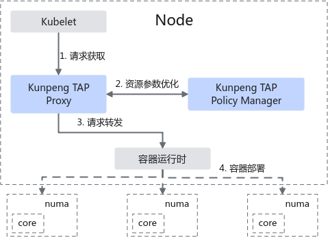
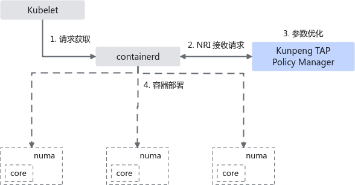

# 鲲鹏拓扑亲和插件 用户指南

## 介绍<a name="ZH-CN_TOPIC_0000002525264761"></a>

### 简介<a name="ZH-CN_TOPIC_0000002525344727"></a>

本文主要介绍如何在使用openEuler操作系统的服务器场景中部署和使用鲲鹏拓扑亲和插件。

目前，在开源Kubernetes（以下简称K8s）集群中，如果希望进行与CPU隔离、内存和NUMA亲和有关的优化，用户需要开启CPU管理器（CPU Manager）的静态（static）策略，并将拓扑管理器（Topology Manager）策略设置为自适应（Best-Effort）或单NUMA节点（Single-numa-node）模式，此时，只有当Pod（K8s的容器管理单元）满足QoS属性为**Guaranteed**类型时（即资源请求值等于限制值且为整数值），策略才能产生优化效果。然而，当前大多数云服务提供商需要在服务器上部署大量容器，甚至超过服务器的物理核心数量。在该场景下，物理资源限制导致无法开启CPU管理器的static策略，进而无法保证容器在运行时具有CPU亲和性。

为了解决此问题，鲲鹏BoostKit推出鲲鹏拓扑亲和插件（Kunpeng Topology Affinity Plugin，后续简称Kunpeng TAP），该插件是K8s集群的资源管理插件，帮助计算节点优化系统资源管理，提供对CPU、内存等资源的不同分配策略，以满足多种场景下的高性能需求。当前，Kunpeng TAP已提供NUMA自适应特性，通过插件方式实现了一个K8s NUMA亲和性调度策略。该插件在Pod进行计算节点上的部署创建时生效，根据计算节点的CPU资源分配情况自动调整Pod的CPU调度范围，此时，能够绕过“资源请求值等于限制值且为整数值”的限制，且保持NUMA亲和性与Pod的可超分特性。

当前需要注意的是，该特性与K8s开源版本的拓扑管理器尚不兼容，同时只对裸金属部署的K8s集群进行了验证，尚不能保证虚拟机场景的完全使能。

### 软件架构<a name="ZH-CN_TOPIC_0000002493185050"></a>

Kunpeng TAP由Kunpeng TAP Policy Manager和Kunpeng TAP Proxy两个核心部分组成。Kunpeng TAP在K8s集群的节点层面运行，通过容器请求代理的形式实现动态调整容器的CPU调度范围功能。

根据部署的形式，Kunpeng TAP分为Proxy模式和NRI插件模式，Proxy模式下的架构图如[**图 1** Kunpeng TAP架构图](#Kunpeng-TAP架构图)所示，各模块的功能如[**表 1** Kunpeng TAP插件及相关模块功能](#Kunpeng-TAP插件及相关模块功能)所示。

**图 1** Kunpeng TAP架构图<a name="fig11864115615445"></a><a id="Kunpeng-TAP架构图"></a><br>


Kunpeng TAP插件架构采取请求代理的方式实现，插件针对Kubelet与容器运行时的容器创建请求进行资源参数调整。

1. 请求获取：Kunpeng TAP插件连接至Kubelet，获取下发的容器分发请求。
2. 资源参数优化：在用户配置的策略选项下，依据系统资源和拓扑结构，以及特定GPU等设备资源分配，能够实现对容器的CPU调度范围进行NUMA拓扑亲和调整。
3. 请求转发：将优化后的请求转发至容器运行时，执行容器管理操作。
4. 容器部署：容器运行时执行部署，系统按照优化后的参数运行容器进程。

**表 1** Kunpeng TAP插件及相关模块功能<a id="Kunpeng-TAP插件及相关模块功能"></a>

|名称|功能|
|--|--|
|Kunpeng TAP Policy Manager|根据NUMA亲和性规则，动态调整Pod/容器的CPU分配组合，以确保应用程序能够高效利用硬件资源，符合NUMA架构的最佳实践。|
|Kunpeng TAP Proxy|代理传递Kubelet与容器运行时之间的请求与响应，获取当前节点上Pod的CPU使用情况，为优化资源分配提供功能和数据支持。|
|Kubelet|运行在集群中的每个节点上，确保容器（Pod）在节点上正确运行，并管理这些容器的生命周期。|
|容器运行时|负责创建、管理和运行容器。|


在Containerd v1.7.0版本及之后支持的NRI（Node Resource Interface）模式下，Kunpeng TAP以插件形式与Containerd进行通信，对原有容器请求链路无干扰，具备更优的稳定性。如[**图 2** NRI模式运行架构](#NRI模式运行架构) 所示。

**图 2** NRI模式运行架构<a name="fig19472125713354"></a><a id="NRI模式运行架构"></a>




## 环境要求<a name="ZH-CN_TOPIC_0000002514027348"></a>

本文基于openEuler环境提供指导，在正式操作前请确保软硬件均满足要求。

**表 1** 硬件要求<a id="硬件要求"></a>

|项目|说明|
|--|--|
|处理器|鲲鹏920系列处理器、鲲鹏950处理器|


**表 2** 操作系统和软件要求<a id="操作系统和软件要求"></a>

|项目|版本|获取方法|
|--|--|--|
|OS|openEuler 20.03 LTS SP3<br>openEuler 22.03 LTS SP4<br>openEuler 24.03 LTS SP3|openEuler 20.03 LTS SP3：[获取链接](https://repo.openeuler.org/openEuler-20.03-LTS-SP3/ISO/aarch64/)<br>openEuler 22.03 LTS SP4：[获取链接](https://repo.openeuler.org/openEuler-22.03-LTS-SP4/ISO/aarch64/)<br>openEuler 24.03 LTS SP3：[获取链接](https://repo.openeuler.org/openEuler-24.03-LTS-SP3/ISO/aarch64/)|
|Golang|1.25|获取链接建议Golang环境配置国内源，以便下载二进制依赖包进行安装。|
|Make|-|通过配置Yum源方式安装。|
|Kubernetes|1.23.6，1.25.16|通过配置Yum源方式安装。|
|Docker|20.10.14|通过配置Yum源方式安装。|
|Containerd|1.6.8或1.7.0（NRI模式下需高于1.7.0）|[获取链接](https://github.com/containerd/containerd/releases/tag/v1.6.8)|
|Kunpeng TAP源代码|release-0.3|[获取链接](https://gitcode.com/boostkit/cloud-native)|
|Kunpeng TAP|release-0.3|Kunpeng TAP的可执行文件，通过[编译Kunpeng TAP](#编译Kunpeng-TAP)编译获得。|


## 编译Kunpeng TAP<a id="编译Kunpeng-TAP"></a>

编译Kunpeng TAP源代码并生成插件可执行文件。

1. 获取Kunpeng TAP源代码，在标签中获取最新发布的kunpeng-tap-release-0.3.0-rc0版本。

    ```
    git clone --branch kunpeng-tap-release-0.3.0-rc0 https://gitcode.com/boostkit/cloud-native.git
    ```

2. 进入cloud-native目录后，下载项目所需依赖。

    ```
    cd /path/to/cloud-native
    go mod tidy
    ```

    其中“/path/to/cloud-native”为项目源码所在路径，请根据实际情况修改。

3. 构建插件。

    运行如下命令构建插件。

    ```
    make kunpeng-tap-build
    ```

    将在“bin”目录下生成二进制文件“kunpeng-tap”。

    对于NRI模式，还须运行如下命令构建插件镜像。

    ```
    make kunpeng-tap-build-nri
    ```

    借助Docker编译“kunpeng-tap-nri:latest”容器镜像。如编译失败，考虑是否配置Docker镜像源。

## 部署Kunpeng TAP<a name="ZH-CN_TOPIC_0000002525264765"></a>

在目标计算节点部署Kunpeng TAP，验证插件成功运行。

**前提条件<a name="section4217106152916"></a>**

- Kunpeng TAP的运行依赖于K8s集群与容器运行时（Docker或Containerd），Docker场景下默认使用Dockershim作为通信组件。在部署该插件之前，需确保K8s集群已完成正确的网络配置，并且能够顺利部署和运行容器实例。
- Kunpeng TAP与K8s开源版本的拓扑管理器尚不兼容，在部署该插件之前需确认K8s开源版本的拓扑管理器的状态为关闭状态（默认为关闭状态）。可通过查看Kubelet命令行中<em>--topology-manager-policy</em>为**关闭**状态即可。
- Kunpeng TAP容器化部署方式要求K8s集群以Containerd（须v1.7.0及以上版本）作为容器运行时，且开启NRI功能。

**基于systemd部署<a name="section640135084213"></a>**

1. 在目标计算节点导入Kunpeng TAP项目源代码与可执行文件。
2. 部署与启动Kunpeng TAP。

    将Docker或Containerd作为容器运行时，Kunpeng TAP支持systemd服务形式进行部署。

    **启动方式一：** 基于systemd部署。进入源代码目录下，运行make命令安装和启动。

    1. 进入源代码目录。

        ```
        cd /path/to/cloud-native
        ```

        其中“/path/to/cloud-native”为Kunpeng TAP源码的实际路径，请根据实际情况修改。

    2. 安装插件，默认以Docker模式启动。

        ```
        make kunpeng-tap-install-service
        ```

        如需显式指定运行时为Docker，运行如下命令。

        ```
        make kunpeng-tap-install-service-docker
        ```

        如果需要修改启动参数，则在源代码目录下的**hack/kunpeng-tap/kunpeng-tap.service.docker**文件的“ExecStart=”下进行修改：

        ```
        [Unit]
        Description=Kunpeng Topology-Affinity Plugin Service
        After=network.target
        
        [Service]
        ExecStart=/usr/local/bin/kunpeng-tap --runtime-proxy-endpoint="/var/run/kunpeng/tap-runtime-proxy.sock" \
            --container-runtime-service-endpoint="/var/run/docker.sock" --container-runtime-mode="Docker" \
            --resource-policy="topology-aware"
        Restart=always
        RestartSec=5
        
        [Install]
        WantedBy=multi-user.target
        ```

        > **说明：** 
        >指定运行时为Containerd，运行如下安装命令，参数配置可在源代码目录下的**hack/kunpeng-tap/kunpeng-tap.service.containerd**文件中修改。
        >```
        >make kunpeng-tap-install-service-containerd
        >```

    3. 安装完毕后，执行如下命令启动插件，并且自动查看启动后的服务状态。

        ```
        make kunpeng-tap-start-service
        ```

    4. 查看日志信息。

        ```
        journalctl -u kunpeng-tap
        ```

    **启动方式二：** 直接启动。仅开发测试时使用，生产环境下不建议以此方式部署。

    - Docker运行时下的启动命令，示例如下：

        ```
        kunpeng-tap --runtime-proxy-endpoint="/var/run/kunpeng/tap-runtime-proxy.sock" \
            --container-runtime-service-endpoint="/var/run/docker.sock" --container-runtime-mode="Docker" \
            --resource-policy="numa-aware"
        ```

    - Containerd运行时下的启动命令，示例如下：

        ```
        kunpeng-tap --runtime-proxy-endpoint="/var/run/kunpeng/tap-runtime-proxy.sock" \
            --container-runtime-service-endpoint="/var/run/containerd/containerd.sock" --container-runtime-mode="Containerd" \
            --resource-policy="numa-aware"
        ```

    > **说明：** 
    >用户可根据需求修改相关参数后启动。参数说明见[**表 1** 参数说明](#参数说明)。

    **表 1** 参数说明<a id="参数说明"></a>

|参数名称|参数描述|默认值|配置原则|
|--|--|--|--|
|container-runtime-mode|插件对接的容器运行时，对应集群运行时设置的Docker或Containerd或NRI。|Docker|依照K8s集群使用的容器运行时决定。|
|resource-policy|容器资源的优化策略，目前支持numa-aware和topology-aware。numa-aware策略支持Burstable类型容器进行CPU的NUMA亲和。topology-aware策略提供Socket、Die、NUMA等拓扑层次的CPU亲和，额外支持内存、GPU资源的优化。|topology-aware|依照需求进行选择。|
|enable-memory-topology|启用topology-aware策略后（设置--resource-policy=topology-aware），内存资源的NUMA优化功能默认关闭，如需开启容器内存的NUMA亲和功能，则设置--enable-memory-topology=true。|false|暂处于Alpha阶段。|
|topology-cluster-affinity|用于在鲲鹏950处理器上启用cluster级别的识别和分配，容器将优先从cluster阶段开始进行分配。|false|依据服务器型号和性能调优需求决定。|
|v或verbose|日志信息等级，调整范围2至5。|2|等级越高，日志输出越详细。|


3. 在计算节点配置Kubelet参数。

    为了让Kunpeng TAP成功代理Kubelet的请求，需要在Kubelet的命令行配置中增加如下参数。

    - 在Docker场景下，在Kubelet启动参数中添加或修改对应参数项如下所示：

        ```
        --docker-endpoint=unix:///var/run/kunpeng/tap-runtime-proxy.sock
        ```

        以使用kubeadm安装集群为例，可以在“/var/lib/kubelet/kubeadm-flags.env”添加参数。

        ```
        KUBELET_KUBEADM_ARGS="--network-plugin=cni --pod-infra-container-image=k8s.gcr.io/pause:3.6 --docker-endpoint=unix:///var/run/kunpeng/tap-runtime-proxy.sock"
        ```

    - 在Containerd场景下，修改Kubelet的启动参数。

        ```
        --container-runtime=remote --container-runtime-endpoint=unix:///var/run/kunpeng/tap-runtime-proxy.sock
        ```

        此时，“/var/lib/kubelet/kubeadm-flags.env”的参数示例可能如下所示。

        ```
        KUBELET_KUBEADM_ARGS="--network-plugin=cni --pod-infra-container-image=k8s.gcr.io/pause:3.6 --container-runtime=remote --container-runtime-endpoint=unix:///var/run/kunpeng/tap-runtime-proxy.sock"
        ```

4. 修改Kubelet参数后，须运行如下命令重新启动kubelet。

    ```
    systemctl daemon-reload
    systemctl restart kubelet
    ```

**容器化部署<a name="section465620784420"></a>**

1. 检查Containerd是否开启NRI功能。开始部署前，在计算节点的Containerd配置文件（默认为“/etc/containerd/config.toml”）当中打开NRI功能。如果不存在上述配置文件，则可运行如下命令创建：

    ```
    containerd config default > /etc/containerd/config.toml
    ```

2. 在配置文件中，打开NRI功能，如果不存在如下内容则添加。

    ```
    [plugins]
      ...
      # 增加下述部分
      [plugins."io.containerd.nri.v1.nri"]
        disable = false  # 打开NRI
        disable_connections = false
        plugin_config_path = "/etc/nri/conf.d"
        plugin_path = "/opt/nri/plugins"
        plugin_registration_timeout = "5s"
        plugin_request_timeout = "2s"
        socket_path = "/var/run/nri/nri.sock"
    ```

3. 重启Containerd，并检查是否重启成功。

    ```
    systemctl daemon-reload
    systemctl restart containerd
    systemctl status containerd
    ```

4. 在节点导入容器镜像。

    借助Docker完成镜像编译后，导出为.tar压缩包：

    ```
    docker save kunpeng-tap-nri:latest -o kunpeng-tap-latest.tar
    ```

    随后，在集群的工作节点中导入上述镜像：

    ```
    ctr -n k8s.io images import kunpeng-tap-latest.tar
    ```

5. 部署Kunpeng TAP容器。命令依赖于kubectl发送请求，确保机器上安装kubectl且具有集群访问权限。

    容器将部署在“kunpeng-tap”命名空间，如果未创建则使用如下代码进行创建：

    ```
    kubectl create namespace kunpeng-tap
    ```

    正式进行部署：

    ```
    make kunpeng-tap-nri-deploy
    ```

    Kunpeng TAP插件容器的部署文件在“config/kunpeng-tap/nri-plugin/daemonset.yaml”中，如果需要设置选项，请在如下位置增加：

    ```
            args:
              - "--container-runtime-mode=NRI"
              - "--nri-socket-path=/var/run/nri/nri.sock"
              - "--resource-policy=topology-aware"
              - "-v=2"
    ```

6. 部署完成后，通过kubectl查看运行状态，进入READY 1/1和Running即表明正常运行。

    ```
    # kubectl get pods -n kunpeng-tap -owide
    NAME                           READY   STATUS    RESTARTS      AGE           IP            NODE        NOMINATED NODE   READINESS GATES
    kunpeng-tap-nri-mhjwk   1/1     Running      0                  25h   10.244.2.59   compute01   <none>           <none>
    ```

7. （可选）查看日志信息，运行命令：

    ```
    kubectl logs kunpeng-tap-nri-mhjwk -n kunpeng-tap
    ```

## 使用Kunpeng TAP<a name="ZH-CN_TOPIC_0000002525344725"></a>

Kunpeng TAP允许在部署Pod时指定CPU资源需求，系统将自动按NUMA亲和性分配资源。通过编写YAML文件并指定节点选择器，可以将Pod部署到特定节点上。成功部署插件后，只需在部署其他Pod时指定CPU资源的request和limit值，系统将自动按照NUMA亲和性原则进行资源分配。

以下为部署一个单容器Pod的YAML文件示例，供用户参考。该Pod请求的CPU资源最小值为4核，最大值为8核，内存固定为4G，容器使用busybox作为镜像。

1. 创建YAML文件，例如example.yaml，并在YAML文件中写入以下配置。

    ```
    apiVersion: v1
    kind: Pod
    metadata:
      name: tap-test
      annotations:
    spec:
      containers:
      - name: tap-example # 替换成实际名称
        image: busybox:latest
        imagePullPolicy: IfNotPresent
        command: ["/bin/sh"]
        args: ["-c", "while true; do echo `date`; sleep 5; done"]
        resources:
          requests:
            cpu: "4"
            memory: "4Gi"
          limits:
            cpu: "8"
            memory: "4Gi"
    ```

2. 以指定Pod在**compute01**节点上运行为例，需要在YAML文件中的**spec**部分加入以下内容。

    > **说明：** 
    >在多个工作节点的K8s集群中，Pod可能会被调度到不同节点的NUMA内。如果希望Pod在指定的节点上运行，只需在YAML文件的**spec**部分加入**nodeSelector**字段，并指定**kubernetes.io/hostname**为目标节点的名称。

    ```
      nodeSelector:
        kubernetes.io/hostname: compute01 #该字段替换成实际节点名称
    ```

3. 在管理节点应用YAML文件，完成Pod部署。

    ```
    kubectl apply -f example.yaml
    ```

4. 判断Kunpeng TAP是否生效。
    1. 以Docker运行时为例，进入步骤二中**nodeSelector**所指定的集群节点 _compute01_ 后，通过**docker**命令查询容器的CpusetCpus参数，判断容器是否与NUMA成功亲和。
    2. 通过**docker ps**查询集群节点运行的容器任务，在**NAMES**列中找到步骤一中“spec.containers.name”指定的 _tap-example_ 容器。

        ```
        # docker ps | grep tap-example
        ```

    3. 依据 _CONTAINER ID_ 查询目标容器的部署参数 _CpusetCpus_ ，该参数表示容器的可调度CPU范围。

        ```
        # docker inspect bf32de0d09fe | grep "CpusetCpus"
                    "CpusetCpus": "0-23",
        ```

        如果启用了内存绑定功能，可以通过如下命令查看，注意其取值表示节点的编号：

        ```
        # docker inspect bf32de0d09fe | grep "CpusetMems"
                    "CpusetMems": "0",
        ```

        > **说明：** 
        >在不同的机器上查看时，绑定的NUMA节点不固定， _CpusetCpus_ 数字可能不一致。

        containerd运行时可以运行如下命令查看容器的可调度CPU范围。

        ```
        # crictl inspect bf32de0d09fe | grep "cpuset_cpus"
                    "cpuset_cpus": "0-23",
        ```

        如果NUMA节点亲和失败，则可能无法查找到cpuset\_cpus输出。

    4. 查询系统的NUMA信息，与上述的容器可调度CPU范围进行对比，一致则表示亲和于对应NUMA节点。

        ```
        # lscpu
        ...
        NUMA node0 CPU(s):               0-23
        NUMA node1 CPU(s):               24-47
        NUMA node2 CPU(s):               48-71
        NUMA node3 CPU(s):               72-95
        ...
        ```

        “node0”表示编号为“0”的NUMA节点，“0-23”表示NUMA节点内的CPU编号。

5. （可选）此外，当对容器的GPU资源进行亲和时，需要查询系统中GPU设备的NUMA分布，可以运行如下命令查看，以AMD Radeon GPU为例。

    ```
    lspci -nn|grep VGA|grep Radeon
    ```

    回显如下图所示。

    

    图中的1002:67c7为<vendor\>:<deviceID\>，用于下一步查询。

    ```
    lspci -vvv -d 1002:67c7 | grep NUMA
    ```

    回显如下图所示。

    

## （可选）卸载Kunpeng TAP<a name="ZH-CN_TOPIC_0000002493185048"></a>

当不再需要使用该插件时，可以停止运行并卸载插件。请在工作节点卸载插件。

**systemd模式<a name="section14339193435217"></a>**

1. 删除Kubelet参数。

    将添加的参数<em>--docker-endpoint=unix:///var/run/kunpeng/tap-runtime-proxy.sock</em>删除，并且重启Kubelet。

    ```
    systemctl daemon-reload
    systemctl restart kubelet
    systemctl status kubelet
    ```

2. 在工作节点上，进入“cloud-native”源码目录，并执行插件卸载命令。

    ```
    cd /path/to/cloud-native
    make uninstall-service
    ```

    其中“/path/to/cloud-native”为Kunpeng TAP源码的实际路径，请根据实际情况修改。

3. 查看插件是否已成功删除。

    ```
    systemctl status kunpeng-tap
    ```

    回显如下表示插件已成功删除。

    ```
    Unit kunpeng-tap.service could not be found.
    ```

**NRI模式<a name="section207067317537"></a>**

1. 卸载Kunpeng TAP。

    在工作节点上，进入“cloud-native”源码目录，并执行插件卸载命令。

    ```
    cd /path/to/cloud-native
    make kunpeng-tap-nri-undeploy
    ```

    其中“/path/to/cloud-native”为Kunpeng TAP源码的实际路径，请根据实际情况修改。

2. 执行如下命令，查看到没有部署的容器示例表示卸载成功。

    ```
    kubectl get pods -n kunpeng-tap -owide
    ```

## 缩略语<a name="ZH-CN_TOPIC_0000002493025072"></a>

|**缩略语**|**英文全称**|**中文全称**|
|--|--|--|
|NUMA|Non-Uniform Memory Access|非统一内存访问|
|Kunpeng TAP|Kunpeng Topology Affinity Plugin|鲲鹏拓扑亲和插件|
|NRI|Node Resource Interface|节点资源接口|


