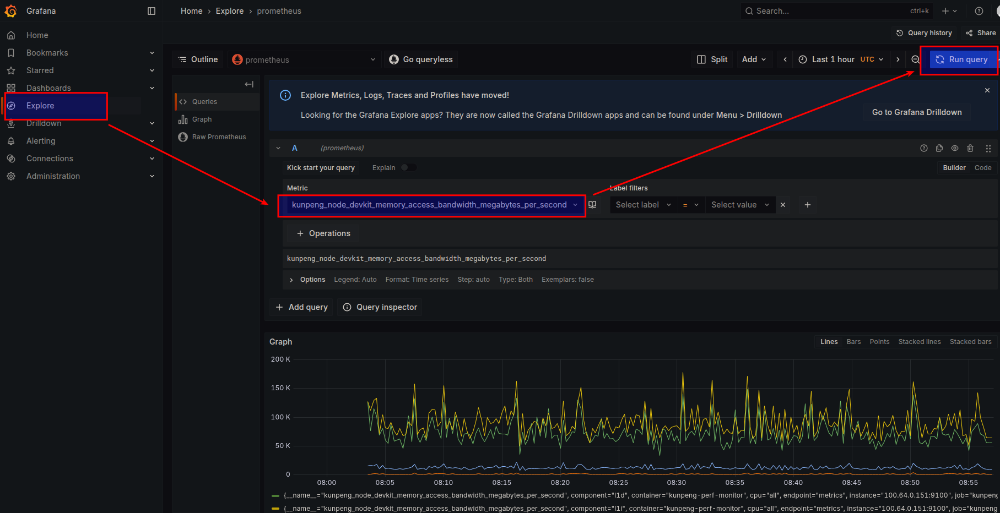

# kunpeng-perf-monitor DevKit Collector用户指南

## 简介<a name="devkit-collector-introduction"></a>

kunpeng-perf-monitor是一款面向鲲鹏服务器Kubernetes集群的节点性能监控组件，以DaemonSet方式部署在集群节点上，并通过Prometheus Exporter接口提供性能指标。

DevKit Collector是kunpeng-perf-monitor中基于[Kunpeng DevKit Tuner CLI](https://www.hikunpeng.com/document/detail/zh/kunpengdevps/profiler/profiler/KunpengDevKitCli_0032.html)实现的采集组件。该组件周期性采集CPU流水线、Cache和内存访问数据，并将采集结果转换为Prometheus指标，用于分析CPU流水线瓶颈、内存访问效率和带宽等性能问题。

通过部署DevKit Collector，用户可以在Prometheus或Grafana中持续观察节点性能变化，缩短性能瓶颈的定位时间。本文介绍DevKit Collector的环境准备、部署、配置、指标查询和故障处理方法。DevKit Collector包含以下两个采集器。

**表 1** DevKit Collector采集器说明<a id="devkit-collector采集器说明"></a>

|采集器|用途|支持的采集范围|
|--|--|--|
|devkit-topdown|分析CPU流水线瓶颈|system、CPU、PID|
|devkit-memory|采集Cache、内存等相关指标|system、CPU|

本文以NodePort独立模式作为首次部署示例。完成部署后，可以通过节点IP和端口`30010`查看指标。如果集群中已经部署Prometheus Operator，也可以选择使用ServiceMonitor接入Prometheus。

> **说明：**
> NodePort独立模式和Prometheus模式使用相同名称的Kubernetes资源，两种模式不能同时部署。切换模式前需要先卸载当前模式。

## 环境要求<a name="devkit-collector-environment-requirements"></a>

本文基于特定环境提供指导。在正式操作前，请确保软硬件和操作权限均满足要求。

**硬件要求<a name="devkit-collector-hardware-requirements"></a>**

如[**表 2** 硬件要求](#devkit-collector硬件要求)所示。

**表 2** 硬件要求<a id="devkit-collector硬件要求"></a>

|项目|要求|
|--|--|
|处理器|鲲鹏950处理器|

**操作系统和软件要求<a name="devkit-collector-software-requirements"></a>**

如[**表 3** 已验证的操作系统和软件版本](#devkit-collector已验证的软件版本)所示。表中版本为已验证版本，使用其他兼容版本时需要自行验证。

**表 3** 已验证的操作系统和软件版本<a id="devkit-collector已验证的软件版本"></a>

|软件|版本或要求|获取方式|
|--|--|--|
|操作系统|openEuler 24.03 LTS SP3|[获取链接](https://www.openeuler.org/zh/download/archive/detail/?version=openEuler%2024.03%20LTS%20SP3)|
|Kubernetes|1.28.14|参考《[Kubernetes部署指南（CentOS&openEuler）](https://www.hikunpeng.com/document/detail/zh/kunpengcpfs/ecosystemEnable/Kubernetes/kunpengk8s_04_0001.html)》进行下载部署。|
|containerd|1.6.22|参考《[Containerd 安装指南（CentOS 8.1&openEuler 20.03）](https://www.hikunpeng.com/document/detail/zh/kunpengcpfs/ecosystemEnable/Containerd/kunpengcontainerd_03_0001.html)》进行下载安装。|
|Go|推荐 1.25.0|[获取链接](https://go.dev/dl/)|
|Docker|18.09.0|yum安装|
|kube-prometheus|release-0.16|参考[官方社区](https://github.com/prometheus-operator/kube-prometheus/tree/release-0.16)进行安装和部署|

## 编译镜像 <a name="devkit-collector-build"></a>

编译前请确保编译镜像的服务器可以访问Go module、DevKit Tuner CLI下载地址，并能拉取容器基础镜像。

**编译前准备<a name="devkit-collector-build-preparation"></a>**

检查Go和Docker，确保其已安装并版本符合要求。

```bash
go version
docker version
```

Go版本推荐 1.25，Docker daemon应处于可用状态。

**操作步骤<a name="devkit-collector-build-steps"></a>**

1. 获取源码。

    ```bash
    git clone https://gitcode.com/boostkit/cloud-native.git
    cd /path/to/cloud-native
    ```

    `/path/to/cloud-native`表示实际的源码目录，后续命令均在该目录中执行。

2. 构建`kunpeng-perf-monitor:1.0`镜像。

    ```bash
    make kunpeng-perf-monitor-docker
    ```

    构建过程会使用`Dockerfile.kunpeng-perf-monitor`编译容器镜像，并将Kunpeng DevKit Tuner CLI安装到镜像的`/opt/devkit`目录。

3. 查看镜像是否构建成功。

    ```bash
    docker images | grep kunpeng-perf-monitor
    ```

    能查询到`kunpeng-perf-monitor`且tag为`1.0`，说明镜像已经构建成功。

4. 检查镜像中的exporter和DevKit Tuner CLI。

    ```bash
    docker run --rm --entrypoint sh kunpeng-perf-monitor:1.0 -c \
      'test -x /bin/kunpeng-perf-monitor && \
       test -x /opt/devkit/devkit && \
       test -f /opt/devkit/execute.ini && \
       test -f /opt/devkit/tuner/lib/libkperf.so'
    ```

    命令退出码为`0`且没有错误输出，说明镜像包含DevKit Collector运行所需文件。

5. 将镜像导出为tar包。

    ```bash
    docker save kunpeng-perf-monitor:1.0 -o kunpeng-perf-monitor-1.0.tar
    ```

6. 将`kunpeng-perf-monitor-1.0.tar`复制到每个ARM64目标节点，然后导入Kubernetes。

    ```bash
    ctr -n k8s.io images import kunpeng-perf-monitor-1.0.tar
    ctr -n k8s.io images ls | grep kunpeng-perf-monitor
    ```

    能查询到`kunpeng-perf-monitor:1.0`，说明镜像已经导入成功。

> **须知：**
> 部署清单使用`imagePullPolicy: IfNotPresent`，可避免重复拉取镜像。如果导入镜像前环境内已有`kunpeng-perf-monitor:1.0`镜像，需要删除节点上的旧镜像或导入后确认镜像内容已经更新。

## 部署DevKit Collector<a name="devkit-collector-deployment"></a>

本节命令在已经获取源码并能访问Kubernetes集群的控制节点上执行。首次使用时，建议先部署NodePort独立模式。

部署清单`config/kunpeng-perf-monitor/k8s/deployment-devkit.yaml`会在`default`命名空间创建以下资源。

**表 4** 默认部署资源<a id="devkit-collector默认部署资源"></a>

|资源|名称或值|
|--|--|
|ServiceAccount|kunpeng-perf-monitor|
|Role和RoleBinding|kunpeng-perf-monitor-config-reader|
|ConfigMap|kunpeng-perf-monitor-devkit-config|
|DaemonSet|kunpeng-perf-monitor-devkit|
|Service|kunpeng-perf-monitor-devkit|
|容器端口|9100|
|DevKit Tuner CLI|/opt/devkit/devkit|

> **须知：**
> Kunpeng DevKit Tuner CLI利用PMU抓取相关数据，因此部署文件将DaemonSet以root用户运行，并添加`SYS_ADMIN` capability，同时以只读方式挂载CPU和PMU相关sysfs。部署前应确认这些权限符合所在集群的安全策略。
> 此外DaemonSet设置了`hostPID: true`，用以获取节点上的进程信息。

**部署NodePort独立模式<a name="devkit-collector-nodeport-deployment"></a>**

1. 进入源码目录。

    ```bash
    cd /path/to/cloud-native
    ```

2. 确认没有部署Prometheus模式。如果之前部署过Prometheus模式，先执行以下命令删除。

    ```bash
    kubectl delete -f config/kunpeng-perf-monitor/k8s/devkit-prometheus/deployment.yaml --ignore-not-found
    ```

3. 部署NodePort独立模式的Devkit Collector。

    ```bash
    kubectl apply -f config/kunpeng-perf-monitor/k8s/deployment-devkit.yaml
    ```

4. 等待DaemonSet就绪。

    ```bash
    kubectl rollout status \
      daemonset/kunpeng-perf-monitor-devkit --timeout=5m
    ```

    出现`daemon set "kunpeng-perf-monitor-devkit" successfully rolled out`，说明DaemonSet已经就绪。

5. 查看Pod和Service。

    ```bash
    kubectl get daemonset,pod,service -o wide
    ```

    每个符合条件的节点应运行一个`Running`且`Ready`的Pod。Service类型应为`NodePort`，端口应包含`9100:30010/TCP`。类似如下输出：

    ```bash
    NAME                                         DESIRED   CURRENT   READY   UP-TO-DATE   AVAILABLE   NODE SELECTOR              AGE   CONTAINERS             IMAGES                     SELECTOR
    daemonset.apps/kunpeng-perf-monitor-devkit   1         1         1       1            1           kubernetes.io/arch=arm64   43h   kunpeng-perf-monitor   kunpeng-perf-monitor:1.0   app.kubernetes.io/component=devkit-collector,app.kubernetes.io/name=kunpeng-perf-monitor

    NAME                                    READY   STATUS    RESTARTS   AGE   IP             NODE     NOMINATED NODE   READINESS GATES
    pod/kunpeng-perf-monitor-devkit-kflkq   1/1     Running   0          43h   100.64.0.149   master   <none>           <none>

    NAME                                  TYPE        CLUSTER-IP    EXTERNAL-IP   PORT(S)          AGE   SELECTOR
    service/kubernetes                    ClusterIP   10.96.0.1     <none>        443/TCP          21d   <none>
    service/kunpeng-perf-monitor-devkit   NodePort    10.96.1.186   <none>        9100:30010/TCP   43h   app.kubernetes.io/component=devkit-collector,app.kubernetes.io/name=kunpeng-perf-monitor
    ```

**（可选）部署Prometheus模式<a name="devkit-collector-prometheus-deployment"></a>**

如果**集群已经部署[kube-Prometheus](https://github.com/prometheus-operator/kube-prometheus)，并希望由Prometheus自动发现DevKit Collector并收集相关指标**，可以执行以下步骤。

1. 检查`ServiceMonitor` CRD。

    ```bash
    kubectl api-resources | grep -w servicemonitors
    ```

2. 删除NodePort独立模式并等待旧Pod删除完成。

    ```bash
    kubectl delete -f config/kunpeng-perf-monitor/k8s/deployment-devkit.yaml \
      --ignore-not-found
    kubectl -n default wait --for=delete pod \
      -l app.kubernetes.io/component=devkit-collector --timeout=5m
    ```

    如果此前未部署NodePort独立模式，第二条命令可能提示没有匹配资源，可以继续下一步。

3. 部署Prometheus模式的Devkit Collector。

    ```bash
    kubectl apply -f config/kunpeng-perf-monitor/k8s/devkit-prometheus/deployment.yaml
    kubectl -n default rollout status \
      daemonset/kunpeng-perf-monitor-devkit --timeout=5m
    ```

4. 查看Service、ServiceMonitor和EndpointSlice。

    ```bash
    kubectl -n default get service kunpeng-perf-monitor-devkit
    kubectl -n default get servicemonitor kunpeng-perf-monitor-devkit
    kubectl -n default get endpointslice \
      -l kubernetes.io/service-name=kunpeng-perf-monitor-devkit
    ```

    Service类型应为`ClusterIP`，ServiceMonitor的采集路径为`/metrics`，每个Ready Pod应对应一个endpoint。

## 使用DevKit Collector<a name="devkit-collector-usage"></a>

### 验证指标采集<a name="devkit-collector-first-verification"></a>

DevKit Collector启动后会立即开始首次采集。TopDown和Memory在同一个Pod中串行执行，建议在Pod就绪后等待约 15 秒，再检查指标。

**NodePort独立模式<a name="devkit-collector-nodeport-verification"></a>**

1. 查看Pod所在节点的`INTERNAL-IP`。

    假设节点名称为`master`，使用如下命令查看该节点的`INTERNAL-IP`。

    ```bash
    kubectl get node master -o wide
    ```

    参考输出：

    ```bash
    NAME     STATUS   ROLES                  AGE   VERSION    INTERNAL-IP     EXTERNAL-IP   OS-IMAGE                    KERNEL-VERSION                             CONTAINER-RUNTIME
    master   Ready    control-plane,worker   22d   v1.28.14   192.168.122.2   <none>        openEuler 24.03 (LTS-SP3)   6.6.0   containerd://1.6.22.28
    ```

    记录该节点的`INTERNAL-IP`（示例为`192.168.122.2`），下文使用`<node-ip>`表示该地址。

2. 访问指标接口即可查看相关指标。

    ```bash
    curl http://<node-ip>:30010/metrics | \
      grep -E kunpeng_node_devkit
    ```

    默认system采集范围下，回显中应包含以下指标。

    ```text
    kunpeng_node_devkit_topdown_collection_success{target="system",target_type="system"} 1
    kunpeng_node_devkit_memory_collection_success{period_milliseconds="1000",target="system",target_type="system"} 1
    ```

    `collection_success=1`表示最近一次DevKit Tuner CLI执行和结果解析成功，若采集失败则为`0`，不会输出其他相关指标。

**Prometheus模式<a name="devkit-collector-prometheus-verification"></a>**

1. 确认Prometheus Service的地址和端口 `<prometheus-address>:<port>`。

  > **说明:**
  > 1. 默认的kube-prometheus部署时，Prometheus服务以ClusterIP形式部署，**仅在集群内可访问**。若想在集群外（如对应节点的物理机）访问，需要将其配置为**NodePort**。配置参考如下的 **配置Prometheus和Grafana的NodePort** 小节。
  > 2. Grafana是kube-prometheus内置的图形化操作界面，可便捷查询指标，后文也将会使用它进行指标查询，所以一并配置为NodePort。

  **（可选）配置Prometheus和Grafana的NodePort**
  kube-prometheus默认部署时，Prometheus和Grafana的Service类型为ClusterIP，仅在集群内可访问。如果需要在外部访问这两个服务，需要将它们的类型改为NodePort。修改内容参考：
  
  在`manifests/`目录下，对两个Service文件进行如下修改,其中nodePort设定值可根据实际情况调整。
  `grafana-service.yaml`：`spec.type`改为`NodePort`，为http端口指定`nodePort: 30000`。

  ```yaml
  spec:
    type: NodePort
    ports:
    - name: http
      port: 3000
      targetPort: http
      nodePort: 30000
  ```

  `prometheus-service.yaml`（Service名`prometheus-k8s`）：`spec.type`改为`NodePort`，为web端口指定`nodePort: 30090`（`reloader-web`端口不对外暴露，由系统自动分配）。

  ```yaml
  spec:
    type: NodePort
    ports:
    - name: web
      port: 9090
      targetPort: web
      nodePort: 30090
    - name: reloader-web
      port: 8080
      targetPort: reloader-web
  ```
  
  **查询`<prometheus-address>:<port>`**
  运行如下命令。

  ```bash
  kubectl get svc -A | grep -i prometheus
  ```

  从输出中找到Prometheus Service所在的命名空间（默认为monitoring）、Service名称（默认为prometheus-k8s）和`PORT(S)`（默认为9090）。如果按照上述参考配置Prometheus的NodePort，则`PORT(S)`为`9090:30090/TCP`中，`9090`是Service端口，`30090`是NodePort。

- 在集群内访问Prometheus时，`<prometheus-address>`即为Service的`CLUSTER-IP`，`<port>`填写Service端口。
- 通过NodePort从集群外访问Prometheus时，`<prometheus-address>`填写节点的`INTERNAL-IP`，`<port>`填写`PORT(S)`中冒号后的NodePort。节点地址可以通过`kubectl get node <node-name> -o wide`确认。

1. 将`<prometheus-address>:<port>`替换为上一步确认的实际地址和端口，查询active target。

    ```bash
    curl -fsS 'http://<prometheus-address>:<port>/api/v1/targets?state=active' | \
      jq '.data.activeTargets[] |
        select(.labels.job == "kunpeng-perf-monitor") |
        {scrapeUrl,health,lastError,labels}'
    ```

    应有类似如下结果：

    ```bash
    {
      "scrapeUrl": "http://<pod-ip>:9100/metrics",
      "health": "up",
      "lastError": "",
      "labels": {
        "container": "kunpeng-perf-monitor",
        "endpoint": "metrics",
        "instance": "<pod-ip>:9100",
        "job": "kunpeng-perf-monitor",
        "namespace": "default",
        "pod": "kunpeng-perf-monitor-devkit-bcclv",
        "service": "kunpeng-perf-monitor-devkit"
      }
    }
    ```

    `health`应为`up`，`lastError`应为空。随后可以在Prometheus或Grafana中查询相关指标。

### 配置采集范围<a name="devkit-collector-configure-scope"></a>

采集配置保存在ConfigMap `default/kunpeng-perf-monitor-devkit-config`的`devkit-tuner.yaml`中。ConfigMap更新通过校验后会自动生效，不需要重启Pod。

默认配置如下。

```yaml
topdown:
  cpu: ""
  pid: ""
  duration: 3
memory:
  cpu: ""
  duration: 3
  period: 1000
```

**表 5** ConfigMap字段说明<a id="devkit-collector-configmap字段说明"></a>

|字段|作用|合法值|
|--|--|--|
|topdown.cpu|指定TopDown CPU采集范围；为空表示system|CPU编号、范围或逗号分隔集合，例如0、0-3、0,2-3|
|topdown.pid|指定TopDown PID采集范围；为空表示system|纯数字或逗号分隔的PID，例如12345、12345,12346|
|topdown.duration|TopDown采集时长，单位为秒|1到5的整数；省略时为3|
|memory.cpu|指定Memory CPU采集范围；为空表示system|CPU编号、范围或逗号分隔集合|
|memory.duration|Memory采集时长，单位为秒|1到5的整数；省略时为3|
|memory.period|Memory采样周期，单位为毫秒|100或1000；省略时通常为1000|

配置时需要遵守以下规则。

- `topdown.cpu`和`topdown.pid`不能同时填写。
- `topdown.pid`不接受`ALL`。
- Memory不支持PID或cgroup采集范围。
- `memory.duration`为`1`时，`memory.period`必须省略或设置为`100`。
- TopDown profile level固定为`-L 0`，Memory metric固定为`-m 1`，用户不能通过ConfigMap修改。
- 配置中包含未知字段、错误类型或非法值时，DevKit Collector会拒绝整份配置并继续使用上一份有效配置。

执行以下步骤修改采集范围。

1. 查看当前ConfigMap。

    ```bash
    kubectl -n default get configmap kunpeng-perf-monitor-devkit-config \
      -o jsonpath='{.data.devkit-tuner\.yaml}'
    ```

2. 创建完整的新配置。以下示例将TopDown和Memory都设置为CPU `0-3`采集范围。

    ```bash
    cat > /tmp/devkit-tuner.yaml <<'EOF'
    topdown:
      cpu: "0-3"
      pid: ""
      duration: 3
    memory:
      cpu: "0-3"
      duration: 3
      period: 1000
    EOF
    ```

3. 更新ConfigMap。

    ```bash
    kubectl -n default create configmap kunpeng-perf-monitor-devkit-config \
      --from-file=devkit-tuner.yaml=/tmp/devkit-tuner.yaml \
      --dry-run=client -o yaml | kubectl apply -f -
    ```

4. 查看DevKit Collector是否接受配置。

    ```bash
    kubectl -n default logs \
      -l app.kubernetes.io/component=devkit-collector --since=2m | \
      grep -E 'devkit_config_changed|devkit_config_rejected'
    ```

    出现`devkit_config_changed`表示配置已经生效。出现`devkit_config_rejected`表示配置被拒绝，DevKit Collector会继续使用上一份有效配置。

5. 等待下一轮采集（15-30s）后，再次查询相关指标。CPU `0-3`示例对应的标签应包含`target_type="cpu"`和`target="cpu0-3"`。

如需恢复system采集范围，请将`topdown.cpu`、`topdown.pid`和`memory.cpu`都设置为空字符串，再整体更新ConfigMap。**删除ConfigMap不会恢复默认值**，DevKit Collector会继续使用上一份有效配置。

如需删除ConfigMap，请执行：

```bash
kubectl -n default delete configmap kunpeng-perf-monitor-devkit-config
```

**TopDown PID采集范围示例<a name="devkit-collector-pid-scope-example"></a>**

```yaml
topdown:
  cpu: ""
  pid: "12345"
  duration: 3
```

该示例对应`target_type="pid"`和`target="pid12345"`。Memory配置保持原值，不能设置PID。

**（可选）调整后台采集周期<a name="devkit-collector-interval"></a>**

默认后台采集周期为`15`秒。环境变量`DEVKIT_COLLECT_INTERVAL`只接受正整数秒，例如`30`；不能填写`30s`、`5m`、小数、零或负数。非法值会记录`devkit_collect_interval_invalid`，并回退到`15`秒。

1. 临时修改当前DaemonSet的后台采集周期。

    ```bash
    kubectl -n default set env \
      daemonset/kunpeng-perf-monitor-devkit \
      DEVKIT_COLLECT_INTERVAL=30
    kubectl -n default rollout status \
      daemonset/kunpeng-perf-monitor-devkit --timeout=5m
    ```

2. 如需持久化配置，在实际使用的部署清单中为容器增加以下环境变量，然后重新应用清单。

    ```yaml
    env:
    - name: DEVKIT_COLLECT_INTERVAL
      value: "30"
    ```

    该变量只在进程启动时读取，修改后会触发Pod滚动更新。配置值小于`11`秒时不会阻止启动，但日志会出现`devkit_capacity_warning`。Prometheus模式下建议使该值与ServiceMonitor的`interval`保持一致。
3. 验证配置生效。
   使用如下命令查询当前采集周期：

   ```bash
   kubectl get daemonset/kunpeng-perf-monitor-devkit -o yaml | grep DEVKIT_COLLECT_INTERVAL -A 1
   ```

   预期输出：

   ```bash
    - name: DEVKIT_COLLECT_INTERVAL
      value: "30"
   ```

### 查看指标<a name="devkit-collector-metrics"></a>

**表 6** TopDown主要指标<a id="devkit-collector-topdown指标"></a>

|指标|说明|
|--|--|
|kunpeng_node_devkit_topdown_cycles|最近采集窗口的CPU cycles|
|kunpeng_node_devkit_topdown_instructions|最近采集窗口的instructions|
|kunpeng_node_devkit_topdown_ipc_ratio|IPC比值|
|kunpeng_node_devkit_topdown_bound_percent|TopDown树节点百分比|
|kunpeng_node_devkit_topdown_pmu_event_count_value|PMU Event的窗口计数值|
|kunpeng_node_devkit_topdown_collection_success|最近一次TopDown采集是否成功|
|kunpeng_node_devkit_topdown_last_success_unixtime_seconds|最近一次TopDown成功采集时间|

**表 7** Memory主要指标<a id="devkit-collector-memory指标"></a>

|指标|说明|
|--|--|
|kunpeng_node_devkit_memory_cache_miss_percent|Cache Miss百分比|
|kunpeng_node_devkit_memory_ddr_system_bandwidth_megabytes_per_second|system DDR带宽|
|kunpeng_node_devkit_memory_access_bandwidth_megabytes_per_second|L1、L2、TLB Access带宽|
|kunpeng_node_devkit_memory_access_hit_percent|L1、L2、TLB命中率|
|kunpeng_node_devkit_memory_l3_read_bandwidth_megabytes_per_second|L3 read带宽|
|kunpeng_node_devkit_memory_l3_read_hit_bandwidth_megabytes_per_second|L3 read hit带宽|
|kunpeng_node_devkit_memory_l3_read_hit_percent|L3 read命中率|
|kunpeng_node_devkit_memory_ddrc_bandwidth_megabytes_per_second|DDRC read和write带宽|
|kunpeng_node_devkit_memory_collection_success|最近一次Memory采集是否成功|
|kunpeng_node_devkit_memory_last_success_unixtime_seconds|最近一次Memory成功采集时间|

带宽指标的单位为DevKit Tuner CLI报告中的MB/s。百分比和命中率指标为无量纲数值。所有业务指标都是最近采集窗口的Gauge快照，不应使用promql的`rate()`或`increase()`按Counter处理。

#### （可选）Prometheus查询示例promql

查询TopDown system采集范围的健康状态。

```promql
kunpeng_node_devkit_topdown_collection_success{
  job="kunpeng-perf-monitor",
  target_type="system",
  target="system"
}
```

查询Memory指标距离最近成功采集已经过去的秒数。

```promql
time() - kunpeng_node_devkit_memory_last_success_unixtime_seconds{
  job="kunpeng-perf-monitor"
}
```

查询TopDown中Memory Bound的子节点。

```promql
kunpeng_node_devkit_topdown_bound_percent{
  path=~"backend_bound\\.memory_bound\\..*"
}
```

> **说明：**
> Prometheus的`up=1`只表示HTTP scrape成功。判断DevKit Collector后台采集是否成功时，应同时查询对应采集器的`collection_success`和`last_success_unixtime_seconds`。

#### （推荐）Grafana图形化查看指标<a name="devkit-collector-grafana"></a>

本节适用于**已经部署kube-prometheus**，并**使用Prometheus模式部署DevKit Collector**的场景。NodePort独立模式只提供`/metrics`接口，不会自动将历史数据写入Prometheus，因此不能直接在Grafana中查看趋势图。

**查看图形化指标**

1. 使用浏览器访问Grafana。

    ```text
    http://<node-ip>:<grafana-node-port>/
    ```

2. 登录Grafana。默认用户名密码为`admin/admin`，登录后会要求修改密码，建议修改为复杂密码。
3. 查询相关指标。
   如下图所示，在左侧导航栏选择**Explore**，然后点击**Metric**，输入`devkit`便会自动列出所有相关指标，选择其中一个，最后点击**Run query**即可查看指标趋势图。

  

> **说明：**
> 在Explore页面右上角可设定查询时间范围。

### 故障处理<a name="devkit-collector-troubleshooting"></a>

1. 查看最近 10 分钟的DevKit Collector日志。

    ```bash
    kubectl -n default logs \
      -l app.kubernetes.io/component=devkit-collector \
      --timestamps --since=10m | \
      grep -E 'collection_(start|finish)|devkit_config_(rejected|deleted)|devkit_collect_interval_invalid|devkit_capacity_warning'
    ```

    正常采集会出现配对的`collection_start`和`collection_finish`，成功结束的日志包含`status=success`。

2. 根据现象排查问题。

    **表 8** 常见问题处理方法<a id="devkit-collector常见问题"></a>

    |现象|可能原因|处理方法|
    |--|--|--|
    |Pod启动失败并提示找不到镜像|镜像未导入containerd的k8s.io namespace，或节点仍使用旧镜像|执行ctr -n k8s.io images ls，重新导入镜像后删除失败Pod|
    |NodePort无法访问|Pod或Service未就绪，节点端口被防火墙阻断|检查Pod、Service、EndpointSlice和节点网络|
    |/metrics可访问但collection_success=0|DevKit Tuner CLI执行失败、超时或报告解析失败|查看collection_finish日志中的status和error|
    |ConfigMap修改不生效|YAML包含未知字段、字段类型或取值错误，或者TopDown CPU和PID冲突|查看devkit_config_rejected，修正后重新提交完整配置|
    |删除ConfigMap后没有恢复system采集范围|删除事件会保留上一份有效配置|重新提交CPU和PID均为空的完整配置|
    |Prometheus中没有target|ServiceMonitor未被Prometheus选中|检查Prometheus的serviceMonitorSelector、namespace selector和Service labels|
    |Prometheus中up=1但业务采集失败|HTTP scrape正常，后台采集失败|查询两个采集器的collection_success和最近成功时间|

DevKit Tuner CLI或结果解析失败时，DevKit Collector会将本轮`collection_success`设置为`0`，并停止发布本轮业务指标，避免把旧数据误认为当前数据。最近一次成功采集时间会保留；问题修复后，下一轮成功采集会重新发布业务指标。

## （可选）卸载DevKit Collector<a name="devkit-collector-uninstall"></a>

根据当前部署模式选择对应命令。

1. NodePort独立模式执行以下命令。

    ```bash
    kubectl delete -f config/kunpeng-perf-monitor/k8s/deployment-devkit.yaml \
      --ignore-not-found
    ```

2. Prometheus模式执行以下命令。

    ```bash
    kubectl delete -f config/kunpeng-perf-monitor/k8s/devkit-prometheus/deployment.yaml \
      --ignore-not-found
    ```

3. 检查资源是否已经删除。

    ```bash
    kubectl -n default get \
      daemonset,service,configmap,serviceaccount,role,rolebinding,servicemonitor \
      | grep kunpeng-perf-monitor || true
    ```

    没有回显结果，说明本文创建的DevKit Collector资源已经删除。
